<!-- Page: 1 -->

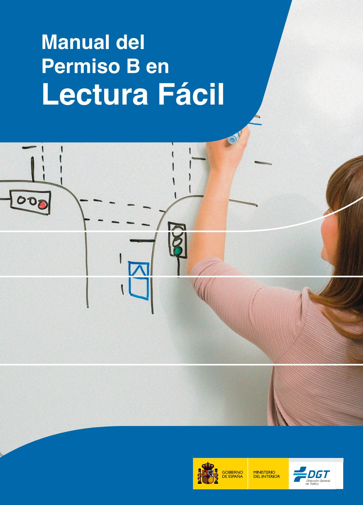

<!-- Page: 2 -->

#### **Editado por el Ministerio del Interior - Dirección General de Tráfico**

Basado en el contenido de:

#### **© 2023 ETRASA – Editorial Tráfico Vial, S.A.U. – 1ª Edición Corregida Junio 2025**

C/ Puerto Navacerrada, 128 Polígono Industrial "Las Nieves" 28935 Móstoles (Madrid)

«Cualquier forma de reproducción, comunicación pública o transformación de esta obra solo puede ser realizada figurando su procedencia, salvo excepción prevista por la ley. Diríjase a CEDRO (Centro Español de Derechos Reprográficos) si necesita fotocopiar o escanear algún fragmento de esta obra (www.conlicencia.com; 91 702 19 70 / 93 272 04 47)»

**Catálogo de Publicaciones de la Administración General del Estado (CPAGE)** https://cpage.mpr.gob.es/

NIPO: 128250063

Este logotipo identifica los materiales que siguen las directrices internacionales de la IFLA (International Federation of Library Associations and Institutions) e Inclusion Europe en cuanto a lenguaje, contenido y forma, a fin de facilitar su comprensión. Lo otorga la Asociación Lectura Fácil (www.lecturafacil.net).

Este documento ha sigo adaptado y validado siguiendo la norma UNE 153101:2018 EX de Lectura Fácil.

Adaptación a Lectura Fácil: María Peralta y Laia Vidal (Asociación Lectura Fácil) Validación: Cristina Casanova, Fernando Covas y Elisenda Copons (+Tu, Fundació de Suport).

<!-- Page: 3 -->

## **ÍNDICE GENERAL**

| Tema 1. Definiciones                                 |
|------------------------------------------------------|
| Tema 2. Documentación                                |
| Tema 3. El estado del conductor                      |
| Tema 4. Obligaciones de conductores y peatones       |
| Tema 5. Dispositivos de seguridad en el vehículo     |
| Tema 6. Elementos del vehículo y normas para usarlos |
| Tema 7. Sistema de luces de los vehículos            |
| Tema 8. Señales de circulación                       |
| Tema 9. La vía                                       |
| Tema 10. Velocidad y distancias                      |
| Tema 11. Maniobras                                   |
| Tema 12. Normas de preferencia para circular         |
| Tema 13. Transportar personas y cargas               |
| Tema 14. Conducir de forma segura                    |
| Tema 15. Mecánica y mantenimiento del vehículo       |
| Tema 16. Accidentes de tráfico                       |

**[Anexo puntos. El permiso de conducir por puntos](#page-466-0)**

**[Tema 17. Conducción preventiva y eficiente](#page-436-0)**

<!-- Page: 4 -->

<!-- Page: 5 -->

# **Índice**

#### **Definiciones relacionadas con los vehículos**

- **■** Vehículos sin motor
- **■** Vehículos a motor
- **■** Otro tipo de vehículos con motor

#### **Definiciones relacionadas con las personas**

- **■** Conductor
- **■** Peatón
- **■** Titular del vehículo
- **■** Conductor habitual

**Categorías de los vehículos dependiendo de su uso**

<!-- Page: 6 -->

## **Definiciones relacionadas con los vehículos**

#### **Vehículo**

Aparato preparado para circular por vías, calles, carreteras y terrenos de todo tipo.

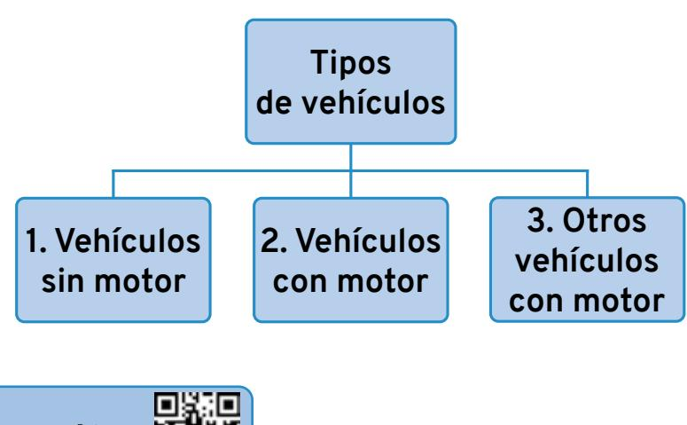

## **Vehículos sin motor**

| Vehículos sin motor              |
|----------------------------------|
| Vehículo arrastrado por animales |
| Ciclo y bicicleta                |
| Remolque                         |
| Semirremolque                    |

<!-- Page: 7 -->

#### **Vehículos arrastrados por animales**

Por ejemplo, coche de caballos.

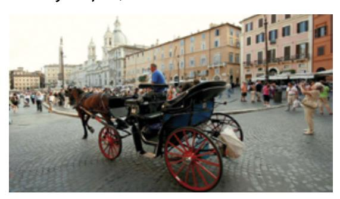

#### **Ciclo**

Vehículo de dos o más ruedas que lleva pedales. Se mueve por la energía y el impulso de la persona que lo conduce.

La bicicleta es un ciclo de dos ruedas.

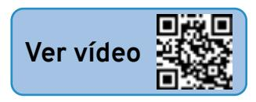

#### **Remolque**

Plataforma con ruedas que se engancha a un vehículo con motor, por medio de un eje, para transportar cargas.

**Eje.** Barra que atraviesa un objeto y le ayuda a moverse y a girar.

En un remolque, el eje hace que la carga se reparta y que se pueda conducir mejor.

<!-- Page: 8 -->

# **Remolque ligero Remolque pesado** Con carga pesa como máximo 750 kilos. Con carga puede pesar más de 750 kilos.

#### **Semirremolque**

Remolque que se une de forma directa a un vehículo con motor, sin eje.

| Semirremolque ligero                     | Semirremolque no ligero                 |
|------------------------------------------|--------------------------------------------|
|                                          |                                            |
| Con carga pesa como máximo 750 kilos. | Con carga puede pesar más de 750 kilos. |

#### **Vehículos a motor**

Vehículos que necesitan un motor para funcionar. Los vehículos a motor se clasifican en:

## **■ Automóviles**

Sirven para transportar a personas y cosas. También se usan para mover o arrastrar otros vehículos.

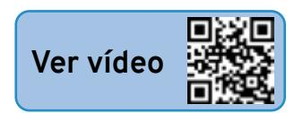

<!-- Page: 9 -->

#### **■ Vehículos especiales**

Sirven para hacer trabajos o servicios determinados. Algunos tienen motor propio y otros son remolcados. Por ejemplo, excavadoras para mover la tierra y tractores para trabajar en el campo.

Hay distintos tipos de automóviles y de vehículos especiales:

| Automóviles |                                       |  |
|-------------|---------------------------------------|--|
|             | Motocicletas de dos ruedas         |  |
|             | Motocicletas con sidecar              |  |
|             | Vehículos de tres ruedas              |  |
|             | Cuatriciclo (o cuadriciclo) pesado |  |
|             | Turismo                               |  |
|             | Pick-up                               |  |
|             | Derivado de turismo                   |  |
|             | Mixto adaptable                       |  |
|             | Autobús / Autocar                     |  |
|             | Trolebús                              |  |
|             | Camión                                |  |

<!-- Page: 10 -->

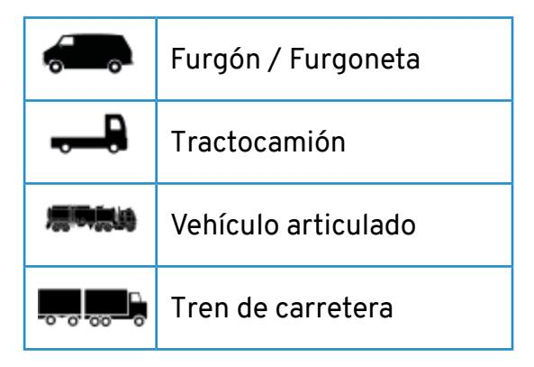

| Vehículos especiales |                    |  |
|----------------------|--------------------|--|
| A motor              |                    |  |
|                      | Quad - ATV         |  |
|                      | Tractor            |  |
|                      | Motocultor         |  |
|                      | Máquina automotriz |  |
| Remolcados           |                    |  |
|                      | Remolque agrícola  |  |
| Máquina remolcada    |                    |  |

<!-- Page: 11 -->

## **Automóviles Motocicletas**

**[Ver vídeo](https://www.youtube.com/watch?v=TBERC3yG5Ls)**

Vehículos de dos ruedas que tienen que cumplir al menos una de estas dos características relacionadas con la **cilindrada** y la velocidad:

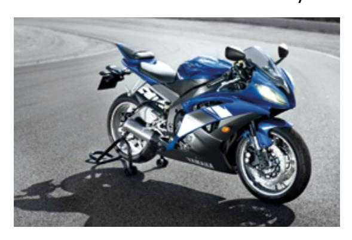

- **■** Si es de gasolina, tener un motor con una cilindrada mayor de 50 centímetros cúbicos o, lo que es lo mismo, 0,05 litros.
- **■** Alcanzar una velocidad mayor de 45 kilómetros por hora.

**Cilindrada.** Medida para calcular la potencia de un motor.

Cuanta más cilindrada tenga un motor, mayor será su potencia.

La cilindrada se mide en litros o en centímetros cúbicos.

<!-- Page: 12 -->

#### **Motocicletas con sidecar**

Son motocicletas de tres ruedas que tienen un asiento al lado para que se siente otra persona.

Deben cumplir las mismas características de cilindrada y velocidad que las motocicletas de dos ruedas.

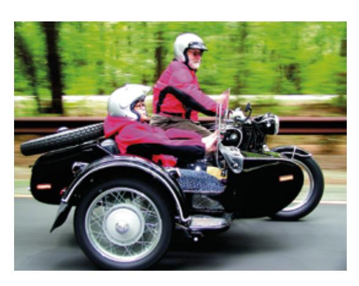

#### **Vehículo de tres ruedas**

Vehículo de tres ruedas simétricas que debe cumplir las mismas características de cilindrada y velocidad que las motocicletas de dos ruedas y los sidecares.

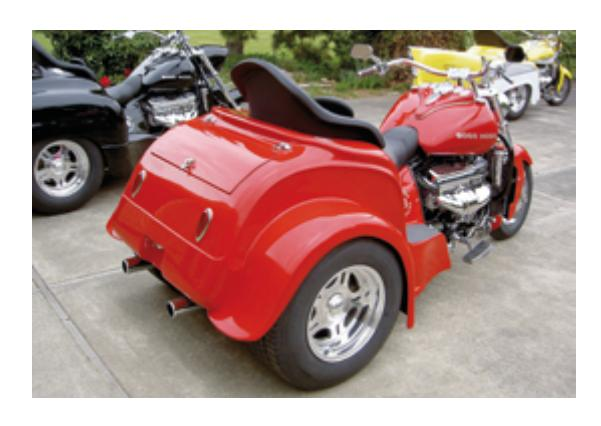

<!-- Page: 13 -->

#### **Cuatriciclo pesado**

Automóvil de cuatro ruedas que cumple estas características:

- **■** Con carga y pasajeros pesa como máximo 450 kilos si lleva personas o 600 kilos si lleva mercancías.
- **■** La potencia máxima que puede tener el motor es de 15 **kilovatios**.

**Kilovatio.** Unidad que se usa para medir la potencia máxima que puede tener un aparato.

#### **Turismo**

Automóvil que se usa para transportar a personas.

Tiene por lo menos cuatro ruedas.

Puede tener nueve asientos como máximo, contando el asiento del conductor.

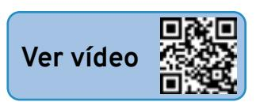

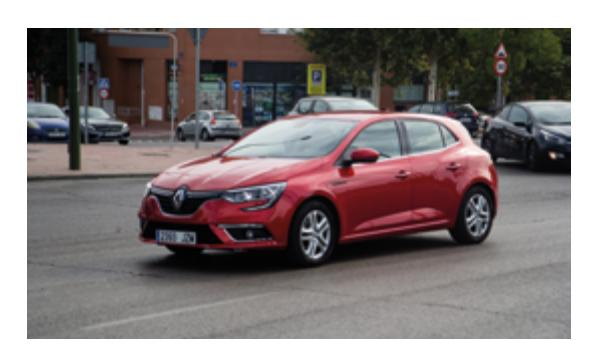

<!-- Page: 14 -->

#### **Derivado del turismo**

Automóvil con la **carrocería** de un turismo, pero que sirve para transportar mercancías en vez de personas.

Solo tiene una fila de asientos para dejar más espacio a las mercancías.

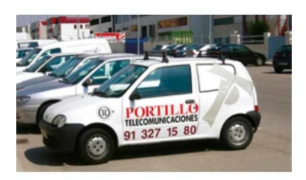

**Carrocería.** Estructura que da forma al automóvil.

#### *Pick up*

Vehículo en el que los asientos para las personas y la zona de carga están separados en dos espacios diferentes.

Con carga y pasajeros pesa como máximo 3.500 kilos.

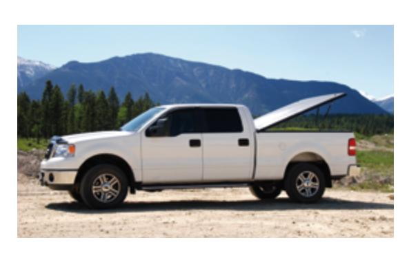

<!-- Page: 15 -->

#### **Vehículo mixto adaptable**

Vehículo que sirve para transportar a personas o mercancías.

Los asientos se pueden poner o quitar dependiendo del uso que se le quiera dar al vehículo.

Pueden viajar en él nueve personas como máximo.

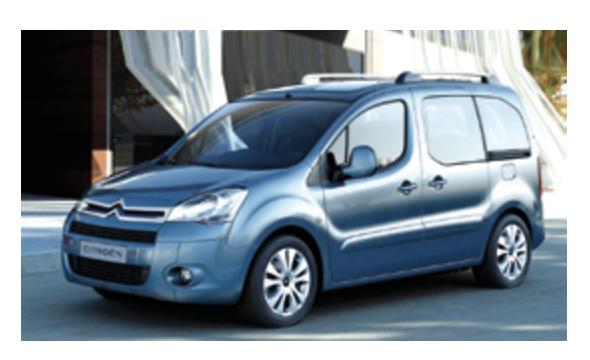

## **Autobús o autocar**

Vehículo con más de nueve asientos que sirve para transportar a personas y sus equipajes.

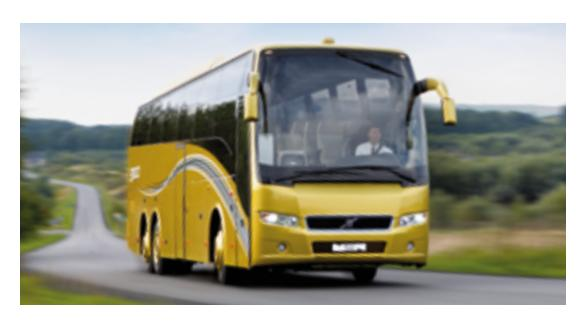

<!-- Page: 16 -->

#### **Camión**

Vehículo de cuatro ruedas o más que sirve para transportar mercancías.

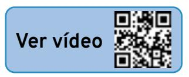

#### Tiene dos partes:

- **■** La cabina. Espacio con asientos donde viajan los pasajeros y el conductor. Puede tener nueve asientos como máximo.
- **■** Resto del camión. Espacio que está en la parte de atrás. Es el lugar en el que viajan las mercancías.

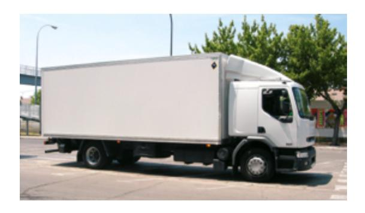

#### **Furgón o furgoneta**

Vehículo con cuatro ruedas o más que sirve para transportar mercancías.

A diferencia del camión, la cabina y el resto del camión están juntas, no separadas.

<!-- Page: 17 -->

#### **Tractocamión**

Vehículo que sirve para arrastrar el semirremolque.

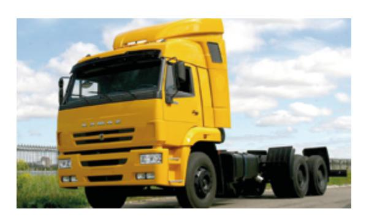

#### **Conjunto de vehículos**

Automóvil formado por un vehículo a motor y un remolque o semirremolque enganchado o unido a él.

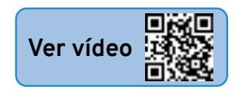

Hay tres tipos de conjuntos de vehículos:

1. Tren de carretera. El remolque está enganchado al vehículo a motor por medio de un eje.

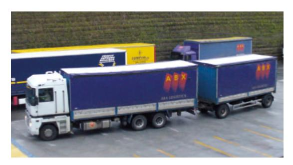

<!-- Page: 18 -->

- 2. Vehículo articulado. El semirremolque está unido al vehículo a motor, sin eje.
- 3. Configuración euromodular. Vehículos enganchados que tienen al menos 6 ejes en sus ruedas.

Los ejes conectan las ruedas entre sí y les ayudan a girar.

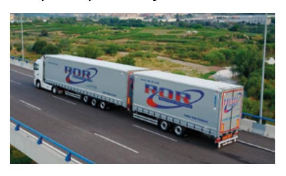

#### **Vehículos especiales**

#### **Quad ATV**

Vehículo de cuatro ruedas o más que se usa más para conducir por montes o caminos que por carreteras.

Se conduce con manillar, igual que una motocicleta.

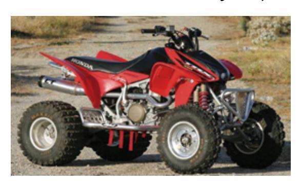

<!-- Page: 19 -->

#### **Tractor**

Vehículo de cuatro ruedas o más que tiene un motor muy grande.

Se usa para transportar o arrastrar materiales y cargas pesadas.

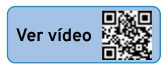

El tractor se utiliza sobre todo en trabajos de campo (tractor agrícola) y en la construcción (tractor de obras).

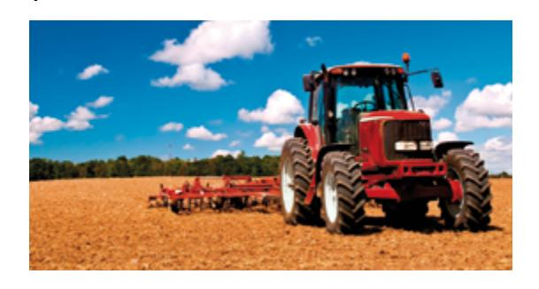

## **Motocultor**

Vehículo pequeño que tiene motor y ruedas.

La persona que lo conduce va andando y lo mueve por medio de una pieza larga, como un manillar.

Esta pieza larga es parte del motocultor.

Se utiliza sobre todo en jardinería y en agricultura para remover la tierra en huertos o terrenos pequeños.

<!-- Page: 20 -->

#### **Máquina automotriz**

Vehículo de cuatro ruedas o más que se usa para hacer trabajos en el campo y en la construcción.

#### **Vehículos remolcados**

#### Existen dos tipos:

- 1. Remolque agrícola Vehículo para hacer trabajos en el campo. Tiene que ser arrastrado por un tractor o por otros vehículos especiales.
- 2. Máquina remolcada Vehículo que sirve para hacer trabajos en obras, en el campo o en otros servicios. Tiene que ser arrastrado por otro vehículo especial.

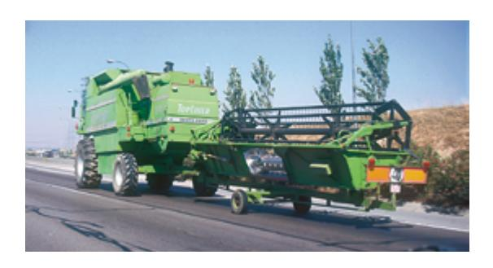

<!-- Page: 21 -->

#### **Otros tipos de vehículos a motor**

Algunos vehículos que llevan motor no se consideran vehículos a motor porque tienen unas características especiales.

| Vehículos no considerados a motor |                                                  |  |
|-----------------------------------|--------------------------------------------------|--|
|                                   | Tranvía                                          |  |
|                                   | Ciclomotor                                       |  |
|                                   | Vehículos para personas de movilidad reducida |  |
|                                   | Bicicleta de pedales con motor                |  |
|                                   | Vehículo de movilidad personal                |  |

## **Tranvía**

Funciona a través de raíles puestos en la carretera o en la calle.

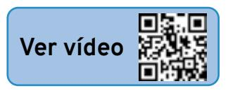

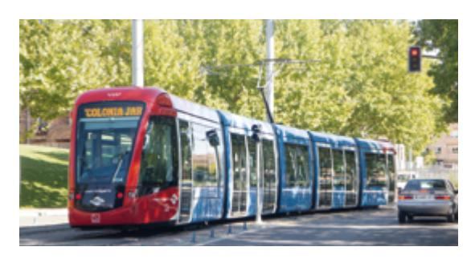

<!-- Page: 22 -->

#### **Ciclomotor**

Vehículos de dos, tres o cuatro ruedas. Tienen motores con poca potencia. La velocidad máxima que alcanzan es de 45 kilómetros por hora. En los ciclomotores pueden viajar dos personas como máximo.

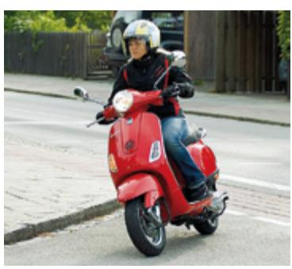

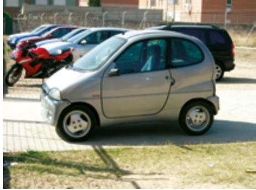

#### **Vehículos para personas de movilidad reducida**

Se fabrican para que los usen personas que tienen una discapacidad física. La velocidad máxima que alcanzan es de 45 kilómetros por hora. Como máximo pesa 350 kilos.

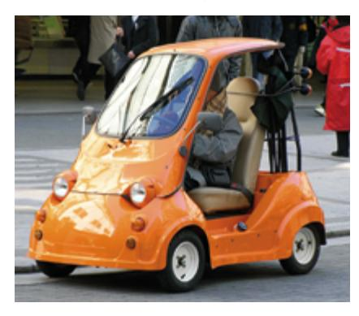

<!-- Page: 23 -->

**Bicicletas de pedales con motor**

**Vehículos de movilidad personal**

Tienen un motor eléctrico que alcanza una velocidad de entre 6 y 25 kilómetros por hora.

Por ejemplo, el patín eléctrico.

En este tipo de vehículos solo puede viajar una persona.

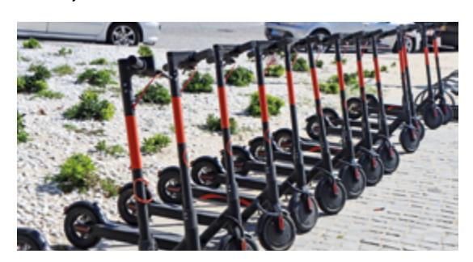

## **Definiciones relacionadas con las personas**

## **Conductor**

Persona que conduce un vehículo. También es la persona que lleva el control de los mandos añadidos en los vehículos de la autoescuela para aprender a conducir.

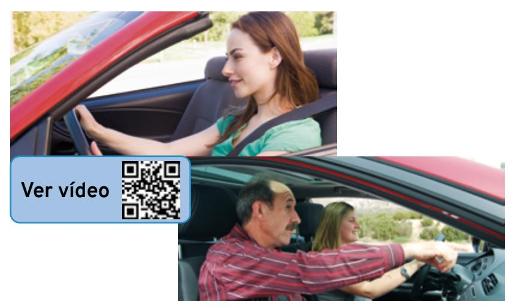

<!-- Page: 24 -->

### **Peatón**

Persona que va andando por la acera y la carretera. También son peatones las personas que:

- **■** Arrastran o empujan un cochecito de niño, una silla de ruedas o cualquier vehículo pequeño sin motor.
- **■** Van andando y llevan consigo un ciclo o un ciclomotor de dos ruedas.
- **■** Van en silla de ruedas.

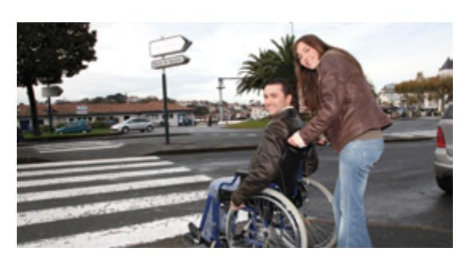

## **Titular del vehículo**

Persona que tiene puesto a su nombre el vehículo en el registro oficial que corresponda.

Esta persona llevará siempre en el vehículo la documentación en la que se dice que es el titular y la enseñará a las autoridades cuando se la pidan.

El titular del vehículo es el responsable de que no conduzcan ese vehículo personas que no tienen permiso de conducir.

<!-- Page: 25 -->

### **Conductor habitual**

Persona que suele conducir un vehículo, aunque no sea el titular.

El conductor habitual debe tener el permiso de conducir necesario para conducir ese vehículo.

El titular del vehículo es quien autoriza a esa persona a ser conductor habitual.

## **Categorías de los vehículos dependiendo de su uso**

| Categoría | Uso                                                                          |  |
|-----------|------------------------------------------------------------------------------|--|
| M         | Vehículos a motor creados para transportar a personas y sus equipajes. |  |
|           | Por ejemplo, coches y autobuses.                                             |  |
| N         | Vehículos a motor creados                                                    |  |
|           | para transportar mercancías.                                                 |  |
|           | Por ejemplo, furgonetas y camiones.                                          |  |
| O         | Remolques creados para transportar a personas y mercancías.               |  |

<!-- Page: 26 -->

# **Índice**

#### **Documentos necesarios para conducir**

#### **Permiso de conducir**

- **■** Tipos de permiso de conducir
- **■** Permiso de conducir por puntos
- **■** Conductores noveles
- **■** ¿Cuándo debes renovar tu permiso de conducir tipo B?

#### **Permiso de circulación**

- **■** ¿Qué vehículos deben tener permiso de circulación?
- **■** ¿Qué datos aparecen en el permiso de circulación?

#### **Tarjeta de inspección técnica (ITV)**

- **■** ¿Qué vehículos deben tener la tarjeta de inspección técnica?
- **■** ¿Qué datos aparecen en la tarjeta de inspección técnica?
- **■** ¿Cuándo debes pasar la inspección técnica de tu vehículo (ITV)?
- **■** Resultados de la inspección técnica

#### **Seguro obligatorio de responsabilidad civil**

- **■** ¿Qué vehículos deben tener seguro obligatorio de responsabilidad civil?
- **■** ¿Qué cubre el seguro obligatorio?
- **■** ¿Qué no cubre el seguro obligatorio?
- **■** ¿Qué consecuencias tiene no asegurar el vehículo?

#### **Personas responsables**

<!-- Page: 27 -->

## **Documentos necesarios para conducir**

Para conducir un vehículo necesitas los siguientes documentos:

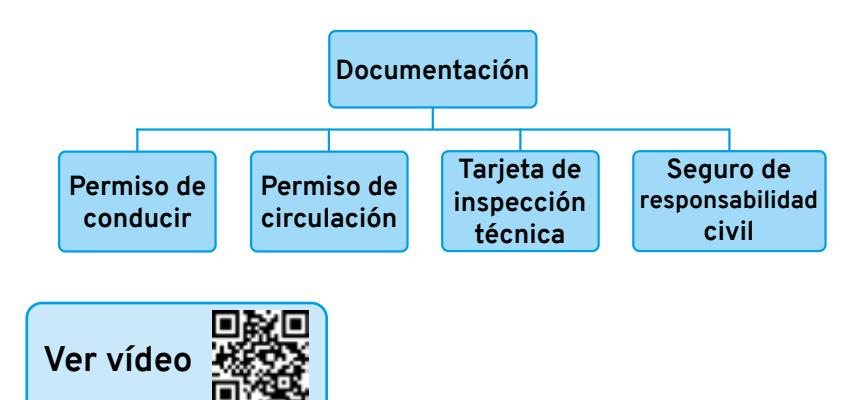

Debes llevar siempre estos documentos en el vehículo cuando conduces para enseñarlos a las autoridades que se encargan de vigilar el tráfico.

Estos documentos deben ser los originales. También puedes presentar una fotocopia de los documentos compulsada por un organismo público oficial. Por ejemplo, el ayuntamiento, la policía o un notario.

**Compulsar.** Certificar un organismo oficial que la copia del documento es auténtica

<!-- Page: 28 -->

Cuando necesitas adaptar el vehículo para conducir, debes pedir un permiso especial y hacer los cambios necesarios en el vehículo.

Por ejemplo, colocar mandos en el volante para personas que tienen una discapacidad en las piernas y dificultad para usar los pedales del coche.

Vamos a conocer los 4 documentos necesarios que debe tener un conductor, para qué sirven y cómo se utilizan.

## **Permiso de conducir**

Documento que autoriza a una persona a conducir y asegura que cumple los requisitos para hacerlo.

#### **Tipos de permiso de conducir**

Debes conseguir un permiso u otro dependiendo del vehículo que vas a conducir:

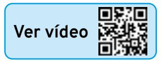

<!-- Page: 29 -->

| Tipo de       | Vehículos                                                                                                                                                                                   | Edad mínima              |
|---------------|---------------------------------------------------------------------------------------------------------------------------------------------------------------------------------------------|--------------------------|
| permiso AM | que puedes conducir Ciclomotores de dos o tres ruedas y cuadriciclos ligeros. Vehículos para personas con movilidad reducida.                                             | para conducir 15 años |
| A1            | Motocicletas con una cilindrada máxima de 125 centímetros cúbicos y una potencia máxima de 11 kilovatios. Triciclos de motor con una potencia máxima de 15 kilovatios. | 16 años                  |
| A2            | Motocicletas con una potencia máxima de 35 kilovatios.                                                                                                                                | 18 años                  |
| A             | Motocicletas y triciclos con cualquier tipo de motor y de potencia.                                                                                                                   | 20 años                  |

<!-- Page: 30 -->

| B   | Ciclomotores. Vehículos para personas con movilidad reducida. Automóviles que pueden llevar hasta nueve pasajeros. Vehículos especiales agrícolas. Vehículos especiales no agrícolas que alcancen una velocidad máxima de 40 kilómetros por hora y no pesen más de 3.500 kilos. Conjunto de vehículos cuando el remolque no lleve un peso mayor de 750 kilos. | 18 años |
|-----|---------------------------------------------------------------------------------------------------------------------------------------------------------------------------------------------------------------------------------------------------------------------------------------------------------------------------------------------------------------------------------------------------------------------------|---------|
| B+E | Conjunto de vehículos. El remolque puede llevar una carga de hasta 3.500 kilos.                                                                                                                                                                                                                                                                                                                                  | 18 años |

<!-- Page: 31 -->

**Permiso de conducir por puntos**

Cuando consigues el permiso de conducir te dan 8 puntos.

Perderás alguno de estos puntos o todos ellos si cometes alguna falta grave o muy grave. Por ejemplo, usar el móvil mientras conduces.

Puedes recuperar los puntos después de un tiempo haciendo un curso de reeducación para conducir. Este curso dura 12 horas.

### **Conductores noveles**

A la persona que consigue el permiso de conducir se le llama conductor novel durante el primer año.

Los conductores noveles deben llevar en el coche una placa verde rectangular con una letra L de color blanco.

Esta placa se coloca en el cristal de la parte de atrás del coche.

Se tiene que ver bien para que los demás conductores sepan que ese coche lo conduce una persona novel.

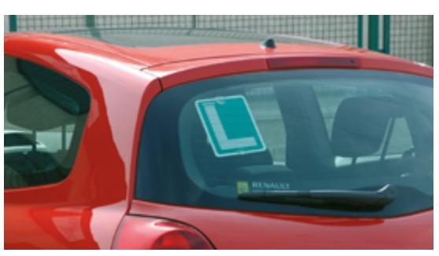

<!-- Page: 32 -->

#### **¿Cuándo debes renovar tu permiso de conducir tipo B?**

- **■** Cada 10 años si tienes menos de 65 años.
- **■** Cada 5 años si tienes más de 65 años.

Hay que pedir la renovación del permiso antes de que caduque.

También deberás pedir de nuevo el permiso de conducir si lo pierdes, te lo roban o cambia alguno de tus datos personales. Por ejemplo, el domicilio.

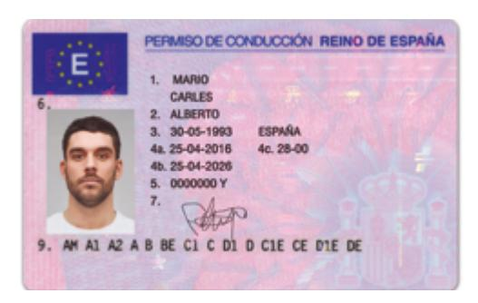

## **Permiso de circulación**

Documento que confirma que un vehículo tiene **matrícula** y está autorizado a circular.

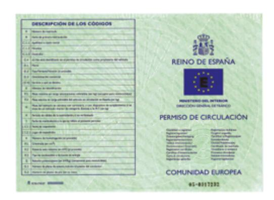

<!-- Page: 33 -->

#### **¿Qué vehículos deben tener permiso de circulación?**

- **■** Todos los vehículos con motor.
- **■** Los ciclomotores.
- **■** Los remolques y semirremolques que pueden transportar más de 750 kilos.

**Matrícula.** Conjunto de letras y números que identifican a los vehículos.

Cada vehículo tiene una matrícula diferente que se graba en una placa de metal y se coloca en el vehículo.

## **¿Qué datos aparecen en el permiso de circulación?**

- **■** Nombre, apellidos y domicilio del titular del vehículo.
- **■** Número de matrícula del vehículo y fecha en la que se matriculó.
- **■** Número de plazas que tiene el vehículo.
- **■** Uso que se le da al vehículo. Es decir, si sirve para transportar personas o mercancías.
- **■** Peso máximo que puede cargar el vehículo.

El titular de un vehículo debe comunicar cualquier cambio en sus datos a la Jefatura de Tráfico.

<!-- Page: 34 -->

Lo debe hacer como muy tarde 15 días después del cambio.

También debe comunicar si vende o entrega el vehículo a otra persona. En este caso, tiene 10 días para comunicarlo. La persona que compra o recibe el vehículo debe pedir que se renueve el permiso de circulación a su nombre.

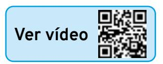

## **Tarjeta de inspección técnica (ITV)**

Documento que demuestra que un vehículo no tiene averías y está en buenas condiciones para funcionar.

## **¿Qué vehículos deben tener la tarjeta de inspección técnica?**

- **■** Todos los vehículos con motor.
- **■** Todos los ciclomotores.
- **■** Todos los remolques y semirremolques.

## **¿Qué datos aparecen en la tarjeta de inspección técnica?**

- **■** Características del vehículo.
- **■** Registro de las inspecciones que ha pasado el vehículo.

<!-- Page: 35 -->

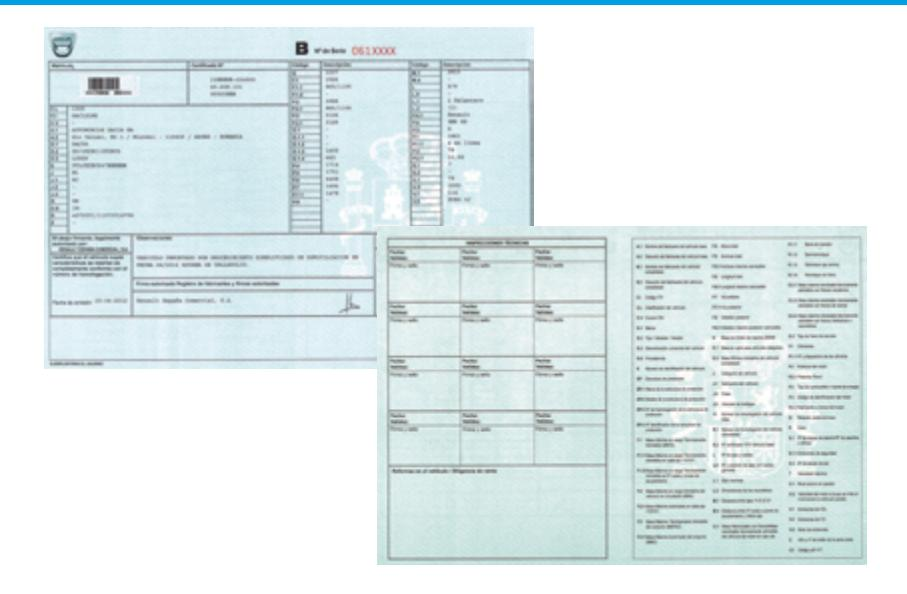

## **¿Cuándo debes pasar la inspección técnica de tu vehículo (ITV)?**

Para saber cuándo hay que hacer la revisión de cada vehículo, debes tener en cuenta qué tipo de vehículo es, cuántos años tiene y para qué sirve: si es un automóvil, un vehículo especial...

| Tipos de vehículo                                                                                                            | Cuándo pasar la inspección técnica (ITV)                                   |
|------------------------------------------------------------------------------------------------------------------------------|-------------------------------------------------------------------------------|
| Ciclomotores de dos ruedas                                                                                                | Primera revisión a los 3 años. Después de 3 años, revisión cada 2 años. |
| Ciclomotores de tres ruedas y cuadriciclos ligeros Motocicletas, vehículos de tres ruedas y cuadriciclos pesados | Primera revisión a los 4 años. Después de 4 años, revisión cada 2 años. |
| Quads                                                                                                                        |                                                                               |

<!-- Page: 36 -->

| Vehículos de motor que pueden transportar                                                                         | Primera revisión a los 4 años. Después de 4 años, revisión cada 2 años.                                                                                              |
|----------------------------------------------------------------------------------------------------------------------|----------------------------------------------------------------------------------------------------------------------------------------------------------------------------|
| hasta nueve pasajeros                                                                                                | Después de 10 años, revisión cada año.                                                                                                                                  |
| Vehículos de motor que pueden transportar mercancías con un peso de hasta 3,5 toneladas                     | Primera revisión a los 2 años. Después de 2 años, revisión cada 2 años. Después de 6 años, revisión cada año. Después de 10 años, revisión cada 6 meses. |
| Remolques para transportar mercancías o personas o para alojar personas Excepto la caravana remolcada | Primera revisión al año. Hasta los 10 años revisión cada año. Después de 10 años, una vez cada 6 meses.                                                        |
| Caravana remolcada                                                                                                   | Primera revisión a los 6 años. Después de 6 años, cada 2 años.                                                                                                       |

También hay que pasar una inspección técnica cuando se reforma el vehículo, o si ha sufrido un accidente y la estructura se ha dañado.

El titular del vehículo es la persona encargada de controlar que se pasan las inspecciones técnicas.

<!-- Page: 37 -->

#### **Resultados de la inspección técnica**

Cuando el vehículo está en buenas condiciones, los técnicos de la ITV:

- **■** Escriben en la tarjeta de inspección técnica que el vehículo está bien y la fecha de la siguiente revisión.
- **■** Entregan una pegatina. Debes colocarla en el interior del vehículo, en el lado derecho del parabrisas.
- **■** Entregan un informe. Lo debes llevar siempre en el vehículo.

## **Cuando el vehículo tiene algún fallo o problema grave:**

- **■** No puedes seguir circulando.
- **■** Debes llevarlo a un taller para que lo arreglen.
- **■** Una vez arreglado, lo debes llevar a hacer una nueva inspección para comprobar que ya puede circular.

## **Seguro obligatorio de responsabilidad civil**

Las personas que tienen un vehículo con motor tienen la obligación de contratar y pagar un seguro. Este seguro sirve para proteger a las demás personas, objetos o vehículos si tienes un accidente. A este seguro se le llama seguro de responsabilidad civil.

<!-- Page: 38 -->

#### **¿Qué vehículos deben tener seguro obligatorio de responsabilidad civil?**

Todos los vehículos con motor si el propietario vive en España, excepto:

- **■** Trenes y tranvías.
- **■** Sillas de ruedas.
- **■** Juguetes con motor.

Otros vehículos que no necesitan tener un seguro de responsabilidad civil son los remolques, semirremolques y máquinas remolcadas que no puedan cargar más de 750 kilos.

#### **¿Qué cubre el seguro obligatorio?**

- **■** Los daños que tu vehículo causa a algún objeto. Por ejemplo, arreglar una farola si chocas contra ella.
- **■** Los daños a otra persona. Por ejemplo, si atropellas a un peatón.

Sin embargo, el seguro no cubre los daños a otra persona si es ella la que tiene un mal comportamiento. Por ejemplo, si un peatón se lanza contra tu coche para que lo atropelles.

Tampoco cubrirá los daños a una persona por motivos que no tienen que ver con la conducción.

Por ejemplo, un accidente de tráfico provocado por un huracán o un incendio.

<!-- Page: 39 -->

#### **¿Qué no cubre el seguro obligatorio?**

- **■** Las lesiones que en un accidente sufra el conductor del vehículo asegurado. Por ejemplo, no paga los gastos médicos de un conductor que pierde una pierna en un accidente.
- **■** Los daños que sufran los objetos que están dentro del coche de la persona que conduce.
- **■** Los daños que el accidente provoque en los objetos de la persona asegurada, de la persona que conduce o de sus familiares. Por ejemplo, no cubre el arreglo de la puerta de un garaje que un conductor rompe al entrar en casa de su hermano.
- **■** Los daños a personas que no llevan casco si es obligatorio llevarlo.

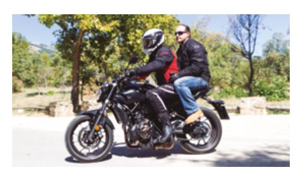

**■** Los accidentes y daños que se produzcan en un vehículo robado.

Cuando hay un accidente, los conductores de todos los vehículos tienen que informar a sus seguros. Lo deben hacer como muy tarde 7 días después del accidente.

<!-- Page: 40 -->

## **¿Qué consecuencias tiene no asegurar el vehículo?**

- **■** El vehículo no puede circular. Si te para un agente de vigilancia de tráfico, inmovilizará el vehículo en ese momento.
- **■** El propietario del vehículo tiene que pagar los gastos del lugar en el que el vehículo esté parado mientras no tiene seguro.
- **■** El propietario del vehículo tiene que pagar una multa.

Debes llevar siempre en el vehículo el justificante de pago del seguro. Así podrás demostrar que el vehículo está asegurado.

En este justificante aparecerá la siguiente información:

- **■** Nombre de la empresa aseguradora.
- **■** Número de matrícula del vehículo.
- **■** Placa del seguro.
- **■** Fecha en la que hay que renovar el seguro.
- **■** Indicación de qué daños cubre el seguro.

## **Personas responsables**

Por norma general, la persona que comete una falta o infracción como conductor o peatón es quien debe pagar la multa o la sanción.

<!-- Page: 41 -->

Sin embargo, hay casos en los que los conductores son responsables de una falta o infracción, aunque no hayan provocado ellos el accidente.

#### Estos casos son:

**■** Conductores y pasajeros que no llevan casco en vehículos en los que es obligatorio llevarlo.

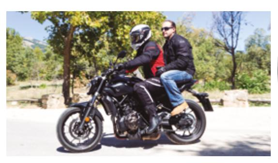

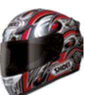

**■** Conductores que llevan a menores de edad en vehículos en los que no está permitido que viajen niños de esa edad.

Cuando las faltas o infracciones de tráfico las comete una persona menor de 18 años, la multa la debe pagar su padre, madre o tutor.

La persona que sea titular de un vehículo es responsable de las faltas o infracciones relacionadas con:

- **■** La documentación del vehículo.
- **■** No cumplir con las revisiones del vehículo.
- **■** El estado en el que esté el vehículo.

<!-- Page: 42 -->

# **Índice**

**Estado físico y psicológico del conductor Factores que influyen en el estado del conductor**

- **■** Fatiga
- **■** Somnolencia
- **■** Alcohol
- **■** Otras drogas
- **■** Enfermedades y medicamentos
- **■** Alimentación
- **■** Ropa adecuada

#### **Accidentes por distracciones**

- **■** Fumar en el vehículo
- **■** Uso del teléfono móvil
- **■** Navegadores GPS

<!-- Page: 43 -->

## **Estado físico y psicológico del conductor**

Debes estar en buenas condiciones físicas y psicológicas para conducir.

Hay muchos factores físicos y psicológicos que afectan a tu seguridad y a la de otras personas cuando conduces un vehículo.

Por ejemplo, tu capacidad para ver bien, tu estado de ánimo y el tiempo que tardas en reaccionar ante imprevistos que ocurren en la carretera.

Además, debes tener la formación suficiente para manejar el vehículo y comprender todas las normas de circulación.

#### **La vista**

A través de los ojos recibimos la mayoría de la información para conducir bien.

Alguna de esta información es: estado de la carretera, señales de tráfico, distancia con los objetos y velocidad del resto de vehículos.

Para conducir bien es necesario ver las cosas que tienes delante, a los lados y detrás.

<!-- Page: 44 -->

#### Pero algunos factores hacen que veas menos:

- **■** Beber alcohol.
- **■** Tomar drogas.
- **■** Estar cansado.
- **■** Conducir muy deprisa.

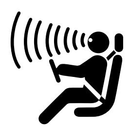

## **El estado de ánimo**

Los cambios en el estado de ánimo pueden hacer que pierdas la concentración y provocar un accidente de tráfico.

Por ejemplo, tener una discusión fuerte mientras conduces o recibir una noticia muy triste antes de conducir pueden cambiar tu estado de ánimo.

#### **El tiempo de reacción**

Es el tiempo que pasa entre oír o ver algo y reaccionar.

Por ejemplo, el tiempo que pasa entre que ves un semáforo en rojo y paras el coche.

En condiciones normales, el tiempo de reacción de una persona que está conduciendo es entre medio segundo y un segundo.

<!-- Page: 45 -->

Factores que hacen que una persona tarde más tiempo en reaccionar:

- **■** Estar cansado (fatiga).
- **■** Tener sueño.
- **■** Tener muchos años.
- **■** Oír o ver mal.
- **■** Las enfermedades.
- **■** Algunos medicamentos.
- **■** El alcohol y las drogas.
- **■** Comer mucho antes de conducir.
- **■** Mucho calor en el coche.
- **■** Estado de ánimo alterado.
- **■** Poner poca atención a la conducción.

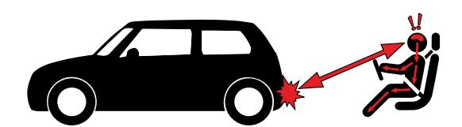

## **Factores que influyen en el estado del conductor**

#### **Estar cansado (fatiga)**

Es uno de los principales riesgos que puede provocar accidentes en la carretera.

La fatiga puede ser física o psicológica. La fatiga física produce sensación de cansancio y la psicológica hace que te cueste más concentrarte.

<!-- Page: 46 -->

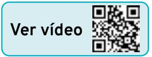

#### **¿Qué puede causar fatiga?**

- **■** Cómo está la carretera.
- **■** Cómo está el vehículo.
- **■** Cómo está el conductor.

#### **Cómo está la carretera:**

- **■** Carretera con mucho tráfico.
- **■** El suelo de la carretera está en mal estado.
- **■** No conoces la carretera.
- **■** Dificultades con el clima: lluvia, niebla, nieve o demasiado calor.

### **Cómo está el vehículo:**

**■** Mucho calor dentro del vehículo. La temperatura adecuada es 23 grados más o menos.

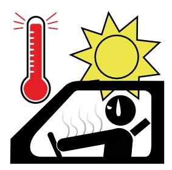

- **■** Conduces de noche con poca iluminación.
- **■** Conduces en un vehículo en mal estado o que hace demasiado ruido.
- **■** Estás incómodo en el asiento.

<!-- Page: 47 -->

#### **Cómo está el conductor:**

- **■** Conduces muchas horas sin descansar o haces descansos muy cortos.
- **■** Conduces rápido durante mucho tiempo.
- **■** Conduces con sueño, después de beber alcohol o te encuentras mal de salud.
- **■** Haces recorridos largos y de noche cuando no tienes costumbre de hacerlos.
- **■** Tienes el permiso de conducir hace poco tiempo.
- **■** Conduces con el cuerpo en mala postura.

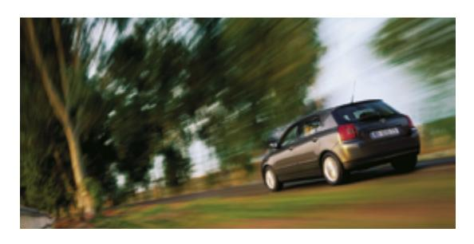

**¿Cuáles son los síntomas de la fatiga?**

Hay algunas señales que te avisan de que estás sufriendo fatiga y debes dejar de conducir.

#### Estas señales son:

- **■** Dificultad para concentrarte en la carretera.
- **■** Te pesan los ojos y empiezas a ver mal.
- **■** Oyes mal.
- **■** Sensación de tener los brazos dormidos.
- **■** Sensación de presión en la cabeza.
- **■** Te mueves mucho en el asiento y cambias de postura.

<!-- Page: 48 -->

- **■** Haces movimientos más lentos.
- **■** Sensación de estar más nervioso e irritable.
- **■** Dificultad para tomar decisiones sobre la conducción.
- **■** Tardas más tiempo en reaccionar.

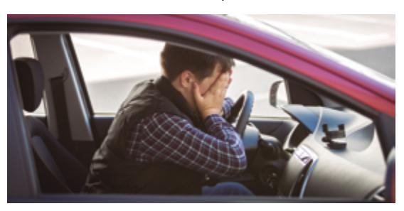

## **Tener sueño (somnolencia)**

Muchos de los accidentes de tráfico están relacionados con conducir con sueño.

No es necesario quedarse totalmente dormido para tener un accidente por este motivo. Los síntomas de la somnolencia aparecen antes de dormirse del todo.

#### **Somnolencia.**

Estado en el que se tiene sensación de cansancio, pesadez en el cuerpo y sueño.

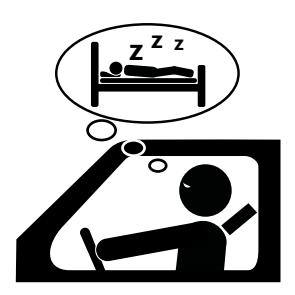

<!-- Page: 49 -->

#### **¿Qué puede causar somnolencia?**

- **■** Dormir menos horas de las habituales.
- **■** Cambiar las horas a las que sueles dormir.
- **■** Dormir mal, aunque duermas muchas horas.
- **■** Conducir por carreteras con poco tráfico.
- **■** Tomar alcohol o medicamentos antes de conducir.
- **■** Tener enfermedades relacionadas con el sueño.
- **■** Conducir de madrugada o al mediodía, después de comer.

#### **¿Cuáles son los síntomas de la somnolencia?**

Hay algunas señales que te avisan de que estás sufriendo somnolencia y debes dejar de conducir.

## Estas señales son:

- **■** Dificultad para mantener la cabeza recta, o tener los ojos abiertos.
- **■** Ver borroso.
- **■** Bostezar muchas veces.

<!-- Page: 50 -->

- **■** Perder la concentración o tener pensamientos sin sentido.
- **■** Distraerte con cualquier cosa.
- **■** Estar inquieto o irritable.
- **■** Dificultad para recordar los últimos kilómetros que has recorrido.
- **■** Salirte de tu carril.
- **■** No fijarte en las señales de tráfico o en el lugar en el que debes salir de la carretera.
- **■** Conducir muy cerca del vehículo que está delante del tuyo.

#### **Efectos de la somnolencia:**

- **■** Tardar más tiempo de lo normal en reaccionar.
- **■** Dificultad para tomar decisiones sobre la conducción.
- **■** Sentir que te cuesta hacer movimientos con el cuerpo o los haces más lentos.
- **■** Dormirte durante unos segundos sin darte cuenta.

<!-- Page: 51 -->

**¿Cómo puedes evitar la fatiga y la somnolencia?**

- **■** Para el vehículo en un lugar seguro cuando sientas los primeros síntomas y duerme 20 o 30 minutos.
- **■** Descansa 20 o 30 minutos cada dos horas o cada 200 kilómetros, aunque no sientas fatiga ni somnolencia.
- **■** Si tienes un detector de fatiga obedece a lo que te diga. Es un sistema que funciona a través de sensores y reconoce si la persona está muy cansada o a punto de dormirse. En esos casos te avisa mediante una luz, sonido o vibración en el volante para que pares el vehículo y no sufras un accidente.

**Sensor.** Dispositivos que captan información de cosas que pasan fuera del vehículo.

<!-- Page: 52 -->

### **Alcohol**

Es muy peligroso beber alcohol cuando vas a conducir, aunque bebas poca cantidad.

El alcohol se extiende por todo tu cuerpo a través de la sangre y afecta, sobre todo, al cerebro y a la vista.

El alcohol es la causa de muchos accidentes de tráfico.

#### **Tasa de alcoholemia**

La alcoholemia es la cantidad total de alcohol que hay en la sangre después de beber.

La tasa de alcoholemia es la cantidad de alcohol que hay en cada litro de sangre.

Se puede calcular de dos formas:

- **■** Gramos de alcohol que hay en cada litro de sangre.
- **■** Miligramos de alcohol que hay en cada litro de aire que expulsamos de los pulmones al respirar.

<!-- Page: 53 -->

La tasa de alcoholemia permitida depende del tipo de vehículo y del permiso de conducir.

- 1. Para personas que han conseguido el permiso de conducir hace menos de dos años. Y para los vehículos que transportan:
  - **■** Mercancías con un peso mayor de 3.500 kilos.
  - **■** Más de nueve personas.
  - **■** Menores.
  - **■** Personas en servicios de urgencias.
  - **■** Cargas peligrosas.

La tasa de alcohol permitida es:

- **■** 0,15 miligramos de alcohol por cada litro de aire.
- **■** 0,3 gramos de alcohol por cada litro de sangre.
- 2. Para cualquier otro vehículo y conductor, la tasa de alcohol permitida es:
  - **■** 0,25 miligramos de alcohol por cada litro de aire.
  - **■** 0,5 gramos de alcohol por cada litro de sangre.

De todas formas, la única tasa de alcoholemia segura para conducir es 0,0, o sea, no beber alcohol.

<!-- Page: 54 -->

**¿Qué factores influyen en la tasa de alcoholemia?**

El alcohol no afecta a todas las personas de la misma forma.

Los factores que influyen en la tasa de alcoholemia son:

- **■** La cantidad de alcohol que bebes. Cuanto más alcohol bebas, mayor será la tasa de alcoholemia.
- **■** El peso de la persona. El alcohol afecta más a las personas delgadas.
- **■** El sexo de la persona. El alcohol suele afectar más a las mujeres.

<!-- Page: 55 -->

- **■** El tiempo que pasa desde que bebes alcohol. El momento en el que la tasa de alcoholemia es más alta es una hora después de beber alcohol. Después los efectos del alcohol van bajando muy poco a poco.
- **■** El tipo de bebida y la forma de beberla. El alcohol llega más rápido a la sangre después de beber algunas bebidas como ginebra o whisky que después de beber otras bebidas como vino o cerveza. Además, el alcohol llega más rápido a la sangre cuando se mezcla con tónica o algunos refrescos.
- **■** Dormir después de beber. El alcohol se elimina más despacio cuando dormimos. Por eso, no es seguro conducir después de beber mucho alcohol y dormir unas pocas horas.
- **■** La velocidad a la que bebes. El cuerpo elimina mejor el alcohol cuando bebes despacio que cuando bebes rápido.
- **■** Beber alcohol sin comer. La comida ayuda a que el alcohol llegue a la sangre de forma más lenta.
- **■** La edad. El alcohol suele afectar más a las personas menores de 18 años y a las personas mayores de 65 años.

<!-- Page: 56 -->

**■** Circunstancias personales. Hay circunstancias que pueden hacer que el alcohol afecte más a una persona. Por ejemplo, estar embarazada, el estrés o tener alguna enfermedad.

## **Efectos del alcohol mientras conduces**

#### En el comportamiento

- **■** Falsa seguridad en ti mismo.
- **■** Te expones a más riesgos.
- **■** Cometes más faltas que provocan accidentes.
- **■** Puedes tratar de forma más agresiva o impulsiva a otros conductores.

<!-- Page: 57 -->

| En la forma de ver el entorno | ■ Ves peor las señales de tráfico y los semáforos. ■ Calculas peor la distancia a la que están otros vehículos. ■ Menos capacidad de ver lo que pasa a un lado y a otro. ■ Te deslumbras más con las luces de los vehículos. ■ Posibilidad de sufrir distracciones con elementos del entorno. |  |
|----------------------------------|--------------------------------------------------------------------------------------------------------------------------------------------------------------------------------------------------------------------------------------------------------------------------------------------------------------------------------------------|--|
| En los movimientos            | ■ Dificultad para coordinar los movimientos de tu cuerpo.                                                                                                                                                                                                                                                                            |  |
| En la toma de decisiones      | ■ Necesitas más tiempo para reaccionar. ■ Más probabilidad de tomar malas decisiones o de no saber cómo llevarlas a cabo.                                                                                                                                                                                             |  |

<!-- Page: 58 -->

#### **Otras drogas**

Consumir drogas antes de conducir es muy peligroso. Una de cada 10 personas que mueren en un accidente de tráfico había consumido drogas antes de conducir.

Está prohibido conducir cualquier tipo de vehículo cuando una persona ha consumido drogas y siguen en su organismo.

Solo se puede conducir después de consumir sustancias que ha recetado el médico y que no afectan a la conducción.

#### **¿Cómo perjudican las drogas en la conducción?**

Todas las drogas son peligrosas y está prohibido conducir cuando se han consumido. Pero cada una de ellas produce unos efectos distintos, que son la causa del peligro.

| Tipo de droga | Posibles peligros mientras la persona conduce                                                                                                                                                            |
|---------------|-------------------------------------------------------------------------------------------------------------------------------------------------------------------------------------------------------------|
| Cannabis      | ■ Ver el entorno de otra manera. Por ejemplo, los colores se ven distintos. ■ Calcular peor las distancias ■ Perder la concentración. ■ Necesitar más tiempo para reaccionar. |
|               | ■ Dormirse conduciendo.                                                                                                                                                                                  |
|               | Ver vídeo                                                                                                                                                                                                   |

<!-- Page: 59 -->

- **Cocaína ■** Volverse más impulsivo o agresivo.
  - **■** Perder la sensación de peligro.
  - **■** Conducir de forma más peligrosa.
  - **■** Ver el entorno de otra manera.
  - **■** Perder la concentración.

## **[Ver vídeo](https://www.youtube.com/watch?v=fVmbNWEg0iQ)**

- **Éxtasis ■** Sufrir alucinaciones.
  - **■** Tener más sensibilidad a la luz o ver borroso.
  - **■** Perder la concentración.
  - **■** Sufrir depresión o ansiedad.
  - **■** Sentir fatiga cuando pasan los efectos de la droga.

- **LSD ■** Sufrir alucinaciones.
  - **■** Reaccionar de forma agresiva.
  - **■** Tener ansiedad e incluso pánico.

- **Anfetaminas ■** Perder la paciencia.
  - **■** Tener comportamientos impulsivos y violentos.
  - **■** Tener poca sensación de peligro.
  - **■** Sufrir retraso de la fatiga y el sueño. Esto puede provocar que la persona se sienta de repente muy cansada y se duerma sin querer cuando pase el efecto de la droga.

<!-- Page: 60 -->

**Pruebas para detectar alcohol y drogas**

Conducir después de beber o tomar drogas está prohibido y castigado por la ley. La persona que lo hace tendrá que pagar una multa e incluso puede ir a la cárcel.

Para saber si una persona que conduce ha tomado alcohol o drogas se le hace una prueba.

**¿En qué consiste la prueba?**

Para detectar si una persona ha bebido alcohol el Agente de tráfico le pide que sople en un dispositivo que capta la cantidad de alcohol que tiene en la sangre.

Si la prueba da positivo o la persona muestra signos de haber bebido se le repite la prueba para confirmarlo.

Para detectar si una persona ha tomado drogas se le coge una muestra de saliva y se introduce la muestra en un dispositivo.

<!-- Page: 61 -->

Si la persona no está de acuerdo con los resultados puede pedir que le hagan un análisis de sangre.

#### **Resultado de las pruebas**

Si las pruebas de alcohol o drogas dan positivo la persona que conduce habrá cometido una falta muy grave.

#### Las consecuencias son:

- **■** Pagar una multa.
- **■** Perder de entre 4 y 6 puntos del permiso de conducir.
- **■** Posibilidad de perder el permiso de conducir durante un tiempo.
- **■** Posibilidad de ir a la cárcel si ha puesto en peligro la vida de otras personas.

El policía de tráfico puede prohibir a la persona que siga conduciendo.

Dejará el coche inmovilizado hasta que se le pasen los efectos del alcohol o las drogas.

<!-- Page: 62 -->

**¿Quién se debe hacer las pruebas de detección de alcohol y drogas?**

Las personas que conducen un vehículo y:

- **■** Sufren un accidente de tráfico.
- **■** Muestran síntomas de conducir bajo los efectos del alcohol o las drogas.
- **■** Son denunciados por saltarse alguna norma de circulación o cometer alguna otra falta.
- **■** Pasan por un control para prevenir el consumo de alcohol y drogas.

También deberán hacerse la prueba los peatones que puedan provocar un accidente de tráfico con su comportamiento.

La ley impone multas y sanciones a las personas que se niegan a hacerse estas pruebas cuando se lo piden los agentes de seguridad.

#### **Enfermedades y medicamentos**

Algunas enfermedades y medicamentos hacen que la persona pierda capacidades para conducir con seguridad.

Cuando tienes una enfermedad o tomas medicación siempre debes preguntar a los médicos si puedes conducir.

También es importante ir al Centro Médico de Reconocimiento de Conductores. Allí te dirán si es seguro conducir con la medicación que estás tomando.

<!-- Page: 63 -->

Si tienes una enfermedad crónica puedes seguir estos consejos para no sufrir accidentes mientras conduces:

- **■** Conocer bien la enfermedad.
- **■** Conocer los efectos de los medicamentos que tomas.
- **■** Saber cómo actuar en caso de crisis.
- **■** Evitar conducir cuando te encuentras mal.
- **■** No abandonar el tratamiento hasta que lo autorice el médico.
- **■** No beber alcohol mientras tomas la medicación.

<!-- Page: 64 -->

#### **¿Qué enfermedades pueden afectar para conducir?**

| Enfermedad              | Consejos para conducir                                                                                                                                                                                                                                                                                                                                                                                                                           |
|-------------------------|--------------------------------------------------------------------------------------------------------------------------------------------------------------------------------------------------------------------------------------------------------------------------------------------------------------------------------------------------------------------------------------------------------------------------------------------------|
| Alergia respiratoria | ■ Conducir con las ventanillas cerradas. ■ Poner suave el aire acondicionado. ■ Mantener limpio el vehículo y los conductos de ventilación. ■ No mezclar alcohol con medicamentos. ■ No hacer viajes largos conduciendo. ■ Usar gafas de sol. El sol, muchas veces, te hace estornudar. ■ No conducir al amanecer ni por zonas húmedas. ■ No tomar medicación sin receta del médico. |
| Estrés                  | ■ No conducir en las fases de más estrés. ■ No conducir si tomas medicación contra el estrés. ■ Buscar ayuda para reducir el estrés.                                                                                                                                                                                                                                                                                        |
| Depresión               | ■ No tomar drogas o alcohol para mejorar el estado de depresión. ■ Tomar solo la medicación que te ha recetado el médico. ■ Ponerte en manos de especialistas y seguir el tratamiento. ■ No conducir en los períodos de más depresión.                                                                                                                                                                          |

<!-- Page: 65 -->

#### **¿Qué medicamentos pueden ser peligrosos para conducir?**

| Medicamento      | ¿Para qué sirve?                                                         | Posibles efectos                                                              |
|------------------|--------------------------------------------------------------------------|-------------------------------------------------------------------------------|
| Analgésicos      | Ayuda a que el dolor disminuya o desaparezca.                      | Sueño. Vértigo. Falta de concentración.                              |
| Antitusígenos    | Calmar la tos.                                                           | Cambios. de humor. Pérdida de reflejos.                              |
| Antihistamínicos | Tratar las alergias.                                                     | Sueño. Depresión. Pérdida de reflejos.                               |
| Psicofármacos    | Tratar la depresión, la ansiedad y los trastornos del sueño. | Sueño. Pérdida de reflejos. Mareos. Visión borrosa. Confusión. |

<!-- Page: 66 -->

### **Alimentación**

Comer mucha cantidad y alimentos difíciles de digerir antes de conducir puede provocar sueño y fatiga. Por el contrario, comer muy poco puede provocar mareos.

Lo más adecuado es hacer varias comidas ligeras en vez de una muy fuerte. También es recomendable esperar un tiempo (entre 15 y 20 minutos)

al terminar de comer antes de conducir.

Es importante beber agua o zumos para que el cuerpo esté hidratado y tener menos posibilidades de sufrir sueño o fatiga.

### **Ropa adecuada**

Debes llevar ropa cómoda cuando conduces. Una ropa muy ajustada no te dejará moverte bien.

En invierno, debes quitarte el abrigo antes de empezar a conducir.

El calzado tiene que ser cómodo y ligero para usar mejor los pedales.

No es aconsejable conducir con zapatos de tacón, chanclas o zapatos con la suela muy gruesa.

<!-- Page: 67 -->

#### **Motocicleta**

Debes prestar especial atención a la ropa que te pones cuando conduces una motocicleta.

En este vehículo no hay carrocería que te proteja en un accidente.

**Carrocería.** Pieza de metal que cubre la mayoría de las partes de un vehículo.

La ropa más adecuada para conducir una motocicleta es:

- **■** Traje de piel o de un material parecido. Este traje debe estar bien ajustado a tu cuerpo.
- **■** Guantes de piel y con protección.
- **■** Botas fuertes que sujeten el pie y el tobillo.
- **■** Vestir con colores vivos y llamativos.

<!-- Page: 68 -->

## **Accidentes por distracciones**

Las distracciones en la conducción se producen cuando la persona que conduce se fija en algo que pasa dentro o fuera del vehículo y que no tiene que ver con la conducción.

Por ejemplo, coger el móvil o mirar un escaparate.

## **¿Cuándo son más frecuentes los accidentes por distracciones?**

- **■** En conductores jóvenes entre 18 y 25 años y en los mayores de 70 años.
- **■** Cuando hay varias personas dentro del vehículo.
- **■** En los meses de verano.
- **■** En los viajes de fin de semana y durante el día.
- **■** En carreteras más que en ciudad.
- **■** En autopistas y autovías.

<!-- Page: 69 -->

#### **Causas de accidentes por distracción**

#### **Ditracciones relacionadas con la carretera**

Conocer bien la carretera y confiarse demasiado.

Las señales están escondidas o no se ven bien por algún motivo.

Situación de tráfico complicada con muchos vehículos, peatones y señales a las que atender.

No se ve bien porque es de noche o porque deslumbran las luces de los otros coches.

#### **Distracciones de la persona que conduce**

Sufrir fatiga o sueño.

Sufrir estrés, ansiedad o depresión.

Tener muchos años.

Consumir alcohol, drogas o tomar medicamentos.

Algunas conductas como: usar el móvil, encenderse un cigarro o usar el navegador GPS.

Mirar un mapa, echar un insecto fuera del vehículo, comer o beber conduciendo.

<!-- Page: 70 -->

### **Fumar en el vehículo**

Las personas que fuman mientras conducen sufren el doble de accidentes que las personas que no fuman.

#### Los motivos son:

- **■** Falta de atención en la carretera mientras buscas el cigarro y lo enciendes.
- **■** Una de las manos está ocupada con el cigarro.
- **■** Ves peor la carretera por el humo que sale del cigarro.
- **■** El aire dentro del coche es de peor calidad y puede afectar a las capacidades para conducir.

#### **Usar el teléfono móvil**

Puede ser muy útil llevar un teléfono móvil en el coche por si hay una avería o emergencia. Pero usarlo mal puede provocar accidentes.

El riesgo de accidente cuando se usa el móvil en el vehículo es cuatro veces mayor que cuando no se utiliza.

<!-- Page: 71 -->

#### Los motivos son los siguientes:

- **■** Prestas más atención a la conversación que a la carretera.
- **■** Calculas peor las distancias y dejas de ver algunas señales por la falta de atención a la conducción.
- **■** Salidas de la carretera e invasión del carril contrario por prestar atención a la conversación.
- **■** Dificultad para manejar el volante cuando llevas el móvil en la mano o en el hombro.
- **■** Desorientación y pérdida de la noción del tiempo.

En España está prohibido usar el teléfono móvil mientras conduces.

Pero sí se puede utilizar a través de un dispositivo de manos libres que permite hablar por el móvil sin tocar la pantalla.

Sin embargo, los dispositivos de manos libres también son peligrosos porque la persona que conduce presta parte de su atención a la conversación y no a la carretera.

<!-- Page: 72 -->

#### **Recomendaciones para usar el móvil y el dispositivo de manos libres**

- **■** Para el vehículo en un lugar seguro cuando necesites hacer una llamada. Sigue conduciendo solo cuando se acabe la llamada.
- **■** Cuando hables a través del dispositivo de manos libres avisa a la otra persona de que estás conduciendo.
- **■** No tengas conversaciones que duren más de un minuto.
- **■** Nunca llames a una persona si sabes que está conduciendo y no tiene manos libres.
- **■** Cuando conduces, ten cuidado con los peatones que van hablando por el móvil. Pueden estar distraídos.

#### **Navegadores GPS**

Es un sistema que calcula la ruta de un lugar a otro en tiempo real. Te ayuda a orientarte y a saber por dónde tienes que ir.

Si te equivocas, el navegador GPS vuelve a calcular la ruta y te dice de nuevo por dónde debes ir.

<!-- Page: 73 -->

Consejos para usar bien el navegador GPS:

**■** Programa el dispositivo antes de empezar a conducir.

No lo hagas mientras conduces.

- **■** Déjalo fijo en un sitio. Que no se mueva ni ruede por el vehículo.
- **■** Colócalo en un lugar en el que lo puedas ver sin apartar la vista de la carretera.
- **■** Colócalo en un lugar que deje abrir los **airbags** si fuera necesario.

**[Ver vídeo](https://www.youtube.com/watch?v=z92x1QgjnRI)**

**Airbag.** Dispositivo de seguridad que se coloca en la parte delantera de un automóvil y en los laterales para proteger a los pasajeros en caso de accidente.

<!-- Page: 74 -->

# **Índice**

**Seguridad en la carretera**

**Obligaciones de los conductores**

- **■** Obligaciones generales
- **■** Vehículos de dos o tres ruedas
- **■** Vehículos especiales

**Obligaciones de los peatones**

- **■** Obligaciones generales
- **■** Vehículos de movilidad personal

**Animales en carretera**

<!-- Page: 75 -->

## **Seguridad en la carretera**

La seguridad en la carretera depende de los conductores y también de los peatones.

Por eso es necesario que todas las personas colaboremos respetando a los demás y circulando de manera ordenada cuando vamos andando o en cualquier vehículo.

Para conseguirlo, es importante que sigamos todas las indicaciones y obligaciones que marca la ley.

Por ejemplo, está prohibido tirar objetos y materiales a la carretera o dejarlos abandonados.

En especial objetos que puedan estropear la carretera, dificultar que pasen los vehículos o provocar un accidente.

<!-- Page: 76 -->

## **Obligaciones de los conductores**

#### **Obligaciones generales**

Cuando conduces un vehículo estás obligado a no distraerte para prevenir daños o accidentes.

De esta forma, evitarás peligros para ti, para las personas que viajan contigo, las que viajan en otros vehículos y los peatones.

En especial, debes prestar atención a los peatones, sobre todo niños, personas mayores, personas que no ven o que van en silla de ruedas.

**[Ver vídeo](https://www.youtube.com/watch?v=tJDNXWyV9mc)**

#### Está prohibido para todos los conductores:

- **■** Conducir un vehículo que expulsa más ruidos, gases o humos de los permitidos.
- **■** Llevar abiertas las puertas del vehículo o abrirlas antes de que esté parado del todo.
- **■** Abrir las puertas y bajarte del vehículo antes de asegurar que no hay peligro para ti o para otros vehículos y peatones. Por ejemplo, es peligroso abrir la puerta del coche sin mirar porque en ese momento puede pasar una bicicleta por delante y puedes provocar un accidente.

<!-- Page: 77 -->

**■** Usar auriculares conectados al móvil o a otro aparato para escuchar música o cualquier tipo de sonido. Solo está permitido el uso de algunos auriculares específicos en el casco de motocicletas y ciclomotores cuando los auriculares sirven como navegadores GPS.

- **■** Usar el teléfono móvil. Lo puedes utilizar a través de dispositivos de manos libres.
- **■** Echar **combustible** al vehículo cuando el motor está en funcionamiento, las luces están encendidas o la radio conectada. Todo debe estar apagado o desconectado para echar combustible en el vehículo.

**Combustible.** Materia que al juntarse con oxígeno desprende calor.

Muchos vehículos necesitan combustible para funcionar. Por ejemplo, la gasolina.

<!-- Page: 78 -->

#### **Términos relacionados con la conducción segura**

| Conducción defensiva | Forma de conducir en la que la persona está atenta para prever qué van a hacer los otros usuarios de la vía (conductores y peatones) y reaccionar de forma adecuada. Por ejemplo, tener en cuenta que otro conductor puede necesitar cambiar de carril y estar preparado si esto ocurre.               |
|-------------------------|--------------------------------------------------------------------------------------------------------------------------------------------------------------------------------------------------------------------------------------------------------------------------------------------------------------------------------|
| Zona de inseguridad  | Espacio en el que pueden surgir imprevistos por parte de otros conductores y peatones. Por ejemplo, un niño sale corriendo a la carretera detrás de una pelota o una bicicleta se cruza con tu vehículo de repente. Estos imprevistos pueden surgir por delante, por detrás y a los lados de tu vehículo. |

#### **Vehículos de dos o tres ruedas**

Estos vehículos se ven menos, son menos estables y además son más frágiles que otros automóviles. Por eso, sus pasajeros tienen más posibilidades de sufrir lesiones en caso de accidentes.

#### **¿Cuáles son estos vehículos?**

- **■** Motocicletas y motocicletas con sidecar.
- **■** Vehículos de tres ruedas, *quads* y cuadriciclos pesados.
- **■** Ciclomotores.

<!-- Page: 79 -->

Siempre que circules en estos vehículos como conductor o pasajero debes llevar el casco de seguridad bien abrochado y ajustado a tu cabeza.

Cuando conduzcas una bicicleta de noche o no se vea bien por otro motivo, tienes que encender las luces del vehículo y llevar una prenda de vestir u objeto que brille y se vea a una distancia de 150 metros.

Esta prenda u objeto brillante lo debes llevar si eres el conductor y también si viajas como pasajero.

Algunos vehículos de dos o tres ruedas tienen la obligación de llevar cinturón de seguridad. En esos casos, te lo tienes que abrochar.

En los vehículos con cinturón de seguridad no necesitas llevar casco.

<!-- Page: 80 -->

#### **Vehículos especiales**

Los vehículos que entran en las carreteras para hacer obras o dar algún servicio especial deben llevar una luz amarilla encendida mientras hacen los trabajos de mejora o conservación de la carretera.

Cuando trabajan en autopistas o autovías deben encender la luz amarilla desde que entran a la autopista o autovía hasta que llegan a su lugar de destino.

Esta luz sirve para que otros conductores sepan que el vehículo está allí. No tienen prioridad para pasar ni adelantar.

La velocidad máxima a la que pueden circular estos vehículos es de 40 kilómetros por hora.

<!-- Page: 81 -->

## **Obligaciones de los peatones**

#### **Obligaciones generales**

**Al andar por pueblos y ciudades**

**Al andar por la carretera**

**Al cruzar la carretera**

#### **Al andar por pueblos y ciudades**

- **■** Camina por la acera y no por la carretera siempre que puedas. Esta norma también la deben cumplir los peatones que lleven patines, monopatines u otros aparatos similares que no sean eléctricos.
- **■** Circula siempre por la derecha, en ciudad y en carretera, cuando arrastres o empujes una bicicleta o un ciclomotor de dos ruedas, carros de mano o algún aparato parecido. También deben ir por la derecha las personas que van en silla de ruedas.

<!-- Page: 82 -->

**■** Las personas que lleven un objeto muy grande o un vehículo pequeño sin motor pueden andar por la calzada si el **arcén** o la acera son pequeños y estorban a los peatones.

**Arcén.** Laterales de la carretera que pueden estar a la derecha y a la izquierda. Por el de la derecha solo pueden circular algunos vehículos, como, por ejemplo, los ciclomotores.

#### **Al andar por la carretera**

- **■** En carreteras que están fuera de pueblos o ciudades debes caminar siempre por la izquierda de la carretera.
  - A no ser que sea más seguro andar por la derecha.
- **■** Por la noche debes llevar un elemento luminoso o brillante que se pueda ver a una distancia de 150 metros. Por ejemplo, un chaleco que refleja la luz, una pulsera luminosa…

<!-- Page: 83 -->

**■** Los grupos de personas deben ir en fila, uno detrás de otro. Las personas que van delante deben llevar una luz blanca o amarilla que brille y las personas que van detrás deben llevar una luz roja que brille también.

Así los conductores podrán saber dónde empieza y dónde acaba la fila de peatones.

#### **Al cruzar la carretera o la calle**

**■** Cruza en línea recta sin pararte hasta llegar a la otra acera.

- **■** En los pasos de peatones, asegúrate de que los coches han parado o vienen despacio antes de empezar a cruzar.
- **■** Rodea las plazas o glorietas. No las cruces por la carretera.

<!-- Page: 84 -->

#### **Vehículos de movilidad personal**

Los patinetes eléctricos, **monociclos** eléctricos demás vehículos de movilidad personal tienen prohibido circular por:

**Monociclo.** Vehículo que tiene una sola rueda unida al asiento por medio de una barra metálica.

- **■** Aceras y zonas peatonales.
- **■** Túneles.
- **■** Travesías.
- **■** Autopistas y autovías.
- **■** Carreteras que están fuera del pueblo o ciudad.

#### **¿Qué obligaciones tienes si conduces estos vehículos?**

- **■** No puedes usar auriculares mientras conduces.
- **■** No puedes usar el móvil mientras conduces.
- **■** Debes hacer las pruebas de alcohol y drogas cuando te lo pida un agente, igual que el resto de conductores.
- **■** Debes llevar prendas brillantes y luminosas si conduces de noche o en lugares en los que se ve mal.
- **■** Debes llevar casco cuando lo exija la ley.
- **■** No puedes llevar pasajeros.

<!-- Page: 85 -->

## **Animales en la carretera**

El **ganado**, los animales que cargan material o los que transportan personas, solo podrán circular por la carretera cuando no haya otros caminos para ir de un sitio a otro.

Siempre los tiene que guiar una persona mayor de 18 años.

El ganado y los animales de carga siempre irán por el arcén derecho. Cuando no haya arcén irán pegados al borde derecho de la carretera.

Los animales que vayan en manada o rebaño también irán por el lado derecho de la carretera, ocupando el menor espacio posible.

Ningún animal puede circular por autopistas o autovías.

**Ganado.** Grupo de animales criados por personas para producir carne, leche, lana y otros productos.

Por ejemplo, vacas, ovejas, cabras y cerdos.

<!-- Page: 86 -->

# **Índice**

#### **La importancia del vehículo en los accidentes de tráfico**

#### **Elementos de seguridad activa**

- **■** Sistemas de alumbrado
- **■** Los frenos
- **■** Las ruedas
- **■** Otros elementos de seguridad activa

#### **Elementos de seguridad pasiva**

- **■** El chasis y la carrocería
- **■** El cinturón de seguridad
- **■** Los airbags
- **■** El reposacabezas
- **■** El casco

<!-- Page: 87 -->

## **La importancia del vehículo en los accidentes de tráfico**

Para que un vehículo sea seguro y tenga menos riesgo de sufrir accidentes debe cumplir dos requisitos:

- 1. Seguir el programa de revisiones y mantenimiento obligatorio para cada vehículo.
- 2. Tener un buen sistema de seguridad. La mayoría de vehículos nuevos tienen unos sistemas de seguridad que ayudan a que el vehículo sea más seguro y sufra menos accidentes.

Pero la realidad es que los vehículos nuevos tienen el mismo número de accidentes que los vehículos más viejos. Esto puede ocurrir por dos motivos:

- 1. Pocos conductores saben para qué sirven y cómo funcionan los sistemas de seguridad de su vehículo.
- 2. Los conductores corren más riesgos porque confían demasiado en los sistemas de seguridad de su vehículo. No se dan cuenta de que estos sistemas de seguridad tienen unos límites.

<!-- Page: 88 -->

**Tema 5. Dispositivos de seguridad en el vehículo**

Los sistemas de seguridad de un vehículo se diferencian en dos modalidades:

**Seguridad activa**

**Seguridad pasiva**

**[Ver vídeo](https://www.youtube.com/watch?v=8sG2Gdo_Nzo)**

## **Seguridad activa**

Elementos del vehículo pensados para evitar accidentes. El conductor tiene que utilizarlos para que funcionen. Por ejemplo, frenos, ruedas y sistema de luces.

<!-- Page: 89 -->

#### **Seguridad pasiva**

Elementos que ayudan a que los pasajeros y otros usuarios sufran menos daños en un accidente. Funcionan de forma automática. Por ejemplo, cinturón de seguridad, airbag y reposacabezas.

## **Elementos de seguridad activa**

## **Sistemas de alumbrado**

Son las distintas luces que hay en el vehículo. Te permiten ver lo que hay a tu alrededor y que los peatones y conductores de otros vehículos te vean cuando es de noche o se ve mal.

Gracias al sistema de alumbrado puedes iluminar las carreteras y las calles para ver los peligros cercanos y actuar a tiempo.

Es muy importante usar bien las luces encendiendo las adecuadas y apagando las que no necesitas. Algunas luces pueden deslumbrar a otros conductores cuando se usan mal.

<!-- Page: 90 -->

**Tema 5. Dispositivos de seguridad en el vehículo**

Los vehículos actuales llevan nuevos sistemas de alumbrado para proteger más.

Estos nuevos sistemas de alumbrado son:

**Lámparas de xenón y bixenón**

que otras luces.

**Activación automática de alumbrado**

**Luces adaptativas**

#### **Lámparas de xenón y bixenón**

Faros que iluminan la carretera con una luz potente de color blanco azulada más parecida a la luz natural que la de los faros que se usaban antes.

Consiguen iluminar mejor la carretera, que la persona que conduce vea a más distancia y reducir el cansancio de los ojos. Además, deslumbran menos al resto de conductores

**Xenón.** Gas que se usa en algunos sistemas de iluminación.

<!-- Page: 91 -->

#### **Activación automática de alumbrado**

Sistema que mide la luz que hay en el exterior y enciende o apaga las luces de forma automática para que se vea mejor el vehículo.

#### **Luces adaptativas**

Sistema que ajusta la intensidad de las luces y el lugar donde alumbran dependiendo de las necesidades de cada momento.

Lo hace teniendo en cuenta: la distancia a la que está el vehículo que viene por el carril contrario, el tipo de carretera por el que conduces y la velocidad a la que va tu vehículo.

Las luces adaptativas se dividen en dos tipos de luces:

1. Luces angulares.

Se encienden cuando giras el volante para marcar el lado hacia el que va a girar tu vehículo.

Esta luz te ayuda a ver mejor en las curvas. En las **rotondas** permite a los demás conductores saber por dónde vas a girar.

**Rotonda.** Plaza circular que es un cruce entre calles.

<!-- Page: 92 -->

2. Luces de carretera automáticas. Sistema para encender unas luces del vehículo que iluminan más espacio de la carretera cuando hay poca luz en el exterior.

Para que estas luces se enciendan tu vehículo tiene que ir a una velocidad mayor de 45 kilómetros por hora y no tiene que detectar otro vehículo cerca.

Estas luces se apagan cuando detectan a otro vehículo en la carretera que viene de frente por el carril contrario.

<!-- Page: 93 -->

### **Los frenos**

Los frenos se encargan de reducir la velocidad del vehículo hasta pararlo del todo.

Los frenos de un vehículo no suelen fallar. Pero en ocasiones sí que ocurre y esto puede causar un accidente grave.

**¿Qué sistemas de seguridad hay en los frenos?**

**Freno motor**

**Sistema antibloqueo de frenos (ABS)**

**Frenado autónomo de emergencia (AES)**

**Aviso de frenado de emergencia (EBD)**

#### **Freno motor**

Sistema que sirve para reducir la velocidad a la que circula un vehículo sin usar el freno de las ruedas. Funciona cuando dejas de acelerar y, así, es el motor el que retiene el vehículo. Si se circula en marchas cortas (1ª o 2ª) el motor frena más el vehículo.

Se recomienda usar el freno motor al bajar cuestas largas.

<!-- Page: 94 -->

#### **Sistema antibloqueo de frenos (ABS)**

Dispositivo que evita que las ruedas se bloqueen al frenar.

Este sistema es muy importante porque te ayuda a mantener el control del vehículo y a frenar en menos espacio.

Cuanto más peso hay en el vehículo más difícil es que se bloqueen las ruedas al frenar. Por ejemplo, será más difícil que se bloquee la rueda de tu motocicleta cuando lleves a un pasajero contigo.

#### **Frenado autónomo de emergencia (AEB)**

Sistema que calcula, a través de un **radar**, la distancia que hay y debe haber entre tu vehículo y el que tienes delante.

En caso de que haya muy poca distancia entre los vehículos, este sistema de frenado te avisará por medio de una voz y un sonido.

Si no haces caso a estas señales y hay peligro de accidente el sistema hará un frenado de emergencia.

**Radar.** Sistema que puede detectar dónde está un objeto, por ejemplo otro coche, y a qué velocidad va.

<!-- Page: 95 -->

#### **Aviso de frenada de emergencia (EBD)**

Sistema que avisa al conductor de un vehículo de que el vehículo de delante tiene que hacer una frenada de emergencia.

Cuando el conductor de delante pisa el freno de manera firme y rápida las luces de frenado de su vehículo parpadean.

De esta manera, el sistema avisa al conductor de atrás para que tenga más tiempo de frenar e intentar no chocar con él.

#### **¿Cómo se usan los frenos?**

Para frenar de forma segura y controlada es necesario:

- 1. Frenar de forma suave, poco a poco y con tiempo suficiente.
- 2. Tener en cuenta el estado de la carretera. Cuando no está en buen estado, hay que frenar más suave y con más tiempo.
- 3. No usar el freno demasiado porque se calentará y frenará peor.

<!-- Page: 96 -->

Para frenar de emergencia en un vehículo sin ABS, debes pisar fuerte y a fondo el pedal de freno hasta que notes que la rueda se empieza a bloquear.

Entonces levanta un poco el pie del freno para evitar que se bloqueen las ruedas. Pero no dejes de frenar.

Para frenar de emergencia en un vehículo con ABS, debes pisar fuerte y a fondo el pedal de freno hasta que el vehículo se pare del todo.

#### **¿Qué hacer cuando fallan los frenos?**

Se puede actuar de distintas formas dependiendo de cuál es la circunstancia en la que fallan los frenos.

| Problema                                                                                | Posible solución                                                                               |
|-----------------------------------------------------------------------------------------|------------------------------------------------------------------------------------------------|
| Los frenos se calientan mucho porque se han usado demasiado en poco tiempo. | Soltar el pedal de freno para que se enfríen.                                               |
| Los frenos fallan cuando el vehículo baja una cuesta larga y muy inclinada.    | No acelerar. Reducir marchas para que el motor actúe como freno.                      |
|                                                                                         | Si no se pueden reducir marchas tirar de la palanca del freno de mano de forma suave. |
| Otras ocasiones en las que fallan los frenos.                                        | Pisar y soltar el pedal varias veces.                                                       |
|                                                                                         | Así se reducirá la velocidad del vehículo.                                                  |

<!-- Page: 97 -->

#### **Las ruedas**

Las ruedas de un vehículo están formadas de dos partes:

- 1. Llanta. Pieza de metal con forma de círculo que es la parte interior de la rueda.
- 2. Neumático. Pieza de goma **elástica** que se coloca alrededor de la llanta.

Una pieza de goma es elástica cuando se puede estirar. Cuando dejas de estirarla, vuelve a su tamaño inicial.

La llanta y el neumático de una rueda tienen que ser compatibles entre sí para que el neumático encaje bien en la llanta.

#### **Los neumáticos**

Los fallos de los neumáticos son una causa común de accidentes de tráfico. Por eso es muy importante que cumplan con unas características de calidad.

<!-- Page: 98 -->

En los neumáticos nuevos y que están en buenas condiciones se puede leer en un lateral cuáles son sus características.

No deben tener ampollas, deformaciones o roturas. Tampoco debe estar despegada alguna de sus capas ni tener cables al descubierto o grietas.

La parte del neumático que está en contacto con la carretera se llama banda de rodamiento.

La banda de rodamiento de los turismos debe tener unas ranuras con al menos 1,6 milímetros de profundidad.

<!-- Page: 99 -->

#### Estas ranuras sirven para que el neumático:

- **■** No se caliente.
- **■** Sea más flexible y ruede mejor por la carretera.
- **■** Se agarre mejor a la carretera.
- **■** Elimine el agua que coge de la carretera cuando llueve.

## **Presión de inflado**

Los neumáticos se inflan con aire para que sean más resistentes y soporten mejor la carga y el peso del vehículo.

El fabricante de cada vehículo es quién marca qué cantidad de aire deben llevar los neumáticos. Esta cantidad de aire será la presión de inflado.

<!-- Page: 100 -->

**¿Qué pasa cuando la presión de inflado no es la correcta?**

## **Presión de inflado menor a la recomendada**

El neumático se calienta, se deforma y se desgasta antes.

Se gasta más combustible.

El vehículo es menos estable.

El vehículo tiene más riesgo de patinar cuando el suelo está mojado.

Hay más posibilidad de que la rueda se reviente.

#### **Presión de inflado mayor a la recomendada**

El neumático tiene menos contacto con el suelo.

Por lo tanto, se agarra menos a la carretera.

Se desgasta más el centro del neumático que los lados.

El vehículo vibra más porque los neumáticos no pueden absorber las piedrecillas y otros elementos.

Por ejemplo, los baches que hay en la carretera.

Los amortiguadores se estropean más.

Debes controlar la presión de los neumáticos de tu vehículo por lo menos una vez al mes. También debes llevar siempre una rueda de repuesto con la presión de inflado correcta.

<!-- Page: 101 -->

#### **Desgaste de los neumáticos**

La goma de los neumáticos se puede desgastar por el roce con la carretera.

Por ese motivo, debes cambiar los neumáticos de tu vehículo cada cinco años, aunque estén en buen estado.

Las gomas de los neumáticos se pueden desgastar antes por estos motivos:

- **■** Conducir de forma brusca o agresiva.
- **■** Conducir muy rápido.
- **■** El clima.
- **■** Los neumáticos se desgastan más en verano.
- **■** Llevar mucha carga en el vehículo.
- **■** No llevar la presión de inflado correcta.
- **■** Conducir por carreteras en mal estado.
- **■** Problemas con los frenos o con otros elementos del vehículo que afectan a las ruedas.

<!-- Page: 102 -->

#### **¿Qué debes hacer cuando se pincha una rueda?**

Los pasos que debes dar si se pincha una rueda mientras conduces son:

- **■** Reducir la velocidad de forma lenta hasta parar el vehículo. No parar de forma brusca.
- **■** Inmovilizar el vehículo en un lugar seguro. Fuera de la carretera y del arcén si es posible.
- **■** Cambiar la rueda pinchada por la de repuesto. Algunos vehículos llevan otros sistemas para poder seguir circulando y hay vehículos que llevan una rueda que solo sirve para llegar con ella al taller más cercano.

Se llama rueda de galleta.

Se pueden recorrer con esta rueda unos 200 kilómetros a una velocidad máxima de 80 kilómetros por hora.

**[Ver vídeo](https://www.youtube.com/watch?v=UXDbSDkuBnU) [Ver vídeo](https://www.youtube.com/watch?v=BBU4HEnye_Q)**

<!-- Page: 103 -->

#### **Equilibrado de las ruedas**

El equilibrado de las ruedas consiste en poner peso en las llantas para que las ruedas soporten el peso y la carga del vehículo. Es muy importante este equilibrio para que las ruedas giren bien.

Las ruedas pueden perder equilibrio por estos motivos:

- **■** Cambio de neumático.
- **■** Las llantas pierden los contrapesos.
- **■** Las llantas se abollan.
- **■** La rueda se desgasta o sufre cortes.

## **¿Cómo saber que una rueda pierde equilibrio?**

Puedes notar una de estas cosas:

- **■** El vehículo hace ruidos y vibra.
- **■** Los neumáticos se desgastan más de lo normal.
- **■** Los tornillos de la rueda están flojos.

<!-- Page: 104 -->

#### **Otros elementos de seguridad activa**

**Control de tracción**

**Control electrónico de estabilidad**

**Limitadores de velocidad**

**Regulador de velocidad**

**Regulador de velocidad adaptativo**

#### **Control de tracción**

Sistema de seguridad que identifica si una rueda está girando más rápido que las demás y la frena para que no patine.

Este sistema ayuda a conservar la estabilidad del vehículo en las curvas, al subir una cuesta o cuando hay lluvia.

**Control electrónico de estabilidad**

Sistema de seguridad que ayuda al vehículo a seguir en el camino que marca el volante y a no desviarse cuando no gira todo lo que le pide el conductor o gira demasiado.

Este sistema te ayuda a mantener el control del vehículo en situaciones de peligro. Por ejemplo, al esquivar un obstáculo

o al tomar una curva.

<!-- Page: 105 -->

#### **Limitadores de velocidad**

Sistema que te permite elegir la velocidad máxima que puede alcanzar tu vehículo.

Al activar el limitador de velocidad, el vehículo no pasará de la velocidad elegida por el conductor.

#### **Regulador de velocidad**

Sistema que te ayuda a mantener la velocidad que elijas para conducir sin necesidad de pisar los pedales para acelerar o bajar la velocidad. Por ejemplo, circular todo el rato a 100 kilómetros por hora en la autopista.

Este sistema se activa desde el volante. Se desactiva cuando aceleras o frenas. Luego tienes que volver a elegir la velocidad y activarlo.

#### **Regulador de velocidad adaptativo**

Además de ayudar a controlar la velocidad, este sistema te ayuda a mantener la distancia con el vehículo de delante.

<!-- Page: 106 -->

Tu vehículo bajará la velocidad o frenará si no guardas esa distancia y te acercas demasiado al vehículo de delante.

## **Elementos de seguridad pasiva**

## **El chasis y la carrocería**

El chasis es la estructura interna del vehículo sobre la que se colocan todas las piezas que lo forman. Es el esqueleto del vehículo y no se ve a simple vista.

La carrocería es la estructura externa de metal que cubre el vehículo.

En caso de accidente, el chasis y la carrocería se deforman y protegen al vehículo para que los pasajeros que van dentro sufran menos daños.

#### **El cinturón de seguridad**

**¿Para qué sirve?**

Para proteger a todas las personas que viajan en un vehículo en caso de un golpe brusco o de que el vehículo vuelque.

En estos casos, el cinturón ayuda a que las personas no se muevan de sus asientos y a que no salgan despedidas fuera del vehículo.

<!-- Page: 107 -->

Llevar el cinturón de seguridad bien puesto hace que una persona tenga el doble de posibilidades de sobrevivir a un accidente.

De hecho, hay menos muertes por accidentes de tráfico desde que existe el cinturón de seguridad.

Para que un cinturón de seguridad sea útil y seguro debe cumplir con los requisitos de calidad y estar bien sujeto a la carrocería del vehículo. Hay que revisarlo cada cierto tiempo y llevarlo al taller para que lo arreglen o lo cambien si tiene algún desperfecto.

**¿Quién debe llevar el cinturón de seguridad?**

Todas las personas que viajan en un vehículo que tiene cinturones de seguridad instalados. Deben hacerlo los conductores y también los pasajeros en todas las carreteras y calles.

<!-- Page: 108 -->

Hay algunas excepciones en las que los conductores no están obligados a llevar el cinturón de seguridad, aunque lo recomendable es que lo lleven siempre.

Estas excepciones solo se pueden aplicar cuando el vehículo viaja dentro de un pueblo o ciudad. Nunca cuando viaja por carreteras, autovías o autopistas.

#### Excepciones:

- **■** Conductores que están aparcando moviendo el vehículo hacia atrás.
- **■** Taxistas que están de servicio.
- **■** Niños que miden menos de 135 centímetros y viajan en un taxi que no tiene sistemas de seguridad para niños. En esos casos, los niños viajarán en los asientos de atrás y se abrocharán el cinturón de seguridad que hay en el asiento.
- **■** Repartidores que tienen que bajar de forma continua del vehículo para recoger y entregar pedidos.
- **■** Conductores y pasajeros de vehículos en servicios de urgencias. Por ejemplo, ambulancias.

<!-- Page: 109 -->

**■** Profesores de autoescuela que llevan a un alumno y están a cargo de los mandos adicionales del vehículo.

Solo pueden viajar sin cinturón de seguridad en cualquier situación o carretera las personas que no pueden llevarlo por razones médicas o de discapacidad.

Estas personas deberán llevar un certificado médico que explique los motivos.

#### **Cinturones de seguridad para niños**

Los niños que miden menos de 135 centímetros deben llevar un sistema de seguridad diferente, más apropiado para ellos.

Se llaman sistemas de retención infantil y están adaptados a la altura y al peso de cada niño.

Lo mejor es que el niño pruebe el sistema de retención infantil antes de empezar a usarlo para comprobar que se ajusta a sus medidas y le resulta cómodo.

<!-- Page: 110 -->

Para colocar un sistema de retención infantil en un vehículo hay que tener en cuenta las siguientes recomendaciones:

- **■** No instalar la sillita en un asiento que tenga airbag enfrente.
- **■** Para los niños pequeños, colocar la sillita en el sentido contrario a la marcha del vehículo. Es decir, mirando hacia atrás. Es más seguro.
- **■** Colocar la sillita en el asiento trasero central. Así irá más protegido en caso de que haya un accidente por cualquiera de los dos lados.

**[Ver vídeo](https://www.youtube.com/watch?v=jBAAR37VZmg)**

Es importante que los sistemas de retención infantil hayan superado todas las pruebas de calidad para que sean seguros.

En vehículos de nueve plazas o menos los niños deben viajar en el asiento de atrás y llevar bien sujeto el sistema de retención infantil.

<!-- Page: 111 -->

Los niños solo podrán viajar en el asiento de delante cuando:

- **■** El vehículo no tenga asientos traseros.
- **■** Todos los asientos traseros estén ocupados por otros niños.
- **■** No se puedan instalar los sistemas de retención infantil en los asientos de atrás.

En los autobuses, los niños que miden menos de 135 centímetros y tienen tres años o más también deben utilizar sistemas de retención infantil.

<!-- Page: 112 -->

En caso de que no haya, tendrán que abrocharse el cinturón de seguridad que haya en el asiento, siempre que sea adecuado a su altura y a su peso.

**¿Cómo se abrocha el cinturón de seguridad?**

Debes llevar el cinturón de seguridad bien abrochado y ajustado al cuerpo. No debe quedar ni muy flojo ni muy apretado para que te puedas mover con facilidad.

El cinturón de seguridad tiene dos cintas que debes llevar en el lugar adecuado para que te protejan.

**[Ver vídeo](https://www.youtube.com/watch?v=6NXVkiPA5_A) [Ver vídeo](https://www.youtube.com/watch?v=6KlqdQlxE3A)**

<!-- Page: 113 -->

#### **Cinta torácica**

Debe pasar por la clavícula, entre el hombro y el cuello, y bajar por el centro del pecho.

Colocar la cinta torácica sobre el cuello o sobre un pecho puede provocar lesiones graves en caso de accidente.

Colocarla sobre el hombro puede hacer que el cinturón se resbale y proteja menos.

#### **Cinta abdominal**

Debe estar colocada sobre los huesos de la cadera.

Siempre por debajo del estómago.

Si se coloca por encima, puede provocar lesiones graves dentro del cuerpo en caso de accidente.

Después de abrocharte el cinturón tira ligeramente de él hacia arriba para probar que te queda bien ajustado.

Comprueba que no está enganchado ni retorcido en ninguna de sus partes.

<!-- Page: 114 -->

### **El efecto submarino**

Este efecto se produce cuando en un accidente el cuerpo se desliza hacia abajo, por debajo del cinturón. Esto ocurre porque el asiento está inclinado hacia atrás y el cinturón mal colocado.

Para que esto no suceda debes:

- **■** Abrocharte bien el cinturón.
- **■** Comprobar que el cinturón está bien ajustado al cuerpo.
- **■** No colocar toallas, cojines o fundas sobre el asiento que puedan hacer que resbale.
- **■** Tener una postura adecuada al conducir, sin inclinar mucho el asiento hacia atrás.

#### **Los airbags**

**¿Qué son?**

Un dispositivo de seguridad que consiste en una bolsa con aire que se infla dentro del vehículo en caso de accidente para proteger a los pasajeros.

<!-- Page: 115 -->

Los airbags están colocados en la parte de delante del vehículo y en los laterales.

#### **¿Para qué sirven?**

Las funciones principales del airbag en caso de accidente son:

- **■** Frenar el movimiento brusco del cuerpo.
- **■** Evitar que las personas choquen de forma violenta contra alguna parte del vehículo.
- **■** Proteger la cara y los ojos de las personas de cristales rotos y otros elementos que se desprenden a causa del accidente.

#### **Precauciones para usar los airbags:**

- **■** Usa siempre el cinturón de seguridad para que el impacto contra el airbag sea menor.
- **■** Coloca tu pecho a una distancia de al menos 25 centímetros del volante para que el airbag delantero no te golpee cuando se infla.
- **■** Desconecta el airbag del asiento del copiloto si vas a colocar en ese asiento una sillita infantil.

<!-- Page: 116 -->

#### **El reposacabezas**

Dispositivo que protege el cuello y las **cervicales** en caso de un golpe brusco.

Es muy importante colocar el reposacabezas a la altura de la cabeza de los pasajeros del vehículo, tanto en los asientos de delante como en los de atrás.

**Cervicales.** Huesos que están en la parte alta de la columna vertebral.

La parte de arriba del reposacabezas debe estar a la misma altura que la parte de arriba de tu cabeza.

Debes intentar que la distancia entre tu cabeza y el reposacabezas sea de cuatro centímetros o menos.

**[Ver vídeo](https://www.youtube.com/watch?v=GvOnuCYkQvY)**

<!-- Page: 117 -->

#### **El casco**

Los golpes en la cabeza son la causa principal de muerte en accidentes en vehículos de dos ruedas. Tres de cada diez personas que sufren un accidente en un vehículo de dos ruedas salvan la vida por llevar casco.

#### **¿Qué hace el casco en caso de accidente?**

- **■** Protege la cabeza de los golpes contra el suelo, otros vehículos o elementos de la carretera.
- **■** Evita que piedras, hierros u otros objetos cortantes entren en la cabeza
- **■** Reparte la fuerza del golpe por todo el casco para que no se concentre solo en un punto de la cabeza. Esto evita lesiones graves.
- **■** Ayuda a que la cara y la cabeza no se quemen al arrastrarse por el suelo después de la caída.

<!-- Page: 118 -->

| Tipo de casco            | Modelo integral. Es decir, que proteja también la parte de debajo de la cara y la mandíbula. Ver vídeo         |  |  |
|--------------------------|----------------------------------------------------------------------------------------------------------------------------|--|--|
| Material                 | Algunos cascos caducan a los pocos años y pueden perder propiedades si se pintan o se colocan pegatinas en ellos. |  |  |
| Talla                    | Debe quedar bien ajustado a la cabeza.                                                                                     |  |  |
| Cierre de las correas | Comprobar que el casco queda bien abrochado y no sale aunque tires con fuerza. Ver vídeo                          |  |  |
| Color                    | Los cascos claros y brillantes son más seguros.                                                                         |  |  |
| Ventilación              | Debe tener suficientes agujeros para que entre y salga el aire.                                                         |  |  |

<!-- Page: 119 -->

**Tema 5. Dispositivos de seguridad en el vehículo**

| Pantalla     | Es recomendable llevar pantallas sobre la cara que no se empañan y permiten que veas bien con ellas. Estas pantallas se llaman antivaho. |
|--------------|---------------------------------------------------------------------------------------------------------------------------------------------------|
| Homologación | El casco debe tener una etiqueta que explique que ha superado las pruebas de calidad y es un casco seguro.                               |
|              |                                                                                                                                                   |

<!-- Page: 120 -->

# **Índice**

#### **Mandos del vehículo**

- **■** Mandos de los vehículos en general
- **■** Mandos de las motocicletas

#### **Visibilidad al conducir**

- **■** Limpiaparabrisas
- **■** Lavaparabrisas
- **■** Luneta térmica
- **■** Retrovisores

#### **Reglas para conducir de forma cómoda y segura**

- **■** Reglas para conducir turismos, furgonetas y camiones
- **■** Reglas para conducir motocicletas

**Sistemas que ayudan a conducir con seguridad**

<!-- Page: 121 -->

## **Mandos del vehículo**

#### **Mandos de los vehículos en general**

Algunos mandos del vehículo se usan con los pies y otros con las manos.

### **Pedal del acelerador**

Sirve para regular la cantidad de combustible que entra en el motor del vehículo.

Cuanto más fuerte pisas el acelerador más combustible entrará en el motor y más correrá el vehículo.

Este pedal se pisa con el pie derecho. Si no lo pisas, el vehículo recibe la cantidad justa de combustible para mantenerse en marcha y no pararse.

#### **Pedal del freno**

Sirve para reducir la velocidad o parar el vehículo. El pedal de freno actúa sobre todas las ruedas del coche. Este pedal se pisa con el pie derecho y hay que pisarlo de forma suave.

<!-- Page: 122 -->

#### **Pedal de embrague**

Es un mecanismo que permite a la **caja de cambios** escoger la velocidad que deseas utilizar y conectarla con el motor.

Sirve para cambiar de velocidad mientras conduces y para permitir que el vehículo vaya hacia adelante o hacia atrás.

Cuando pisas a fondo el pedal de embrague el movimiento del motor no se transmite a la caja de cambios ni a las ruedas. Entonces puedes hacer un cambio de velocidad.

La **caja de cambios** sirve para cambiar de velocidad.

Cuando sueltas el pedal de embrague la potencia del motor vuelve a funcionar por sí sola para que sigas conduciendo.

<!-- Page: 123 -->

#### **Volante**

Parte del vehículo que te permite controlar hacia qué dirección vas y hacia dónde se mueven las ruedas.

#### **¿Cómo debes coger el volante?**

- **■** Con las dos manos. Solo debes soltar una mano el tiempo justo para manejar otros mandos del coche.
- **■** Por la parte exterior. Nunca hay que coger el volante por la parte interior.
- **■** Con firmeza, pero sin hacer mucha fuerza.
- **■** Sin cruzar las manos al girar el volante.

<!-- Page: 124 -->

#### **Freno de mano**

Sistema que frena las ruedas de atrás del vehículo y hace que el vehículo se mantenga parado. El freno de mano es una palanca que se usa con la mano derecha.

#### **Mandos de las motocicletas**

Las motocicletas tienen los mismos mandos que el resto de automóviles. Pero están colocados en otro lugar y se usan de forma distinta.

| Ver vídeo |  |
|-----------|--|

| Con la mano izquierda | Embrague. Funciona apretando una palanca. Mando para emitir sonidos (claxon, bocina). |  |
|--------------------------|---------------------------------------------------------------------------------------------|--|
|                          | Interruptor para encender las luces.                                                        |  |
| Con la mano derecha   | Freno delantero. Palanca para frenar la rueda delantera.                                 |  |
|                          | Acelerador. Está en el manillar y se activa al girar el puño.                            |  |
|                          |                                                                                             |  |

<!-- Page: 125 -->

#### Con los pies **Pedal de freno.**

Activa el freno de la rueda de atrás. Suele estar en la parte derecha de la motocicleta.

#### **Pedal del cambio.**

Sirve para cambiar la velocidad. Suele estar en la parte izquierda de la motocicleta.

## **Visibilidad al conducir**

Es necesario ver bien todo lo que hay alrededor del vehículo para que la conducción sea segura.

Para conseguirlo, todos los cristales tienen que estar limpios.

#### Está prohibido:

- **■** Pegar láminas o pegatinas sobre los cristales que hagan que se vea peor una zona.
- **■** Colocar cristales de colores que no están aprobados ni permitidos por la ley.

<!-- Page: 126 -->

#### **¿Qué elementos del vehículo ayudan a ver mejor?**

**Limpiaparabrisas Lavaparabrisas Luneta térmica Retrovisor**

#### **Limpiaparabrisas**

Mantiene limpio el cristal delantero del vehículo. Hay coches que también tienen un limpialunetas para limpiar el cristal trasero.

Se mueven hacia un lado y hacia otro para limpiar bien los cristales.

Tienen distintas velocidades. Hay que intentar usar la más lenta.

El limpiaparabrisas y el limpialunetas tienen una escobilla que hay que cambiar cuando notas que deja huellas en el cristal o no queda bien limpio.

No hay que usar el limpiaparabrisas cuando el cristal está seco porque lo puede rayar.

Hay limpiaparabrisas automáticos que se activan por sí solos cuando detectan agua. Funcionan más rápido o más lento dependiendo de la cantidad de lluvia que cae sobre el vehículo.

El conductor puede activar o desactivar el limpiaparabrisas automático.

<!-- Page: 127 -->

#### **Lavaparabrisas**

Dispositivo que lanza un chorro de líquido sobre el cristal para que el limpiaparabrisas pueda limpiar mejor.

Hay líquidos especiales que funcionan como lavaparabrisas, aunque se puede usar agua mezclada con un poco de detergente.

Es importante controlar que el depósito en el que está el lavaparabrisas tiene líquido y rellenarlo cuando se esté acabando.

#### **Luneta térmica**

Líneas que se ven en el cristal trasero del vehículo. Quitan el hielo y los vapores que se forman en este cristal para que se vea bien.

#### **Retrovisores**

Espejos que permiten al conductor ver mejor lo que pasa a los lados y por detrás del vehículo.

<!-- Page: 128 -->

#### **Retrovisores en turismos, furgonetas y camiones**

Los turismos, las furgonetas y los camiones que pueden cargar hasta 3.500 kilos de peso deben llevar los siguientes retrovisores:

- **■** Un retrovisor fuera del vehículo, en el lado izquierdo.
- **■** Un retrovisor dentro del vehículo, en la parte central, encima del cristal delantero.
- **■** Un retrovisor fuera del vehículo, en el lado derecho. Este retrovisor es recomendable, pero no es obligatorio.

**[Ver vídeo](https://www.youtube.com/watch?v=2t_BTQVA4LY)**

Se pueden colocar cortinillas contra el sol en las ventanillas de la parte de atrás del vehículo solo cuando están instalados los dos retrovisores exteriores, a la derecha y a la izquierda.

#### **Retrovisores en motocicletas**

Las motocicletas que circulan a menos de 100 kilómetros por hora tienen la obligación de llevar un retrovisor en el lado izquierdo del vehículo.

<!-- Page: 129 -->

Las motocicletas que circulan a más de 100 kilómetros por hora tienen la obligación de llevar dos retrovisores. Uno en el lado izquierdo del vehículo y otro en el lado derecho.

#### **Retrovisores en ciclomotores de dos ruedas**

Estos vehículos deben llevar un retrovisor obligatorio en el lado izquierdo del ciclomotor. El retrovisor del lado derecho es optativo.

## **Reglas para conducir de forma cómoda y segura**

Tener una buena postura al conducir ayuda a evitar la fatiga y a que la conducción sea más segura.

Colocarte en buena postura enfrente del volante te ayuda a responder mejor y de forma más rápida ante imprevistos.

Conducir demasiado cerca del volante produce fatiga porque debes forzar más el cuerpo para hacer movimientos.

Conducir demasiado lejos del volante te obliga a inclinarte hacia adelante para llegar a los mandos

y a despegar la espalda del respaldo del asiento. Esto puede ser peligroso.

<!-- Page: 130 -->

Tu cabeza debe quedar por encima del volante. Si esto no es posible porque no tienes la altura suficiente, puedes utilizar un complemento adecuado perfectamente sujeto al asiento, teniendo en cuenta que no puede ser un cojín o similar.

### **Reglas para conducir turismos, furgonetas y camiones**

#### **Antes de empezar a conducir debes comprobar que:**

**El asiento y el respaldo están bien ajustados**

**Los retrovisores están bien colocados**

**El cinturón está bien abrochado**

#### **El asiento y el respaldo están bien ajustados** cuando:

- **■** Llegas bien a los pedales y puedes pisarlos a fondo sin forzar los tobillos.
- **■** Las piernas no están extendidas del todo. Están ligeramente dobladas y no rozan con ningún elemento del vehículo.
- **■** Tu cabeza está por encima del volante para que puedas ver por encima de él y no a través de él.
- **■** La posición del respaldo del asiento te deja llegar a todos los mandos.
  - Para comprobarlo, apoya la espalda en el respaldo estira los brazos y comprueba que tus muñecas se pueden apoyar sobre la parte de arriba del volante.

**[Ver vídeo](https://www.youtube.com/watch?v=vPN6z28_b7M)**

<!-- Page: 131 -->

**■** El reposacabezas está a la altura de tu cabeza.

#### **Los espejos retrovisores están bien colocados** cuando:

**■** Mirando al retrovisor que está dentro del vehículo, puedes ver los cuatro bordes de la ventanilla de atrás.

<!-- Page: 132 -->

**■** Mirando a los retrovisores que están a los lados, puedes ver la carretera, los vehículos que vienen por detrás y los que tienes a los lados. Girando un poco el cuello puedes ver un trozo de la parte izquierda de atrás de tu vehículo.

Si descubres que los retrovisores están mal puestos mientras conduces, debes parar el vehículo y ponerlos bien.

Para hacer esto intenta parar en un lugar llano y recto.

#### **El cinturón de seguridad está bien abrochado**

Una vez que has hecho estas comprobaciones abróchate bien el cinturón de seguridad antes de empezar a conducir.

#### **Reglas para conducir motocicletas**

- **■** Mantén una posición natural con el cuerpo. No fuerces las posturas.
- **■** Inclina el cuerpo lo justo para llegar al manillar.

<!-- Page: 133 -->

- **■** Mantén los brazos y las manos relajados. Así evitarás el cansancio.
- **■** Cuando la motocicleta empiece a rodar coloca los pies en los apoyapiés. No los dejes colgando.
- **■** Inclina un poco el cuerpo para tomar las curvas. No lo inclines demasiado, como hacen los pilotos profesionales en las carreras.

**¿Qué posturas no son adecuadas para conducir una motocicleta?**

- **■** Inclinar el cuerpo demasiado.
- **■** Llevar los codos metidos hacia adentro.
- **■** Tener los brazos completamente estirados.

Estas posturas provocan fatiga y pueden hacer que te cueste más reaccionar.

<!-- Page: 134 -->

## **Sistemas que ayudan a conducir con seguridad**

## **Sistema de reconocimiento de señales de tráfico (TSR)**

Detecta las señales de límite de velocidad que hay en la carretera para que la persona que conduce pueda reducir la velocidad del vehículo si es necesario.

En algunos vehículos el sistema muestra el número que corresponde a la velocidad máxima a la que puede ir el vehículo. Este número aparece en el **cuadro de instrumentos.**

En otros vehículos, además de avisar, el sistema reduce la velocidad por sí solo cuando el conductor va más rápido de lo que debe.

**Cuadro de instrumentos.** Conjunto de indicadores que están enfrente del conductor y que informan sobre el estado y el funcionamiento del vehículo.

<!-- Page: 135 -->

## **Aviso de salida de carril (LDW)**

Este sistema avisa al conductor cuando hace un cambio de carril imprevisto porque va distraído o porque se ha dormido.

El sistema avisa por medio de una luz en el cuadro de instrumentos, un sonido o haciendo que el asiento del conductor o el volante vibren.

**[Ver vídeo](https://vimeo.com/805057663/18e9d70a23)**

#### **Asistencia de mantenimiento de carril (LKA)**

Sistema que detecta las líneas blancas de la carretera para ayudar al conductor a guiar su coche y a no salirse de su carril.

Avisa al conductor cuando se sale del carril.

<!-- Page: 136 -->

#### **Cámara de marcha atrás y cámara de 360 grados**

La cámara de marcha atrás está situada en la parte de atrás del vehículo.

Su función es mostrar al conductor de los obstáculos que hay detrás del coche cuando conduce marcha atrás. Por ejemplo, cuando tiene que conducir marcha atrás para aparcar el vehículo.

Lo que ve esta cámara aparece en la pantalla que está en la parte de adelante del vehículo.

La cámara 360 grados capta todo lo que hay alrededor del vehículo y lo proyecta en la pantalla de la parte delantera.

Este tipo de cámaras son muy útiles para aparcar el vehículo.

#### **Asistente de aparcamiento**

Sistema para ayudar al conductor a aparcar o a salir de la plaza de aparcamiento. Hay distintos asistentes de aparcamiento con diferentes funciones como:

<!-- Page: 137 -->

Buscar el sitio para aparcar, mostrar lo que hay alrededor del vehículo o girar el volante sin ayuda del conductor mientras el vehículo se aparca.

El conductor debe prestar mucha atención para asegurar que esos movimientos se pueden hacer de forma segura

y puede parar la maniobra en cualquier momento.

## **Sistema de ayuda de salida en pendiente**

Este sistema ayuda a que el vehículo no se vaya para atrás cuando el conductor arranca en una pendiente muy inclinada.

O cuando el conductor cambia el pie del freno al acelerador para continuar la marcha en una pendiente.

<!-- Page: 138 -->

#### **Sistema de alerta de tráfico cruzado (RCTA)**

Este sistema avisa al conductor si hay otros vehículos detrás cuando va marcha atrás. Por ejemplo, cuando está saliendo de una plaza de aparcamiento.

El sistema producirá un sonido cuando vea que hay un vehículo detrás que está demasiado cerca y puede haber peligro de choque.

<!-- Page: 139 -->

# **Índice**

#### **Normas generales para usar las luces del vehículo**

#### **Luces del vehículo**

- **■** Luces de posición
- **■** Luz de estacionamiento
- **■** Luces de gálibo
- **■** Luz de largo alcance o luz de carretera
- **■** Luz de corto alcance o de cruce
- **■** Luces de antiniebla
- **■** Catadióptrico
- **■** Luz indicadora de dirección
- **■** Señal de emergencia
- **■** Luz de frenado
- **■** Tercera luz de freno
- **■** Luz de marcha atrás

#### **Señales acústicas**

<!-- Page: 140 -->

## **Normas generales para usar las luces del vehículo**

**¿Cuándo debes encender las luces del vehículo?**

**Por la noche** debes llevar encendidas las luces que correspondan en cada momento siempre que sea de noche.

**Durante el día**, debes encenderlas en estos casos:

- **■** Hace un día oscuro con poca luz natural.
- **■** Pasas por un túnel.
- **■** Conduces por un **carril reversible**

#### **Carril reversible.**

Carril que a veces está abierto en un sentido y otras veces en el contrario.

**■** Conduces por un **carril adicional** o que va en sentido contrario al que tiene normalmente. Por ejemplo, se coloca un carril adicional o se cambia el sentido de un carril durante un tiempo por obras en la carretera o por un accidente en esa zona.

#### **Carril adicional.**

Un nuevo carril que se abre de forma temporal por obras, retenciones, accidente…

<!-- Page: 141 -->

Si se estropean algunas luces mientras conduces, debes reducir la velocidad del coche y encender las luces que funcionen, aunque se vean menos.

Cuando llegues a una zona iluminada, debes aparcar el vehículo y no seguir circulando hasta que el sistema de luces esté arreglado.

Se considera que una carretera está poco iluminada cuando:

- **■** No se puede leer la matrícula del vehículo de delante a 10 metros de distancia.
- **■** No se ve un vehículo pintado de color oscuro a 50 metros de distancia.

## **Luces del vehículo**

- 1. Luz de posición delantera
- 2. Luz de corto alcance o de cruce
- 3. Luz de largo alcance o carretera
- 4. Indicadores de dirección
- 5. Luz antiniebla delantera
- 6. Luces de circulación diurna

- 1. Luz de posición trasera
- 2. Luz de freno
- 3. Luz antiniebla trasera
- 4. Indicadores de dirección
- 5. Luz de marcha atrás
- 6. Tercera luz de freno

<!-- Page: 142 -->

#### **Luces de posición**

Sirven para que se vea bien el vehículo y se sepa lo ancho que es.

Hay luces de posición en la parte de delante, en la parte de atrás y en los laterales del vehículo.

**¿De qué color son las luces de posición?**

Las luces delanteras son blancas.

Las luces traseras son rojas.

Las luces de los laterales son amarillas.

#### **¿Cuándo se usan?**

- **■** Cuando conduces de noche.
- **■** Al pasar por un túnel.
- **■** En días oscuros en los que hay poca luz natural para conducir.

Cuando el vehículo está en movimiento, las luces de posición siempre se encienden con otro tipo de luces.

Solo se encienden las luces de posición solas, sin otro tipo de luces, cuando el coche está parado por alguna circunstancia.

<!-- Page: 143 -->

Por ejemplo, un coche que tiene que parar por una avería en una carretera mal iluminada.

#### **Luz de estacionamiento**

Se usa cuando un vehículo se tiene que parar en una zona que está mal iluminada. Se puede usar en vez de las luces de posición.

Se colocan en las partes de delante y de atrás del vehículo.

Son de los mismos colores que las luces de posición.

## **Luces de gálibo**

Sirven para indicar de forma clara cuál es la anchura total del vehículo. Son dos luces delanteras y dos traseras que se colocan en los bordes exteriores del vehículo, en la zona más alta, para que se vean bien.

Se usan en los mismos casos que las luces de posición.

#### **Gálibo.** Anchura de un vehículo

## **¿De qué color son?**

Las luces delanteras son blancas. Las luces traseras son rojas.

<!-- Page: 144 -->

**¿Qué vehículos deben llevarlas?**

Es obligatorio para automóviles, remolques y semirremolques que miden más de 2,10 metros de ancho.

Es opcional para automóviles que miden entre 1,80 metros y 2,10 metros de ancho.

#### **Luz de largo alcance o luz de carretera**

Sirve para alumbrar una distancia larga delante del vehículo que circula por la carretera.

Esta luz es obligatoria para todos los automóviles y opcional para los ciclomotores.

Es una luz potente de color blanco que puede deslumbrar a los demás vehículos.

#### **¿Cuándo se usa?**

En carreteras que están fuera de pueblos o ciudades.

Es obligatorio llevarla encendida:

**■** Cuando conduces por una carretera de noche, hay poca luz natural y vas a más de 40 kilómetros por hora.

<!-- Page: 145 -->

**■** A cualquier hora del día en los túneles fuera de un municipio cuando el túnel no está bien iluminado.

Es opcional encenderla cuando conduces a menos de 40 kilómetros por hora.

**¿Cuándo está prohibido encender las luces de largo alcance?**

- **■** Dentro de pueblos y ciudades.
- **■** Cuando el vehículo está parado.

Se pueden usar las luces de largo alcance para avisar a otros conductores de un peligro. Se hará encendiendo y apagando las luces de forma intermitente para no deslumbrar.

#### **Luz de corto alcance o de cruce**

Sirve para alumbrar la carretera que hay delante del vehículo sin deslumbrar ni molestar a los conductores de los otros vehículos.

Es de color blanco.

<!-- Page: 146 -->

#### Es obligatoria para:

- **■** Los automóviles: deben llevar dos luces.
- **■** Los ciclomotores de dos y tres ruedas: deben llevar una o dos luces.

Las motocicletas, los vehículos de tres ruedas y los cuadriciclos pesados pueden llevar una o dos.

#### **¿Cuándo es obligatorio usarla?**

Por la noche, en todo tipo de carreteras, dentro y fuera de pueblos y ciudades.

Durante el día, se usa cuando se conduce por túneles o por carriles provisionales que se colocan por obras, accidentes u otras circunstancias.

<!-- Page: 147 -->

También se deben usar estas luces cuando:

- **■** El vehículo no tiene luces de largo alcance.
- **■** Conduces a menos de 40 kilómetros por hora.
- **■** Hay posibilidad de que puedas deslumbrar a los conductores de otros vehículos al poner las luces de largo alcance.

Las motocicletas siempre deben llevar encendidas las luces de corto alcance durante el día cuando circulen por cualquier calle o carretera.

**[Ver vídeo](https://www.youtube.com/watch?v=faqODETCmqw)**

## **Luces de antiniebla**

Sirven para ver mejor la carretera en caso de niebla, nieve, lluvia intensa y humo.

Hay luces de antiniebla delantera y trasera. Las luces delanteras son blancas o amarillas. Las luces traseras son rojas

<!-- Page: 148 -->

**¿Cómo se usan?**

Las luces de antiniebla delanteras se usan con las luces de posición.

También las puedes utilizar a la vez que las luces de largo alcance y las de corto alcance.

Las luces de antiniebla traseras solo debes usarlas en casos de mucha necesidad, en los que las condiciones del tiempo y visibilidad sean muy malas.

Se pueden encender a la vez que las luces de largo y corto alcance y las luces antiniebla delanteras.

#### **Catadióptrico**

Es un dispositivo que refleja la luz externa de otros vehículos.

Sirve para que se vea el vehículo.

Este tipo de luces están en la parte delantera, trasera y lateral del vehículo.

Los catadióptricos tienen que ser de color:

- **■** Blanco los delanteros.
- **■** Rojo los traseros.
- **■** Amarillo los laterales.

Los remolques y semirremolques los deben llevar de forma triangular en la parte trasera.

<!-- Page: 149 -->

### **Luz indicadora de dirección**

Sirve para avisar de que un vehículo va a girar y moverse hacia la derecha o hacia la izquierda.

Debes encenderla siempre que vayas a cambiar de dirección, de sentido o cambiar de carril. Tienes que apagarla cuando termines ese movimiento.

Su luz es de color amarillo y luce de manera intermitente. Es obligatoria para todos los vehículos a motor, los remolques y los semirremolques.

**[Ver vídeo](https://www.youtube.com/watch?v=PzB9dggqKrE)**

#### **Señal de emergencia**

Advierte de que el vehículo tiene un problema y puede ser un peligro para los demás vehículos que están en la carretera.

Para mostrar la señal de emergencia se encienden todas las luces de dirección del vehículo.

Estas luces son obligatorias para los automóviles, sus remolques y semirremolques.

<!-- Page: 150 -->

**[Ver vídeo](https://www.youtube.com/watch?v=3impyDqbiaA)**

#### **¿Cuándo se usan?**

Se utilizan en los siguientes casos tanto de día como de noche.

- **■** Cuando un vehículo tiene una avería y no puede alcanzar la velocidad mínima que hay que llevar en esa carretera.
- **■** Cuando un vehículo está haciendo un viaje de emergencia. Por ejemplo, llevar al hospital a una mujer que va a dar a luz.

- **■** Para avisar de que otro vehículo está parado por un problema o una emergencia en cualquier carretera o en un túnel.
- **■** Al subir y bajar pasajeros en vehículos de transporte escolar.

<!-- Page: 151 -->

#### **Luz de frenado**

Indica que el vehículo está frenando. El conductor debe avisar con estas luces siempre que vaya a frenar el vehículo, aunque sea por poco tiempo.

Por ejemplo, parar en un semáforo en rojo.

Su luz es de color rojo intenso y están colocadas en la parte de atrás del vehículo. Es obligatoria para todos los automóviles, ciclomotores, remolques y semirremolques.

## **Tercera luz de freno**

Es una sola luz que está colocada en la parte de atrás del vehículo, por encima de las luces de frenado.

Se enciende al mismo tiempo que las luces de frenado y es del mismo color.

Esta luz es opcional para los automóviles. Las motocicletas no la pueden llevar.

<!-- Page: 152 -->

#### **Luz de marcha atrás**

Ilumina la carretera desde la parte de atrás del vehículo para avisar de que ese vehículo va a circular hacia atrás.

Son una o dos luces de color blanco que se encienden de forma automática cuando el vehículo empieza a ir hacia atrás.

Esta luz es obligatoria para todos los automóviles, excepto para las motocicletas, que la tienen prohibida. Es opcional para los vehículos de tres ruedas y los cuadriciclos pesados.

**[Ver vídeo](https://www.youtube.com/watch?v=8j6Wx8XnIqw)**

## **Señales acústicas**

Son sonidos que sirven para avisar a los demás conductores de que un vehículo está ahí.

Solo se pueden usar en los siguientes casos.

- **■** Evitar un posible accidente.
- **■** En carreteras que están fuera de un pueblo o ciudad, para avisar a un conductor de que le vas a adelantar.

<!-- Page: 153 -->

**■** Advertir a otros vehículos de que necesitas pasar o aparcar ahí porque estás haciendo un servicio prioritario. Por ejemplo, cuando llevas a un herido grave al hospital.

<!-- Page: 154 -->

# **Índice**

#### **Tipos de señales**

- **■** Normas generales
- **■** Los agentes de tráfico
- **■** Señales temporales
- **■** Semáforos

#### **Señales verticales**

- **■** Señales que advierten de peligro
- **■** Señales de reglamentación
- **■** Señales de indicación

#### **Líneas y marcas en las carreteras**

- **■** Líneas y marcas blancas
- **■** Líneas y marcas de colores

<!-- Page: 155 -->

## **Tipos de señales**

#### **Normas generales**

- **■** Está prohibido cambiar las señales de la carretera sin una causa justificada.
- **■** La indicación de cada señal se debe cumplir en todo el ancho de la calle o de la carretera. En los casos en los que haya una indicación distinta para cada carril habrá marcas en la carretera que lo indiquen.
  - **■** Todos los conductores y peatones deben obedecer las indicaciones de las señales de circulación.

**[Ver vídeo](https://www.youtube.com/watch?v=8JOQZ2wSuq8)**

**[Ver vídeo](https://www.youtube.com/watch?v=z7_LSb5p5-c)**

<!-- Page: 156 -->

#### **¿Qué señales de circulación debes obedecer primero?**

| 1 | Señales y órdenes de los agentes de tráfico.                                                                                                   |  |
|---|---------------------------------------------------------------------------------------------------------------------------------------------------|--|
| 2 | Señales que indican que la carretera se ha modificado de forma temporal por algún motivo y señales que avisan de curvas y obstáculos. |  |
| 3 | Semáforos.                                                                                                                                        |  |
| 4 | Señales verticales de circulación.                                                                                                                |  |
| 5 | Marcas y líneas en la carretera.                                                                                                                  |  |

#### **Señales a derecha e izquierda**

- **■** Debes obedecer las señales verticales y semáforos que están a tu derecha en la carretera.
- **■** Cuando quieras girar a la izquierda o seguir de frente y no haya señales verticales o semáforos a la derecha debes obedecer las señales que haya a la izquierda.
- **■** Debes obedecer las señales de tu izquierda cuando quieras girar a la izquierda o seguir de frente y haya señales verticales o semáforos con indicaciones distintas en cada lado.

<!-- Page: 157 -->

#### **Señales que se contradicen**

En ocasiones hay señales colocadas juntas, pero que dan indicaciones diferentes.

| Señales diferentes                                                | ¿Cuál debes obedecer?                                                            |  |
|-------------------------------------------------------------------|----------------------------------------------------------------------------------|--|
| Señal de Stop y semáforo en verde                              | Semáforo en verde                                                                |  |
| Señal de Stop y señal de ceda el paso                          | Señal de Stop                                                                    |  |
| Semáforo en verde y señal de prohibido girar a la izquierda | Tienes que obedecer las dos. Puedes seguir de frente o girar a la derecha. |  |

## **Los agentes de tráfico**

**Señales y órdenes de los agentes**

Las señales que dan los agentes de tráfico hay que cumplirlas siempre.

Para dar indicaciones usarán objetos y prendas que se vean bien a 150 metros de distancia.

Los agentes de tráfico darán las indicaciones por los siguientes medios:

**Señales con el brazo** **Señales sonoras con un silbato**

**Señales desde un vehículo**

<!-- Page: 158 -->

#### **Señales con el brazo**

# Brazo levantado

en vertical Se deben detener todos los conductores que se acerquen al agente.

> Cuando esta señal se hace en un cruce pueden seguir circulando los conductores que ya estaban dentro del cruce.

Brazo o brazos extendidos en horizontal

Se deben detener todos los conductores que se acercan al agente.

El brazo o brazos del agente hacen de barrera para los vehículos que se acercan.

Esta orden se debe obedecer hasta que el agente dé otra indicación, aunque baje los brazos.

Balancea una luz roja o amarilla con un brazo

Se deben detener los conductores hacia los que el agente dirige la luz.

Brazo extendido que se mueve hacia arriba

y hacia abajo Deben reducir la velocidad del vehículo todos los conductores que se acercan al agente por el lado desde el que hace la señal con el brazo.

<!-- Page: 159 -->

#### **Señales sonoras con un silbato**

| Varios toques de silbato cortos y repetidos | Detener el vehículo.                       |
|------------------------------------------------|--------------------------------------------|
| Un toque largo de silbato                      | Volver a circular y seguir conduciendo. |

#### **Señales desde un vehículo**

| Bandera roja                                                                              | Los vehículos no pueden circular por esa carretera.                                                                                                                    |
|-------------------------------------------------------------------------------------------|---------------------------------------------------------------------------------------------------------------------------------------------------------------------------|
| Bandera verde                                                                             | Los vehículos pueden volver a circular por esa carretera.                                                                                                              |
| Bandera amarilla                                                                          | Conductores y peatones deben circular con mucho cuidado porque hay un posible peligro en la carretera.                                                           |
| Brazo extendido hacia abajo y fijo                                                     | Obliga a detenerse en el lado derecho a los conductores a los que señala el brazo.                                                                               |
| Vehículo de policía con una luz roja o amarilla intermitente y emitiendo sonidos | Hay que parar el vehículo en el lado derecho, delante del vehículo de policía y quedarse dentro del vehículo siguiendo todas las instrucciones del agente. |

<!-- Page: 160 -->

#### **Señales temporales**

**Paneles con mensajes que cambian**

**Señales de balizamiento**

#### **Paneles con mensajes que cambian**

Son paneles colocados en las carreteras que cambian la información dependiendo de las circunstancias del tráfico.

#### Sirven para:

- **■** Dar información a los conductores.
- **■** Advertir de posibles peligros.
- **■** Dar recomendaciones e instrucciones que se deben cumplir.

#### **Señales de balizamiento**

Son luces, señales y dispositivos para destacar las obras. Indican la dirección que debes seguir en una calle o carretera y los obstáculos que puedes encontrar en ellas.

<!-- Page: 161 -->

**Tema 8. Señales de circulación**

| Panel direccional provisional         | Prohíbe el paso e informa hacia dónde se debe circular.                                                                                                                                            |
|------------------------------------------|-------------------------------------------------------------------------------------------------------------------------------------------------------------------------------------------------------|
| Banderitas y conos                       | Prohíben el paso a través de ellos y por el espacio que hay entre cada banderita o cono.                                                                                                        |
| Luz roja fija                            | La carretera está cerrada al tráfico.                                                                                                                                                                 |
| Luces amarillas fijas o intermitentes | Prohíben el paso a través del espacio que hay entre las luces.                                                                                                                                     |
| Paneles de dirección permanentes      | Dispositivos que indican hacia dónde se debe circular en un lugar en el que siempre hay un posible peligro.                                                                                  |
|                                          | El número de paneles avisan de cuánto peligro hay en esa zona: ■ Un panel significa peligro moderado. ■ Dos paneles significan bastante peligro. ■ Tres paneles significan |
|                                          | mucho peligro.                                                                                                                                                                                        |

## **Semáforos**

Hay distintos tipos de semáforos:

**Para peatones Circulares para vehículos De carril Para algunos vehículos**

<!-- Page: 162 -->

#### **Semáforos para peatones**

Sus indicaciones sirven para los peatones.

No para los conductores

## **Semáforos circulares para vehículos**

| Luz roja fija                                    | Prohibido el paso.                                                                                                                          |  |
|--------------------------------------------------|---------------------------------------------------------------------------------------------------------------------------------------------|--|
| Una o dos luces rojas intermitentes        | Prohíbe el paso durante un tiempo. Se colocan antes de un paso a nivel o un puente.                                                |  |
| Luz amarilla fija                             | Prohíbe el paso igual que la luz roja fija. Aunque sí permite el paso a vehículos que no pueden parar por motivos de seguridad. |  |
| Una o dos luces amarillas intermitentes | Obligan a ceder el paso a los vehículos que vienen por la derecha y por la izquierda. También a los peatones.                      |  |
| Luz verde fija                                   | Permite el paso de vehículos y además les da prioridad en el cruce.                                                                   |  |

<!-- Page: 163 -->

| Flecha negra | El vehículo solo puede ir hacia el lado que indica la flecha. Además, hay que respetar la indicación del color que hay detrás de la flecha. Por ejemplo, no pasar si está rojo.  |  |
|--------------|----------------------------------------------------------------------------------------------------------------------------------------------------------------------------------------------------|--|
| Flecha verde | Permite avanzar a los vehículos hacia dónde indica la flecha. Hay que hacerlo con cuidado fijándose en los peatones que cruzan la calle y los vehículos que entran a ese carril. |  |

**Semáforos cuadrados para vehículos o semáforos de carril**

Solo deben hacerles caso los vehículos que circulan por el carril en el que está colocado el semáforo.

Significado de sus luces

| Luz roja en forma de aspa | No se puede ocupar ese carril. Todos los conductores deben abandonarlo lo más rápido posible. |  |
|------------------------------|-----------------------------------------------------------------------------------------------------------|--|
|------------------------------|-----------------------------------------------------------------------------------------------------------|--|

<!-- Page: 164 -->

| Luz verde en forma de flecha hacia abajo                | Está permitido circular por ese carril. Los conductores deben obedecer el resto de señales que haya en ese carril.          |  |
|---------------------------------------------------------------|--------------------------------------------------------------------------------------------------------------------------------------------|--|
| Luz blanca o amarilla en forma de flecha hacia abajo | Indica a los conductores que deben ir al carril que señala la flecha porque se va a cerrar el carril en el que están ahora. |  |

**Semáforos para algunos vehículos Semáforos para ciclos y ciclomotores**

En el semáforo aparece un ciclo dibujado. Sus indicaciones no sirven para el resto de vehículos.

## **Semáforos para tranvías, autobuses y otros vehículos**

Tienen una línea blanca sobre un fondo negro circular. Sus indicaciones no sirven para los turismos.

<!-- Page: 165 -->

## **Señales verticales**

Son placas con información que se quedan fijas en postes o en otras estructuras de la carretera y de las calles.

Las señales verticales dependiendo de cuál es su función:

## **Recuerda…**

Una **vía** es el lugar por donde se circula, puede ser una calle, una carretera o un camino.

La **calzada** es la parte de la vía por donde circulan los vehículos.

<!-- Page: 166 -->

#### **Señales que avisan de peligro**

El nombre de estas señales empieza por una P de peligro.

**P-1.** Preferencia para pasar.

Los vehículos que van por esa vía tienen preferencia para pasar antes que los vehículos que vienen de las carreteras o calles de los lados.

**P-1a** Preferencia para pasar antes que los vehículos que vienen por la vía de la derecha.

**P-1b** Preferencia para pasar antes que los vehículos que vienen por la vía de la izquierda.

**P-1c** Preferencia para pasar antes que los vehículos que quieren entrar a esa vía por la derecha.

**P-1d** Preferencia para pasar antes que los vehículos que quieren entrar a esa vía por la izquierda.

#### **P-2** Cruce.

Tienen preferencia para pasar los vehículos que vienen por la derecha.

#### **P-3** Semáforos.

Cerca hay un cruce o un trozo de vía con semáforos para regular el tráfico. Tienes que conducir con cuidado porque puede haber vehículos en fila parados en el semáforo.

<!-- Page: 167 -->

**P-4** Cruce con circulación giratoria. Los vehículos solo pueden girar en el sentido de las flechas.

**P-5** Puente móvil.

Hay un puente cerca que se puede levantar o girar.

Cuando se levanta o se gira, se interrumpe la circulación y los vehículos tienen que esperar.

**P-6** Cruce de tranvía. Peligro porque cerca hay un cruce con una línea de tranvía que tiene preferencia para pasar.

**P-7** Paso a nivel con barreras cercano. Un paso a nivel es el lugar donde las vías del tren se cruzan con un camino o carretera. En la vía, antes de llegar a la vía del tren, encontrarás una barrera.

**P-8** Paso a nivel sin barreras cercano. No habrá ninguna barrera que separe la vía por donde circulas y la vía del tren.

**P-9a y P-10a** Hay un paso a nivel, puente móvil o muelle a unos 300 metros.

**P-9b y P-10b** Hay un paso a nivel, puente móvil o muelle a unos 200 metros.

**P-9c y P-10c** Hay un paso a nivel, puente móvil o muelle a unos 100 metros.

<!-- Page: 168 -->

**P-11** Paso a nivel sin barreras En ese mismo lugar.

**P-11a** Paso a nivel sin barreras donde hay más de una vía de tren. En ese mismo lugar.

**P-12** Aeropuerto

Peligro por los ruidos imprevistos que pueden provocar los aviones.

**P-13a** Curva peligrosa hacia la derecha.

**P-13b** Curva peligrosa hacia la izquierda.

**P-14a** Varias curvas peligrosas cerca. La primera va hacia la derecha.

**P-14b** Varias curvas peligrosas cerca. La primera va hacia la izquierda.

**P-15** Perfil irregular.

Hay resaltos, badenes o la vía está en mal estado.

Los resaltos son partes de la vía inclinadas hacia arriba que sobresalen para obligar a los vehículos a reducir la velocidad. Los badenes también son partes de la vía, son baches o zanjas en la vía.

**P-15a** Hay resaltos en la vía.

**P-15b** Hay badenes en la vía.

<!-- Page: 169 -->

**P-16a** Cuesta hacia abajo muy pronunciada.

**P-16b** Cuesta hacia arriba muy pronunciada.

**P-17** La calzada se vuelve más estrecha.

**P-17a** La calzada se vuelve más estrecha a la derecha.

**P-17b** La calzada se vuelve más estrecha a la izquierda.

**P-18** Hay obras en la vía.

**P-19** La calzada resbala.

**P-20** Peatones.

Cuidado, estás llegando a un lugar donde suele haber peatones.

**P-21** Hay niños cerca de ese lugar. Por ejemplo, la salida de una escuela.

<!-- Page: 170 -->

**P-22** Lugar por donde pasan. o cruzan ciclistas con frecuencia.

**P-23** Lugar donde pueden pasar animales domésticos con frecuencia. Por ejemplo, vacas, ovejas...

**P-24** Lugar por donde pueden cruzar animales en libertad.

**P-25** Los vehículos pueden circular en los dos sentidos.

**P-26** Puede haber piedras u otros obstáculos en la carretera porque es una zona donde se desprenden objetos. Por ejemplo, carretera debajo de una montaña.

**P-27** La vía termina en el muelle de un puerto o en una corriente de agua.

**P-28** Saltan piedras pequeñas del suelo de la carretera, llamadas gravilla.

<!-- Page: 171 -->

**P-29** Hay viento fuerte de costado.

**P-30** La calzada está a distinta altura por un lado porque hay un escalón.

**P-31** Hay mucho tráfico en un tramo de la carretera.

**P-32** Hay vehículos que dificultan la circulación por avería, accidente u otras causas.

**P-33** Hay niebla, nieve o humo en la carretera y se ve peor.

**P-34** Una zona de la calzada está muy deslizante por hielo o nieve.

**P-35** Aviso de un peligro distintos a todos los anteriores.

<!-- Page: 172 -->

#### **Señales de reglamentación**

Son señales que informan a los conductores y peatones de sus obligaciones, limitaciones y prohibiciones en la vía.

Las señales de reglamentación que se colocan al lado o encima de la señal que indica el nombre del pueblo o ciudad quieren decir que hay que cumplir esa norma en todo el pueblo o ciudad.

Por ejemplo, una señal circular con el número 40 encima del nombre de un pueblo quiere decir que está prohibido conducir a más de 40 kilómetros por hora en todo el pueblo.

Si la señal circular está antes o después, quiere decir que no se puede conducir a más de 40 kilómetros por hora en ese tramo, hasta que encuentres otra señal.

<!-- Page: 173 -->

El nombre de las señales de reglamentación empiezan con la letra R y hay distintos tipos:

#### **Señales de prioridad**

#### **R-1** Ceda el paso.

Tienes que ceder el paso a todos los vehículos que ya circulan por la vía a la que tú quieres entrar o que están en el carril al que tú quieres ir.

#### **R-2** Stop.

Tienes la obligación de parar el vehículo y dejar pasar a los vehículos que ya circulan por la vía a la que tú quieres entrar.

**R-3** Carretera con preferencia. Mientras vayas por esa carretera tienes preferencia para pasar en los cruces antes que los conductores que llegan al cruce desde otra carretera.

**R-4** Fin de carretera con preferencia. La carretera por la que circulas deja de tener más preferencia que otras carreteras.

**R-5** Prohibido entrar a un paso estrecho si, al atravesarlo, estorbas a los vehículos que vienen de frente.

**R-6** Tienes preferencia para pasar por un paso estrecho antes que los vehículos que vienen en sentido contrario.

<!-- Page: 174 -->

#### **Señales que prohíben la entrada**

**R-100** Circulación prohibida. Prohíbe circular a todos los vehículos, en cualquier sentido.

**R-101** Entrada prohibida.

Prohíbe la entrada a todo tipo de vehículos. Puede que circulen vehículos en el sentido contrario al que tú estás porque esta prohibición solo sea en un sentido.

**R-102** Entrada prohibida para vehículos a motor.

Sí que pueden entrar ciclomotores.

**R-103** Entrada prohibida para vehículos a motor.

Sí que pueden entrar motocicletas de dos ruedas, sin sidecar.

**R-104** Prohibida la entrada de motocicletas.

**R-105** Prohibida la entrada a ciclomotores y a vehículos para personas con movilidad reducida.

**R-106** Prohibida la entrada a vehículos que transportan mercancías, aunque no lleven mucha carga. Por ejemplo, furgonetas y camiones.

<!-- Page: 175 -->

**R-107** Prohibida la entrada a vehículos que transportan mercancías y puedan llevar una carga de toneladas mayor al número que pone en la señal.

Estos vehículos tienen prohibida la entrada, aunque vayan vacíos de carga en ese momento.

**R-108** Prohibida la entrada a vehículos que transportan mercancías peligrosas.

**R-109** Prohibida la entrada a vehículos con mercancías que pueden explotar o arder.

**R-110** Prohibida la entrada a vehículos que transporten más de 1.000 litros de productos que pueden contaminar el agua.

**R-111** Prohibida la entrada de tractores y otras máquinas agrícolas a motor.

**R-112** Prohibida la entrada de vehículo a motor con remolque. Sí que pueden entrar los semirremolques y los remolques de un solo eje.

**R-113** Prohibida la entrada a vehículos que son arrastrados por animales. Por ejemplo, coches de caballos.

**R-114** Prohibida la entrada de bicicletas.

<!-- Page: 176 -->

**R-115** Prohibida la entrada de carros llevados por personas.

**R-116** Prohibida la entrada a peatones.

**R-117** Prohibida la entrada de animales montados por personas.

#### **Señales que limitan el paso**

**R-200** Obligación de parar el vehículo en el lugar donde esté colocada para cumplir con las señales que haya en cada caso.

Por ejemplo, un puesto de peaje en la autopista o un puesto de policía.

**R-201** Prohibido el paso de vehículos que llevan una carga que pesa más que el número de toneladas que indica la señal.

**R-202** Prohibido el paso de vehículos que llevan un peso en el eje de sus ruedas mayor al número de toneladas que indica la señal.

En este caso, no pueden pasar vehículos que lleven un peso en eje mayor a 2,4 toneladas.

<!-- Page: 177 -->

**R-203** Prohibido el paso de vehículos que son más largos que la medida que indica la señal.

**R-204** Prohibido el paso de vehículos que son más anchos que la medida que indica la señal.

**R-205** Prohibido el paso de vehículos que son más altos que la medida que indica la señal.

#### **Otras señales de prohibición o limitación**

**R-300** Separación mínima con el vehículo de delante.

Obligación de mantener con el vehículo de delante los metros de distancia que marca la señal.

**R-301** Velocidad máxima permitida. Está prohibido circular a más velocidad, en kilómetros por hora, que la que pone en la señal. Esto vale hasta que veas otra señal de fin de limitación de velocidad, fin de prohibiciones u otra señal de velocidad máxima.

**R-302** Prohibido girar a la derecha.

**R-303** Prohibido girar a la izquierda y cambiar de sentido.

<!-- Page: 178 -->

**R-304** Prohibido cambiar el sentido de la marcha.

No se puede dar la media vuelta e ir hacia el otro lado.

**R-305** Prohibido adelantar a otros vehículos. Solo puedes adelantar a motocicletas de dos ruedas si no invades el carril contrario. Tienes que obedecer esta señal hasta que aparezca otra que indique que sí puedes adelantar en esa zona.

**R-306** Prohibido adelantar para los camiones que puedan llevar cargas de más de 3.500 kilos. Solo pueden adelantar a motocicletas de dos ruedas si no invaden el carril contrario.

**R-307** Prohibido parar y aparcar en ese lugar.

**R-308** Prohibido aparcar en ese lado de la calzada. Puedes parar, pero no aparcar.

**R-308a** Prohibido aparcar en ese lado de la calzada los días impares del mes. Puedes parar, pero no aparcar.

**R-308b** Prohibido aparcar en ese lado de la calzada los días pares del mes. Por ejemplo, los días 2, 4, 6… Puedes parar, pero no aparcar.

<!-- Page: 179 -->

**R-308c** Prohibido aparcar en ese lado de la calzada los primeros 15 días de cada mes. Puedes parar, pero no aparcar.

**R-308d** Prohibido aparcar en ese lado de la calzada entre el día 16 y el último día de cada mes. Puedes parar, pero no aparcar.

**R-308e** Prohibido aparcar delante de un vado.

Los vados son espacios de la calle reservados para que algunos vehículos puedan entrar a sus garajes, casas o comercios.

**R-309** Zona de aparcamiento de duración limitada.

El conductor está obligado a indicar la hora en que dejó aparcado el vehículo.

**R-310** Recuerda que solo se deben hacer sonidos y pitadas con el vehículo cuando sean necesarios para evitar accidentes.

**Señales de obligación**

**R-400a** Obligación de ir hacia la derecha.

<!-- Page: 180 -->

**R-400b** Obligación de ir hacia la izquierda.

**R-400c** Obligación de seguir recto.

**R-400d** Obligación de girar hacia la derecha.

**R-400e** Obligación de girar hacia la izquierda.

**R-401a** Obligación de pasar por el lado que indica la señal.

**R-401b** Obligación de pasar por el lado que indica la señal.

**R-401c** Obligación de pasar por los lados que indica la señal.

<!-- Page: 181 -->

**R-402** Obligación de girar hacia donde señalan las flechas.

**R-403a** Obligación de girar hacia la derecha o seguir recto.

No puedes hacer cambio de sentido.

**R-403b** Obligación de girar hacia la izquierda o seguir recto. No puedes hacer cambio de sentido.

**R-403c** Obligación de girar a derecha o a izquierda.

**R-404** Obligación para los automóviles de circular por esa calzada. Las motocicletas sin sidecar no están

obligadas.

**R-405** Obligación para las motocicletas sin sidecar de circular por esa calzada.

**R-406** Obligación para camiones, furgones y furgonetas de circular por esa calzada.

**R-407a** Vía reservada solo para bicicletas. Nadie más puede circular por esta vía.

**R-407b** Vía reservada solo para ciclomotores. Nadie más puede circular por esta vía.

<!-- Page: 182 -->

**R-408** Obligación para los vehículos que se mueven por medio de animales de circular por ese camino. Los demás también pueden usar ese camino.

**R-409** Obligación para las personas que viajan montadas encima de un animal de circular por ese camino. Nadie más puede circular por ese camino.

**R-410** Obligación para los peatones de circular por ese camino. Nadie más puede circular por ese camino.

**R-411** Velocidad mínima.

Obligación para los vehículos de circular por lo menos a la velocidad que indica la señal. No puedes circular más despacio. Tienes que seguir esta norma hasta que encuentres otra señal que permita circular a menos velocidad.

**R-412** Obligación de poner cadenas para la nieve en el vehículo para seguir circulando.

**R-413** Obligación de encender las luces de corto alcance.

Debes tenerlas encendidas hasta que otra señal te indique que las puedes apagar.

**R-414** Obligación para los vehículos que transportan mercancías peligrosas de circular por esa carretera.

<!-- Page: 183 -->

**R-415** Obligación de circular por esa carretera para los vehículos que transportan más de 1.000 litros de productos que pueden contaminar el agua.

**R-416** Obligación de circular por esa carretera para los vehículos que transportan material explosivo o que puede arder.

**R-418** Carril solo para vehículos que tienen un equipo de telepeaje.

El telepeaje es un dispositivo electrónico que se coloca en el parabrisas y que reconoce la matrícula de tu vehículo para que la barrera de las autopistas se abra de forma automática.

#### **Señales que acaban con la prohibición o la obligación**

**R-500** Fin de todas las prohibiciones. Señala el lugar desde el que se acaban todas las prohibiciones.

**R-501** Fin de limitación de velocidad. Puedes ir más rápido.

**R-502** Fin de la prohibición de adelantar. Puedes adelantar a otros vehículos.

**R-503** Fin de la prohibición de adelantar para camiones.

Los camiones pueden adelantar a otros vehículos.

<!-- Page: 184 -->

**R-504** Fin de zona de aparcamiento limitado. Los vehículos pueden aparcar en ese lugar.

**R-505** Fin de vía reservada para bicicletas.

**R-506** Fin de velocidad mínima. Puedes conducir más despacio de lo que indica la señal.

## **Señales que dan información de interés**

Dan información de interés a conductores y a peatones.

Se llaman señales de indicación. Hay distintos tipos de señales de indicación.

**Señales de indicaciones generales**

**S-1** Lugar donde comienza una autopista.

- **S-2** Lugar donde termina una autopista.
- **S-2a** Lugar donde termina una autovía.

**S-3** Comienzo de una carretera reservada para que circulen automóviles.

<!-- Page: 185 -->

**S-4** Fin de una carretera reservada para automóviles.

**S-5** Comienza un túnel.

**S-6** Fin del túnel.

**S-7** Velocidad máxima aconsejada. Aconseja la velocidad máxima a la que debes ir siempre en esa carretera.

**S-8** Fin de velocidad máxima aconsejada. Se acaba el tramo de carretera en el que se aconseja conducir a esa velocidad o más despacio.

**S-9** Velocidades aconsejadas. Recomienda conducir entre esas dos velocidades que aparecen en la señal.

**S-10** Fin de velocidades aconsejadas. Indica el lugar desde donde no se aconseja seguir conduciendo a esas velocidades.

<!-- Page: 186 -->

**S-11** Calzada de único sentido. Indican el sentido en el que deben circular los vehículos en esa carretera. También prohíben cambiar de sentido (dar media vuelta).

Las flechas indican el número de carriles

**S-12** Tramo de calzada de sentido único. Indica que en ese tramo de calle o carretera debes circular en el sentido hacia el que apunta la flecha. Está prohibido hacerlo en el otro sentido.

**S-13** Paso de peatones.

**S-15a** Calzada sin salida. Los vehículos solo pueden salir de esa calzada por el mismo lugar por el que han entrado.

**S-16** Zona para frenar de emergencia. Indica una zona en la que los vehículos pueden salirse y pararse cuando le fallan los frenos.

**S-17** Lugar en el que pueden aparcar los vehículos.

<!-- Page: 187 -->

**S-18** Parada de taxis.

**S-19** Parada de autobuses.

#### **Puerto de montaña**.

Vía que cruza una montaña.

**S-21** Circular por un **puerto de montaña**. Indica en qué condiciones está el puerto de montaña y si se puede circular por él o no. La señal tiene tres paneles y cada uno indica una cosa:

#### **S-21.1 a, b, c, d y e.**

Panel número 1. Puede ser de distintos colores Blanco, con la palabra ABIERTO. Pueden circular todos los vehículos.

Verde. Pueden circular todos los vehículos. Pero los camiones que pueden transportar más de 3.500 kilos no pueden adelantar a otros vehículos.

Amarillo. Turismos y autobuses tienen que circular a una velocidad máxima de 60 kilómetros por hora. Los camiones que pueden transportar más de 3.500 kilos y los tráiler no pueden pasar.

Rojo. Los vehículos tienen que llevar cadenas e ir a una velocidad máxima de 30 kilómetros por hora. Los camiones y autobuses no pueden pasar.

**Negro**, con la palabra CERRADO. Ningún vehículo puede pasar por esa carretera.

<!-- Page: 188 -->

#### **S-21.2 a, b, c y d.**

Panel número 2. Puede tener las siguientes señales:

R-306 cuando el panel 1 esté en verde.

R-106 y R-301 hay que conducir a menos de 60 kilómetros por hora cuando el panel 1 esté amarillo.

R-107 con la inscripción 3,5 t y R-412 cuando el panel 1 esté en rojo.

#### **S\_21.3 a y b.**

#### Panel número 3.

Puede llevar escrito el nombre del lugar a partir del cuál hay que seguir las indicaciones de los paneles 1 y 2.

**S-22** Puedes cambiar de sentido.

**S-23** Hay un hospital cerca. Avisa a los conductores para que hagan poco ruido con sus vehículos al pasar por delante.

**S-24** Puedes dejar de usar las luces de corto alcance.

**S-25** Puedes hacer un cambio de sentido por una carretera que está más alta o más baja.

<!-- Page: 189 -->

**S-26 a** Hay una salida de autopista, autovía o vía para automóviles a 300 metros.

**S-26 b** Hay una salida de autopista, autovía o vía para automóviles a 200 metros.

**S-26 c** Hay una salida de autopista, autovía o vía para automóviles a 100 metros.

**S-27** Hay un puesto de auxilio en la carretera para pedir ayuda en caso de accidente o avería.

**S-28** Zona con preferencia para los peatones. No se puede conducir más rápido de 20 kilómetros por hora.

**S-30** Zona por la que pueden andar peatones. No puedes conducir más rápido de 30 kilómetros por hora.

**S-31** Fin de la zona con preferencia para peatones. Puedes circular a más de 30 kilómetros por hora.

**S-32** Telepeaje.

Los vehículos pueden pagar el peaje a través de telepeaje siempre que el vehículo tenga instalados los medios técnicos necesarios.

<!-- Page: 190 -->

**S-33** Hay un camino reservado para peatones y bicicletas, separado del tráfico motorizado, en parques, jardines y bosques.

**S-34** Hay un lugar en el que se puede aparcar un vehículo dentro de un túnel en caso de emergencia o avería.

**S-34a** Indica que ese lugar tiene teléfono de emergencia.

#### **Señales que dan información sobre carriles**

#### **S-50a, S-50b, S-50c, S-50d y S-50e**

Por los carriles señalizados con un número solo pueden ir los vehículos que circulan a esa velocidad o más rápido.

**S-51** Carril reservado para autobuses.

#### **S-52, S-52a y S-52b**

Avisa de que un carril no se puede usar más e indica el carril por el que se puede continuar.

<!-- Page: 191 -->

**S-53c** Carretera que pasa de tener dos carriles a tener tres carriles.

También indica la velocidad máxima a la que se puede circular por cada uno de ellos.

**S-60a.** En una carretera de dos carriles indica que el carril de la izquierda se va a desviar hacia la izquierda.

**S-60b.** En una carretera de dos carriles indica que el carril de la derecha se va a desviar hacia la derecha.

**S-61a.** En una carretera de tres carriles indica que el carril de la izquierda se va a desviar hacia la izquierda.

**S-61b.** En una carretera de tres carriles indica que el carril de la derecha se va a desviar hacia la derecha.

**S-64** Carril bici o vía ciclista en la carretera. Por ese carril solo podrán circular ciclos.

**Señales que informan de servicios**

**S-100** Puesto de socorro donde se puede hacer una cura de urgencia.

<!-- Page: 192 -->

**S-101** Lugar en el que hay ambulancias para atender y trasladar a heridos en accidentes de circulación.

**S-102** Lugar donde se pueden pasar las revisiones del vehículo.

**S-103** Hay un taller de reparación de vehículos.

**S-104** Hay un teléfono.

**S-105** Lugar donde puedes echar combustible al vehículo.

**S-106** Lugar donde puedes reparar el vehículo y echar combustible.

<!-- Page: 193 -->

| S-107 Lugar donde puedes acampar. |  |
| --- | --- |
| S-108 Hay una fuente con agua. |  |
| S-109 Hay un lugar bonito de ver. |  |
| S-110 Hay un hotel o un motel. |  |
| S-111 Hay un restaurante. |  |
| S-112 Hay un bar o cafetería. |  |
| S-113 Pueden aparcar caravanas. |  |

<!-- Page: 194 -->

**S-114** Puedes parar a comer.

**S-115** Desde ese lugar puedes empezar una excursión andando.

**S-116** Puedes acampar en ese lugar con tienda de campaña y con caravana.

**S-117** Hay un albergue juvenil.

**S-118** Hay una oficina de turismo.

**S-119** Zona de un rio en el que se necesita una autorización especial para pescar.

**S-120** Hay un parque nacional.

<!-- Page: 195 -->

**S-121** Hay monumentos para ver y visitar.

**S-122** Señal para indicar otros servicios.

**S-123** Área de descanso para parar a descansar.

**S-124** Zona para aparcar vehículos que conecta con una estación de tren.

**S-125** Zona para aparcar vehículos que conecta con una estación de tren inferior.

**S-126** Zona para aparcar vehículos que conecta con una estación de autobuses.

**S-127** Área de servicio dentro de una autopista o autovía. En las áreas de servicio suele haber gasolineras, restaurantes y lugares para descansar un rato.

<!-- Page: 196 -->

#### **Señales de orientación**

**S-200** Indica todas las salidas que hay en la próxima rotonda. Las salidas pintadas de azul quieren decir

que llevan a una autopista o autovía.

**S-222a** Indica la dirección de una carretera y la de las salidas que llevan a una autopista o autovía.

**S-232** Indica dónde está la entrada a la autopista y a qué distancia.

**S-235a** Indica cuál es la próxima salida dentro de una autopista o autovía y a qué distancia está.

**S-300** Indica los nombres de pueblos y ciudades que hay en una carretera y a qué distancia está ese pueblo o ciudad.

**S-301** Indica los nombres de pueblos y ciudades que hay en una autopista o autovía y a qué distancia está ese pueblo o ciudad.

**S-322** Indica en qué dirección hay una vía ciclista o senda ciclable y la distancia a la que está.

**S-360** Indica cuál es el número de la carretera, el lugar hacia el que va esa carretera y el nombre del pueblo o ciudad que hay en la siguiente salida hacia otra carretera.

<!-- Page: 197 -->

**S-368** Indica el número de la autopista o autovía, hacia donde van y el nombre del pueblo o ciudad que hay en la siguiente salida hacia otra carretera.

#### **Señales para clasificar las carreteras**

**S-400** Carretera europea. Nombre que se le da a esa carretera en Europa.

**S-410** Autopista o autovía.

**S-410a** Autopista de pago.

**S-420** Carretera nacional, del Estado español.

**S-430** Carretera más importante de una Comunidad Autónoma. Se llaman carreteras autonómicas de primer nivel.

**S-440** Carreteras que unen pueblos dentro de una Comunidad Autónoma o sirven para llegar a las carreteras de primer nivel. Se llaman carreteras autonómicas de segundo nivel.

**C-241** Carreteras que unen pueblos pequeños.

Se llaman carreteras autonómicas de tercer nivel.

<!-- Page: 198 -->

#### **Señales que indican dónde estás**

**S-500** Entrada a un pueblo o ciudad.

**S-510** Salida de un pueblo o ciudad.

**S-574** Indica el kilómetro donde te encuentras en una autopista o autovía, y los verás cada 10 kilómetros. Es decir, desde el principio de la autopista o autovía va marcando el kilómetro 10, el kilómetro 20, el kilómetro 30, hasta el final.

**S-574a** Indica el kilómetro donde te encuentras en una carretera, y los verás cada 10 kilómetros, igual que en la autopista y autovía.

**S-574b** Indica el kilómetro donde te encuentras en una autopista de pago, y los verás cada 10 kilómetros, igual que el resto.

**S-575** Indica el kilómetro donde te encuentras en una carretera autonómica, y también los verás cada 10 kilómetros. El color corresponde al nivel de importancia de la carretera.

#### **Paneles complementarios**

**S-800** Indica la distancia que hay desde la señal a algún peligro o advertencia.

<!-- Page: 199 -->

**S-810** Indica cuánto ocupa el tramo peligroso.

Durante cuántos metros o kilómetros hay peligro.

**S-820** y **S-821** Estas señales se colocan debajo de una señal de prohibición. Indican cuántos metros dura esa prohibición siguiendo la flecha.

**S-850** a **S-853** Indica en qué dirección y sentido se puede circular con preferencia. Se coloca junto a la señal R-3, que significa carretera con preferencia.

**S-840** Se coloca debajo de la señal de Ceda el paso.

**S-870** Se coloca debajo de otra señal. Indica que la prohibición o advertencia que hay en la otra señal solo corresponde al carril o ramal al que señala.

Indica la distancia a la que debes parar.

**S-880** Se coloca debajo de otra señal. Indica que la prohibición o aviso que hay en la otra señal solo la deben cumplir los vehículos que se ven en esta señal.

**S-890** Se coloca debajo de otra señal. Indica que la prohibición o aviso que hay en la otra señal se debe cumplir cuando hay nieve, lluvia o niebla.

**S-960** Hay un teléfono de emergencia.

<!-- Page: 200 -->

**S-980** Hay una salida de emergencia.

**S-990** Indica dónde está la salida de emergencia en los túneles.

## **Líneas y marcas en las carreteras**

#### **Líneas y marcas blancas**

**Línea continua**

Esta línea prohíbe a los conductores:

- **■** Atravesar la línea.
- **■** Conducir por encima de ella.
- **■** Circular a la izquierda de la línea cuando la carretera es de dos sentidos.

Cuando la línea es algo más ancha de lo normal indica que hay un carril especial.

Por ejemplo, un carril por el que solo pueden circular algunos vehículos.

<!-- Page: 201 -->

#### **Línea discontinua**

Esta línea prohíbe a los conductores conducir por encima de ella.

Solo se puede conducir por encima cuando el carril mida menos de tres metros y sea necesario.

Cuando la separación entre las líneas discontinuas es más corta de lo normal quiere decir que está cerca una línea continua o una situación de peligro. Por ejemplo, una curva con poca visibilidad.

Cuando la separación entre las líneas es más ancha

de lo normal quiere decir que hay cerca un carril especial.

Línea discontinua. Línea formada por muchas líneas más pequeñas seguidas, con espacios libres entre ellas.

<!-- Page: 202 -->

#### **Líneas discontinuas dobles**

Las líneas discontinuas dobles a los dos lados de un carril significan que en este carril a veces se puede conducir hacia un sentido y otras veces hacia otro.

Habrá semáforos en ese carril u otros medios para indicar en qué sentido se puede circular y evitar accidentes.

#### **Líneas continuas y discontinuas juntas**

En este caso, cada conductor solo debe tener en cuenta la línea que está más cerca del lado por el que va conduciendo.

<!-- Page: 203 -->

#### **Líneas de borde y aparcamiento**

Líneas que marcan dónde termina la carretera o lugares donde se puede aparcar.

#### **Línea transversal continua**

Todos los vehículos deben detenerse en este tipo de líneas cuando lo marquen las siguientes señales: Las señales que indican que es obligatorio detenerse.

- **■** Los pasos de peatones.
- **■** Los semáforos.
- **■** Las instrucciones de los agentes de tráfico.
- **■** Las señales de un paso a nivel o puente móvil.

En todo caso, la marca no obliga por sí sola.

**Línea transversal.** Línea que cruza la carretera a lo ancho, en vez de hacerlo a lo largo.

<!-- Page: 204 -->

#### **Línea transversal discontinua**

Los vehículos no deben rebasarla si deben ceder el paso a otros vehículos siguiendo las normas de preferencia de paso y haciendo caso a las indicaciones que marquen estas señales:

- **■** Señal de Ceda el paso.
- **■** Flecha verde de giro de un semáforo.

## **Paso de peatones**

Líneas anchas en la calzada que indican que los conductores deben dejar paso a los peatones.

<!-- Page: 205 -->

#### **Paso para ciclistas**

Líneas discontinuas y paralelas en la calzada que indican que los ciclistas tienen preferencia para circular por ese lugar.

#### **Señal de Stop escrita en la calzada**

El conductor debe parar su vehículo antes de la línea de detención para ceder el paso a los conductores que circulan por la calzada a la que quiere entrar.

<!-- Page: 206 -->

**Señal de límite de velocidad escrita en la calzada**

Ningún vehículo debe ir a más kilómetros por hora del número que indica la señal en ese carril.

Hay que seguir esa indicación hasta que otra señal diga que se puede circular a otra velocidad.

#### **Flecha para elegir carril**

Todos los conductores deben seguir la dirección o una de las direcciones que marcan las flechas del carril por el que circula.

Si las señales lo permiten también puede cambiar de carril.

## **Flecha de fin de carril**

Avisa de que el carril por el que vas se acaba y te indica hacia dónde debes ir.

<!-- Page: 207 -->

#### **Flecha de vuelta al carril**

Avisa de que va a llegar una línea continua e indica a los conductores que deben colocarse cuanto antes a la derecha del carril.

#### **Marca de paso a nivel**

Las letras P y N escritas en el suelo con dos líneas en forma de cruz indican que hay cerca un paso a nivel.

## **Carril o zona reservada**

Indica que esa zona o carril está reservada para que circulen o paren determinados vehículos. Por ejemplo, autobuses y taxis.

<!-- Page: 208 -->

**Marca de comienzo de carril reservado**

Indica dónde comienza el carril reservado para algunos vehículos.**BUS**

#### **Marca de vía ciclista o senda ciclable**

Indica que ese carril está reservado para que circulen bicicletas.

## **Líneas en forma de cebra**

Prohíbe a los vehículos circular por esa zona. Solo pueden circular en ese espacio los vehículos que tienen la obligación de circular por el arcén.

<!-- Page: 209 -->

#### **Líneas y marcas de colores**

**Línea amarilla con marcas en zigzag**

Indica que está prohibido aparcar en esa zona.

## **Línea amarilla continua**

Indica que está prohibido parar y aparcar en esa zona.

#### **Línea amarilla discontinua**

Indica que está prohibido aparcar en esa zona.

<!-- Page: 210 -->

**Marca formada por cuadrados amarillos**

Indica a los conductores que está prohibido entrar en esa zona si se pueden quedar parados en ella estorbando la circulación.

#### **Cuadrados blancos y rojos**

Zona para hacer un frenado de emergencia. Es el único motivo por el que un vehículo puede entrar a esa zona.

<!-- Page: 211 -->

**Marcas de aparcamiento azules**

En algunas horas del día solo se puede aparcar durante un tiempo y hay que pagar.

<!-- Page: 212 -->

# **Índice**

#### **La vía para vehículos y peatones**

- **■** Partes de la vía para vehículos
- **■** Otras zonas de la vía
- **■** Dirección y sentido

#### **Tipos de vía**

- **■** Dependiendo de dónde está
- **■** Dependiendo de sus características
- **■** Colores que indican el estado de la carretera

#### **Los carriles**

- **■** ¿Por dónde deben circular los vehículos?
- **■** Normas para usar los carriles
- **■** Carriles reservados
- **■** Carriles especiales
- **■** El arcén

#### **Circular por autopistas y autovías**

**■** Emergencias en la autopista y autovía

<!-- Page: 213 -->

## **La vía para vehículos y peatones**

#### **¿Qué es la vía?**

Se llama vía a cada calle, carretera y camino, públicos y privados, por los que pueden circular los vehículos y los peatones.

## **Partes de la vía para vehículos**

Las partes de la vía que importan al conductor son:

#### **Plataforma**

Es toda la zona de la vía que pueden usar los vehículos para circular y para parar. Dentro de la plataforma están la calzada y el arcén.

<!-- Page: 214 -->

#### **Tema 9. La vía**

| Calzada | Parte de la vía por la que circulan los vehículos. Una misma vía puede tener varias calzadas. Se llama calzada estrecha a la que mide menos de 6,5 metros. |
|---------|------------------------------------------------------------------------------------------------------------------------------------------------------------------------------|
| Arcén   | Zona afirmada que está a los dos lados de la calzada por la que no circulan la mayoría de los vehículos. Algunas vías no tienen arcén.                           |

Una vía puede tener varias plataformas.

## **Carril**

Es una de las partes en la que puede estar dividida la calzada. Su anchura debe permitir que circule una fila de coches.

En una misma calzada puede haber varios carriles, dependiendo de lo ancha que sea. Suelen estar separados por una línea de color blanco.

Cuando el carril mide menos de 3 metros de ancho, se llama carril estrecho.

<!-- Page: 215 -->

## **Otras zonas de la vía Recta**

Tramo de vía que no cambia de dirección.

#### **Curva**

Tramo de la vía que cambia de dirección hacia la derecha o hacia la izquierda.

En algunas curvas no se puede ver todo el ancho de la carretera. En ese caso se dice que es una curva de visibilidad reducida.

**[Ver vídeo](https://www.youtube.com/watch?v=yOv_8T7wb6M)**

<!-- Page: 216 -->

#### **Rasante**

Es la inclinación de la carretera. Un cambio de rasante significa que un tramo de la carretera cambia de inclinación.

Hay cambios de rasante de visibilidad reducida en los que la carretera está muy inclinada y no se puede ver a los vehículos que tienes delante o que vienen por el otro sentido.

**[Ver vídeo](https://www.youtube.com/watch?v=2KnxWIbbRqE)**

<!-- Page: 217 -->

#### **Mediana**

Espacio entre dos plataformas separadas por el que no circulan los vehículos.

#### **Apartadero**

Parte de la calzada que se ensancha para que puedan parar los vehículos que lo necesitan sin afectar al resto de vehículos que circulan por esa calzada.

#### **Zona de frenado de emergencia**

Parte de la carretera preparada para que paren vehículos a los que les fallan los frenos.

Al entrar en esa zona, el vehículo se para aunque los frenos no respondan.

<!-- Page: 218 -->

#### **Intersección**

Lugar en el que se cruzan varias carreteras, calles o caminos.

#### **Glorieta**

Intersección en la que hay una construcción circular en el centro y los vehículos tienen que conducir alrededor de esa construcción. No se puede pasar por el centro.

#### **Paso a nivel**

Lugar en el que se cruzan una carretera o camino y las vías del tren.

<!-- Page: 219 -->

#### **Isleta**

Zona de la calzada un poco elevada o pintada que sirve para guiar el tráfico. Suelen estar colocadas en las intersecciones. Las líneas blancas paralelas que forman la isleta se llaman **cebreado**.

#### **Vía ciclista**

Vía preparada para que circulen los ciclos.

<!-- Page: 220 -->

#### Hay varios tipos de vía ciclista:

| Carril bici              | Está al lado de la calzada. Puede funcionar en dos sentidos o en uno solo.                                           |  |
|--------------------------|----------------------------------------------------------------------------------------------------------------------------------|--|
| Carril bici protegido | Está separado de la calzada o de la acera por elementos físicos para proteger más a las personas que los usan. |  |
| Acera bici               | Se señaliza dentro de la acera.                                                                                               |  |
| Pista bici               | Hay un espacio de separación entre la vía ciclista y la carretera.                                                      |  |
| Senda ciclable        | Vía situada en parques, jardines y bosques en la que solo pueden circular peatones y ciclos.                         |  |

**[Ver vídeo](https://www.youtube.com/watch?v=DZ8Sp0nMytI)**

<!-- Page: 221 -->

#### **Zona peatonal**

Parte de la vía reservada a la circulación de peatones. Se consideran zona peatonal la acera, el paseo y el refugio.

El refugio es una zona peatonal situada en la calzada a la que no pueden entrar los vehículos.

Por ejemplo, zona para parar entre dos pasos de peatones.

#### **Poblado**

Espacios en los que hay edificios. Es decir, pueblos y ciudades.

En las carreteras de entrada y salida de los poblados hay señales que llevan su nombre escrito.

<!-- Page: 222 -->

## **Dirección y sentido**

**Dirección**

Línea recta o curva que une dos lugares.

#### **Sentido**

Las dos posibilidades, de ida y de vuelta, que se pueden usar para ir en una misma dirección.

Por ejemplo, dos coches que van por la misma carretera uno en un carril de ida y otro en el carril de vuelta van en la misma dirección, pero en distinto sentido.

Hay carreteras de sentido único y otras en las que se puede circular en los dos sentidos, en carriles distintos.

<!-- Page: 223 -->

#### **Tema 9. La vía**

## **Tipos de vía**

## **Dependiendo de dónde está**

| Vía urbana         | Calles y caminos dentro del poblado.    |  |
|--------------------|--------------------------------------------|--|
| Via interurbana | Carreteras y caminos fuera del poblado. |  |
| Travesía           | Carretera que atraviesa un poblado.     |  |

<!-- Page: 224 -->

## **Dependiendo de sus características**

#### **Autopista**

Es una vía por la que solo pueden circular automóviles y que tiene que cumplir las siguientes características:

- **■** No se puede entrar a ella desde cualquier terreno o finca que esté al lado de la autopista.
- **■** Solo se puede entrar por los accesos preparados y autorizados.
- **■** No la cruza ninguna vía de tren, tranvía o senda, ni ninguna otra carretera.
- **■** Tiene distintas calzadas separadas entre sí para que los vehículos circulen en un sentido o en otro.

Las autopistas pueden ser de peaje. Es decir, hay que pagar para circular por ellas.

<!-- Page: 225 -->

#### **Autovía**

Carretera que tiene las mismas características que la autopista con dos diferencias principales:

- **■** Se puede entrar a ellas desde algunas propiedades que estén al lado de la autovía.
- **■** Tiene más vías de acceso.
- **■** No hay que pagar para circular.

#### **Vía para automóviles**

Carretera por la que solo pueden circular automóviles.

Tiene una sola calzada. Igual que en las autopistas, no se puede entrar a ella desde cualquier terreno o finca que esté al lado.

Está señalizada con las señales S-3 y S-4.

<!-- Page: 226 -->

#### **Carretera convencional**

Son todas las carreteras que no cumplen las características de las autopistas, autovías y vías para automóviles.

## **Calzada o vía de servicio**

Es una vía que va en paralelo a la carretera principal y que une esta carretera con casas, gasolineras y otras propiedades.

## **Colores que indican cuál es el estado de la vía**

| Blanco   | Se puede circular con normalidad.                                                   |
|----------|----------------------------------------------------------------------------------------|
| Verde    | No se puede alcanzar la velocidad máxima permitida en esa vía.                      |
| Amarillo | Hay paros y retenciones de vehículos o el tráfico es lento en algunos tramos. |
| Rojo     | Hay demasiados vehículos y hay muchos paros y retenciones.                       |
| Negro    | La carretera está cortada y no se puede circular.                                   |

<!-- Page: 227 -->

## **Los carriles**

## **¿Por dónde deben circular los vehículos?**

Deben circular por la derecha y lo más cerca posible del borde de la calzada, sobre todo en las curvas y cambios de rasante de visibilidad reducida.

Hay que dejar siempre libre la parte de calzada que corresponde al sentido contrario.

En las carreteras con dos calzadas, los vehículos deben utilizar la calzada de su derecha.

En las carreteras de tres calzadas la del medio puede tener uno o dos sentidos y las de los laterales un solo sentido.

**[Ver vídeo](https://www.youtube.com/watch?v=PkcVHR91Qmk)**

<!-- Page: 228 -->

#### **Tema 9. La vía**

Cuando encuentres en la vía refugios o isletas, debes circular por la parte derecha del refugio o isleta. Si la vía solo tiene un sentido puedes circular por cualquiera de los dos lados del refugio o isleta.

<!-- Page: 229 -->

 Los automóviles normalmente no deben circular por el arcén, salvo avería o algún otro imprevisto.

## **Normas para usar los carriles**

#### Normas generales

| Tipo de carretera                       | ¿Por dónde debes circular?                                                                                                                                            |
|-----------------------------------------|-----------------------------------------------------------------------------------------------------------------------------------------------------------------------|
| De doble sentido y con dos carriles  | Por la derecha.                                                                                                                                                       |
| De doble sentido y con tres carriles | Por la derecha. Nunca se ocupa el carril de la izquierda. El carril central solo se usa para adelantar y para cambiar de dirección hacia la izquierda. |

**[Ver vídeo](https://www.youtube.com/watch?v=xSo_YWGTtgE)**

<!-- Page: 230 -->

#### **Dentro de pueblos o ciudades**

Los automóviles y vehículos especiales pueden circular por el carril que prefieran en vías y carreteras con dos carriles que van en el mismo sentido y están separados por una línea blanca.

En estos casos hay que tener en cuenta que:

- **■** Solo se debe abandonar ese carril para cambiar de dirección, aparcar o adelantar a otro vehículo.
- **■** No se puede impedir el paso o ser un obstáculo para otros vehículos.

Cuando los carriles no estén separados por una línea blanca todos los conductores deben circular por la derecha.

El resto de vehículos, como ciclos, ciclomotores o vehículos para personas con movilidad reducida siempre deben circular por la derecha, aunque haya línea de separación entre carriles.

<!-- Page: 231 -->

**Fuera de pueblos o ciudades**

En carreteras con dos carriles que van en el mismo sentido, los automóviles y los vehículos especiales que con carga pueden pesar más de 3.500 kilos circularán por el carril de su derecha.

Podrán usar el carril de su izquierda cuando lo aconsejen las circunstancias de la carretera o del tráfico y siempre que no entorpezcan a otros conductores.

En carreteras de tres o más carriles que van en el mismo sentido, algunos vehículos tienen la obligación de ir siempre por el carril derecho y tienen prohibido ocupar otros carriles.

Estos vehículos que deben circular por el carril derecho, podrán utilizar el de al lado no pudiendo ocupar ninguno más y en las mismas condiciones que el punto anterior. Estos vehículos son:

- **■** Camiones, furgones y vehículos especiales que con carga pueden pesar más de 3.500 kilos.
- **■** Conjuntos de vehículos que miden más de siete metros de largo.

<!-- Page: 232 -->

### **Carriles reservados**

**Autobús y taxi**

**Para hacer maniobras**

**Vehículos de alta ocupación (VAO)**

#### **Carriles reservados a determinados vehículos**

Algunos carriles están reservados para algún tipo de vehículo en particular y no los pueden usar el resto de los vehículos.

Estos carriles son:

#### **Carril reservado para el autobús**

Está prohibida la circulación por ese carril para el resto de los vehículos.

Sí que pueden circular los taxis cuando en el carril está escrita la palabra TAXI.

Este carril estará separado del resto de carriles por una línea blanca ancha.

<!-- Page: 233 -->

#### **Carril para vehículos de alta ocupación (VAO)**

Para que un automóvil sea un vehículo de alta ocupación tiene que cumplir tres requisitos:

- 1. Solo puede transportar a personas.
- 2. No puede cargar más de 3.500 kilos.
- 3. El número de personas que viaja en el vehículo es el que marca en las indicaciones del carril VAO.

También pueden circular por este carril los siguientes vehículos:

- **■** Motocicletas, turismos o vehículos mixtos adaptables cuando cumplan los tres requisitos necesarios para automóviles VAO (ver párrafo anterior).
- **■** Vehículos de personas con discapacidad aunque solo viaje el conductor.
- **■** Autobuses (que pesen más de 3500 kilos).
- **■** Vehículos que hacen servicios de urgencias.
- **■** Vehículos que hacen obras en la carretera.

<!-- Page: 234 -->

#### **Carriles reservados para algunas maniobras**

**Maniobra.** Movimiento o acción que se hace al conducir un vehículo.

**[Ver vídeo](https://www.youtube.com/watch?v=5c8bYbmnLRU)**

| Carril de entrada (aceleración) | Para vehículos que quieren entrar a una vía.                                                                                                                                                                                                                                                                                                                                                                                                                                                     |
|---------------------------------------|--------------------------------------------------------------------------------------------------------------------------------------------------------------------------------------------------------------------------------------------------------------------------------------------------------------------------------------------------------------------------------------------------------------------------------------------------------------------------------------------------|
| Carril de salida (deceleración) | Para vehículos que quieren salir de una carretera. Debes tomar una serie de precauciones al entrar en este carril: ■ Colócate en el carril más cercano al de salida. ■ Entra en el carril de salida lo antes posible. ■ Conduce más despacio dentro de este carril. ■ Presta atención a las condiciones de la nueva carretera a la que llegas. Por ejemplo, al cambiar de una autovía a otra carretera en la que debes conducir más despacio. |

<!-- Page: 235 -->

## **Supuestos especiales para utilizar los carriles**

**Reversibles**

**En sentido contrario al habitual**

**Adicionales**

#### **Carriles reversibles**

Son carriles por los que se puede circular en un sentido o en otro, dependiendo de las circunstancias. Están marcados con líneas blancas discontinuas a los dos lados del carril.

Todos los conductores deben llevar las luces de corto alcance al circular por este carril, de día y de noche.

**[Ver vídeo](https://www.youtube.com/watch?v=ePCCz2C4n-E)**

<!-- Page: 236 -->

**Carriles que van en sentido contrario al habitual**

Se pueden colocar cuando hay muchos vehículos que quieren ir en el mismo sentido de la carretera.

Así se consigue que haya menos atascos y los vehículos puedan circular mejor.

Estos carriles solo los pueden usar las motocicletas y los turismos.

¿Cómo debes circular por estos carriles?

- **■** Con las luces de corto alcance encendidas, tanto de día como de noche.
- **■** A una velocidad entre los 60 y los 80 kilómetros por hora.
- **■** Sin cambiarte a otros carriles. Ni siquiera para adelantar.

Los vehículos que están en el carril de al lado, en el sentido normal de la carretera, deben tomar las mismas precauciones.

<!-- Page: 237 -->

También se pueden colocar carriles en sentido contrario al normal cuando se están haciendo obras en la carretera.

En ese caso pueden circular por ese carril todos los vehículos autorizados para circular por una carretera en obras.

## **Carriles adicionales**

En calzadas con dos sentidos de circulación, aprovechando los arcenes, se colocan en ocasiones cuando hay muchos vehículos en una misma carretera para que haya un carril más por el que circular.

Están marcados con señales de balizamiento.

¿Cómo debes circular por estos carriles?

- **■** Con cuidado de no mover ni pisar las señales de balizamiento.
- **■** A una velocidad entre 60 y 80 kilómetros por hora.
  - O más despacio si lo indican las señales.
- **■** Con las luces de corto alcance encendidas, tanto de día como de noche.

<!-- Page: 238 -->

**■** Sin cambiarte a otros carriles. Ni siquiera para adelantar.

## **El arcén**

Si no existe vía o parte de ella que les esté destinada para circular, deben circular por el arcén los siguientes vehículos:

- **■** Ciclos.
- **■** Vehículos que siguen a ciclistas.
- **■** Ciclomotores.
- **■** Vehículos arrastrados por animales y animales de montura.
- **■** Vehículos especiales que cargados no pesen más de 3.500 kilos.
- **■** Vehículos para personas con dificultad para moverse.

Cuando la carretera no tenga arcén o no se pueda circular por él, estos vehículos podrán usar solo la parte imprescindible del carril. 

<!-- Page: 239 -->

Los conductores de bicicletas pueden salir del arcén y circular por la parte derecha del carril en las cuestas hacia abajo con curvas.

Todos los vehículos que circulan por el arcén deben hacerlo en fila, uno detrás de otro.

Excepto los conductores de bicicletas que pueden ir al lado dos en la misma fila.

Pero en tramos sin visibilidad, y cuando hay mucho tráfico, también deben ir en fila, uno detrás del otro.

Los vehículos obligados a circular por el arcén no podrán adelantar a otros vehículos cuando el adelantamiento:

**■** Dure más de 15 segundos.

<!-- Page: 240 -->

**■** Necesite un espacio mayor de 200 metros para adelantar.

Los conductores de bicicletas sí pueden adelantar a otros vehículos sin cumplir estas dos normas.

## **Circular por autopistas y autovías**

No pueden circular por autopistas o autovías:

- **■** Peatones.
- **■** Animales.
- **■** Bicicletas.
- **■** Ciclomotores.
- **■** Vehículos para personas con poca movilidad.
- **■** Vehículos de movilidad personal.

Los conductores de bicicletas que tengan más de 14 años sí que pueden circular por el arcén de la autovía, a no ser que haya una señal que lo impida.

<!-- Page: 241 -->

En las autopistas de peaje hay que pasar por las cabinas preparadas para recoger el ticket de entrada a la autopista o para pagar a la salida.

Estas cabinas tienen un semáforo o flecha verde cuando están abiertas y un semáforo o aspa roja cuando están cerradas.

## **Emergencias en la autopista y autovía**

Los vehículos que tengan que circular más despacio en la autopista o autovía por una avería deben salir de esta carretera por la primera salida que se encuentren.

El vehículo que se tenga que parar por una emergencia debe hacerlo en el arcén o en la mediana.

Para pedir auxilio se puede usar el poste de socorro más próximo. Las personas que viajan en el vehículo averiado o accidentado no podrán andar por la carretera.

<!-- Page: 242 -->

#### **Tema 9. La vía**

Cuando un vehículo tiene un accidente o una avería, lo debe de sacar de la carretera otro vehículo que esté autorizado para hacerlo. Por ejemplo, una grúa.

<!-- Page: 243 -->

# **Índice**

#### **Tipos de velocidad**

- **■** Velocidad máxima
- **■** Velocidad mínima
- **■** Velocidad inadecuada
- **■** Velocidad adecuada
- **■** Situaciones en las que debes conducir a poca velocidad

## **Velocidad genérica**

- **■** Límites de velocidad fuera de pueblos y ciudades
- **■** Límites de velocidad máxima dentro de pueblos y ciudades
- **■** Límites de velocidad mínima dentro y fuera de pueblos y ciudades
- **■** ¿Por qué son necesarios los límites de velocidad?

#### **Tipos de distancia**

- **■** Distancia de reacción
- **■** Distancia de frenado
- **■** Distancia de detención
- **■** Separación lateral
- **■** Distancia de seguridad

<!-- Page: 244 -->

## **Tipos de velocidad**

Es muy importante conducir a la velocidad adecuada para evitar peligros y accidentes de tráfico.

Hay distintos tipos de velocidad al conducir:

**Velocidad máxima**

**Velocidad mínima**

**Velocidad inadecuada** **Velocidad adecuada**

## **Velocidad máxima**

Máximo de velocidad permitido que puede alcanzar un vehículo en la carretera por la que circula. Cuando el vehículo va a más velocidad de la máxima permitida, circula con exceso de velocidad.

Por ejemplo, es exceso de velocidad circular a una velocidad de 100 kilómetros por hora en una carretera en la que la velocidad máxima permitida es de 90 kilómetros por hora.

<!-- Page: 245 -->

### **Velocidad mínima**

Mínimo de velocidad a la que debe ir un vehículo en la carretera por la que circula. Cuando un vehículo circula a una velocidad menor de la permitida lleva una velocidad anormalmente reducida.

Por ejemplo, es velocidad anormalmente reducida conducir a 40 kilómetros por hora en una autopista en la que la velocidad mínima permitida es de 60 kilómetros por hora.

#### **Velocidad inadecuada**

Velocidad que está dentro de los límites permitidos pero que no es adecuada por las condiciones del conductor, del clima, el estado de la carretera, o las circunstancias del vehículo.

Por ejemplo, conducir a una velocidad de 70 kilómetros por hora en una carretera en la que hay placas de hielo y el vehículo puede patinar.

Esa velocidad sería la adecuada en circunstancias normales. Pero en ese caso es una velocidad excesiva porque hay hielo en la carretera.

<!-- Page: 246 -->

Conducir a velocidad inadecuada o excesiva es una de las principales causas de accidentes de tráfico.

#### **Velocidad adecuada**

Velocidad que está dentro de los límites permitidos y que es adecuada para las condiciones del clima, de la carretera, las circunstancias del vehículo y el estado del conductor.

La velocidad adecuada permite controlar mejor el vehículo ante imprevistos.

Es más probable que las personas mueran en un accidente de tráfico cuando el vehículo circula a velocidad excesiva que cuando lo hace a velocidad adecuada.

**¿Qué debes tener en cuenta para circular a una velocidad adecuada?**

Siempre tienes que respetar los límites de velocidad.

Pero, además debes tener en cuenta las circunstancias que ocurren en cada momento.

#### Estas circunstancias son:

**■** Tus condiciones físicas y psicológicas. Por ejemplo, si estás muy cansado.

<!-- Page: 247 -->

- **■** Las características del vehículo y la carga que llevas. Es mejor conducir más despacio cuando llevas mucho peso en el vehículo.
- **■** El estado de la carretera. Debes ir más despacio si la carretera tiene badenes o está mal asfaltada.
- **■** La situación del tráfico. Debes conducir más despacio cuando hay mucho tráfico.
- **■** Condiciones del clima. Debes tener más precaución cuando llueve, nieva, hay niebla o hielo en la carretera.

## **Situaciones en las que debes conducir a poca velocidad**

Debes conducir despacio e incluso parar el vehículo, en los siguientes casos:

**■** Cuando hay peatones en la carretera o pueden pasar por ella. En especial, cuando hay niños, personas mayores, personas que no ven o con otro tipo de discapacidad física.

<!-- Page: 248 -->

- **■** Cerca de vías reservadas para ciclistas y en todos los lugares en los que circulan ciclistas.
- **■** En los pasos de peatones en los que no hay semáforo ni agente de tráfico.

**■** Cerca de mercados, escuelas y otros lugares en los que puede haber niños.

**■** En las carreteras o caminos en los que hay animales o pueden aparecer.

<!-- Page: 249 -->

**■** En los tramos en los que hay edificios pegados a la carretera. Pueden salir personas o animales de esos edificios.

**■** Al acercarte a un autobús que está parado. En especial si es un autobús que transporta niños.

- **■** Al acercarte a cualquier vehículo parado en la carretera, a vehículos que prestan servicios de emergencias y a bicicletas que circulan por tu carril o por el arcén.
- **■** Cuando la carretera patina o hay en ella agua, gravilla u otros materiales.

<!-- Page: 250 -->

**■** Al acercarte a pasos a nivel, a rotondas o cruces en los que no tienes prioridad. En estos casos, la velocidad máxima debe ser de 50 kilómetros por hora.

- **■** Al acercarte a lugares estrechos o en los que se ve mal.
- **■** Al cruzarte con otro vehículo cuando las circunstancias no permiten hacerlo de forma muy segura. Por ejemplo, cuando te cruzas con un camión en una curva de una carretera estrecha.

- **■** Cuando te deslumbran las luces de otro vehículo.
- **■** Cuando hay mucha niebla, lluvia, nieve o humo.

<!-- Page: 251 -->

## **Velocidad genérica**

#### **¿Qué es?**

Límite de velocidad que debe cumplir cada tipo de vehículo en cada carretera.

Hay velocidades genéricas máximas y mínimas.

## **Límites de velocidad fuera de pueblos y ciudades Tipo de vehículo**

| ■ Turismos.                                                        |  |
|-----------------------------------------------------------------------|--|
| ■ Motocicletas.                                                    |  |
| ■ Vehículos de tres ruedas.                                        |  |
| ■ Autocaravanas que pueden llevar cargas menores a 3.500 kilos. |  |
| ■ Pick up.                                                         |  |

<!-- Page: 252 -->

| Autopista y autovía                     |                                                                              | Carreteras 120 100 120 90 100                                                                                                      |                                                                                              | Caminos 90 80 70 80 70 50             |                                             |
|--------------------------------------------|------------------------------------------------------------------------------|---------------------------------------------------------------------------------------------------------------------------------------------------|----------------------------------------------------------------------------------------------|---------------------------------------------------------|---------------------------------------------|
| Velocidad 80 70 máxima            | Velocidad 50 mínima                                                    | Velocidad 45 40 máxima                                                                                                                   | Velocidad 45 30 120 100 mínima                                                | Velocidad 40 30 25 20 90 80 máxima | Velocidad 25 20 70 60 mínima |
| 25 20120 120 30 25 45 45 | 100 60 90 100 15 40 45 30 40 35 45 40 40 | 80 90 70 80 45 40 En algunas 25 30 20 25 carreteras el límite 30 35 25 30 puede ser de 100. | 45 35 40 50 70 45 50 40 20 45 60 40 60 15 25 15 | 35 30 30 25 35 30                        | 30 25 25 15 20 25            |

#### **Tipo de vehículo**

- **■** Autobuses.
- **■** Vehículos derivados de turismos.
- **■** Vehículos mixtos adaptables.

| Autopista y autovía          |                           | Carreteras 120 100 120 100 90 |                                               | Caminos 90 80 70 80 70 50             |                                             |
|---------------------------------|---------------------------|----------------------------------------------|-----------------------------------------------|---------------------------------------------------------|---------------------------------------------|
| Velocidad 80 70 máxima | Velocidad 50 mínima | Velocidad 45 40 máxima              | Velocidad 45 120 30 100 mínima | Velocidad 40 30 25 90 20 80 máxima | Velocidad 25 20 70 60 mínima |
| 25 20120 100              | 90 60 80 100     | 70 90 50 80 45 40             | 45 35 40 70 45 50 40        | 35 30 30 25                                    | 30 25 25 15 20                  |

<!-- Page: 253 -->

#### **Tipo de vehículo**

- **■** Camiones.
- **■** Tractocamiones.
- **■** Furgonetas.
- **■** Autocaravanas que pueden llevar cargas mayores de 3.500 kilos.
- **■** Vehículos articulados.
- **■** Vehículos con remolque.

| Autopista y autovía          |                           | Carreteras 120 100 120 100 90 |                                               | Caminos 90 80 70 50 80 70 50       |                                             |
|---------------------------------|---------------------------|----------------------------------------------|-----------------------------------------------|---------------------------------------------------------|---------------------------------------------|
| Velocidad 80 70 máxima | Velocidad 50 mínima | Velocidad 45 45 40 máxima        | Velocidad 40 120 30 100 mínima | Velocidad 30 25 25 90 20 80 máxima | Velocidad 20 70 60 60 mínima |
| 25 12020 90 80         | 100 60 70 90     | 50 80 70 45 45 40             | 45 35 40 50 40                    | 35 30 30 30 25                              | 25 15 25 15 20                  |

#### **Tipo de vehículo**

- 40 15 40 15 **■** Vehículos de tres ruedas que no son motocicletas.
  - **■** Cuadriciclos pesados.
  - **■** Vehículos especiales que pueden alcanzar 60 kilómetros por hora en una zona llana.

| Autopista y autovía             |                           | Carreteras 120 100 120 100      | 90 90 80                                | Caminos 80 70 70                               | 50 50                              |
|------------------------------------|---------------------------|---------------------------------------------|-----------------------------------------------|---------------------------------------------------------|---------------------------------------|
| Velocidad 80 70 máxima    | Velocidad 50 mínima | Velocidad 45 40 45 40 máxima | Velocidad 120 30 100 30 mínima | Velocidad 25 90 20 80 25 20 máxima | Velocidad 70 60 60 mínima |
| 25 20 120 70 100 50 | 90 60 80            | 70 50 45 40 45 40            | 45 35 40 35 30                    | 30 30 25 25                                    | 25 15 15 20                  |

<!-- Page: 254 -->

#### **Tipo de vehículo**

- **■** Vehículos especiales sin luces de freno.
- **■** Vehículos especiales que llevan remolque.
- **■** Motocultores.

| Autopista y autovía                  | Carreteras                                                         | Caminos                                        |
|-----------------------------------------|--------------------------------------------------------------------|------------------------------------------------|
| 120 100 90                        | Velocidad máxima 80 120 70 100 50 90 y mínima | Velocidad máxima 80 70 50 y mínima |
| No pueden 45 40 30 circular | 25 45 20 40 30 60                                   | 25 20 60                                 |

#### 45 40 15 35 **Tipos de vehículo**

**■** Resto de vehículos especiales

| Autopista y autovía      | Carreteras                                                    | Caminos                                                    |
|-----------------------------|---------------------------------------------------------------|------------------------------------------------------------|
| 120                         | Velocidad máxima 120 100 100 90 80 y mínima | Velocidad máxima 90 80 70 70 50 y mínima |
| No pueden 45 circular | 45 40 40 30 25                                    | 30 25 20 20 60                                 |

#### 45 40 15 **Tipos de vehículo**

**■** Ciclos

| Autopista y autovía                                                                  | Carreteras                                                                                   | Caminos                                                              |
|-----------------------------------------------------------------------------------------|----------------------------------------------------------------------------------------------|----------------------------------------------------------------------|
| Velocidad máxima 90 120 100                                                    | 120 100 Velocidad máxima 80 70 50 90 120 100                         | 90 80 70 Velocidad máxima 80 70 50                 |
| 45 40 30 en autovía. Por autopista no 35 45 40 pueden circular. | 45 40 25 45 20 40 30 60 30 25 15 35 45 40 45 40 | 30 25 20 25 20 60 35 30 25 30 25 15 |

<!-- Page: 255 -->

Las bicicletas pueden superar estas velocidades si las circunstancias lo permiten.

#### **Tipo de vehículo**

- **■** Ciclomotores de dos y tres ruedas.
- **■** Cuadriciclos ligeros.
- **■** Vehículos para personas con poca movilidad.

| Autopista y autovía | Carreteras                                         | Caminos                                              |
|------------------------|----------------------------------------------------|------------------------------------------------------|
|                        | 120 100 Velocidad máxima 120 100 90 | 90 80 70 Velocidad máxima 80 70 50 |
| No pueden circular  | 45 40 45 40 30                         | 30 25 20 25 20 60                     |

Para los vehículos que hacen transporte escolar con niños o que llevan mercancías peligrosas el límite de velocidad máxima es de 10 kilómetros menos que para el resto de vehículos.

Por ejemplo, el límite de velocidad en carretera para un autobús es de 90 kilómetros por hora. Pero para un autobús que lleva niños al colegio el límite de velocidad es de 80 kilómetros por hora.

<!-- Page: 256 -->

## **Límite de velocidad máxima dentro de pueblos y ciudades**

#### **Tipo de vehículo**

**■** Todos los vehículos en general

| 100 90 80 | Calles sin bordillos, donde la calzada y la acera están 70 50 120 100 a la misma altura | Calles con un solo carril para cada sentido 90 80 70 | Calles con varios carriles en cada sentido 50 |
|-----------------|-----------------------------------------------------------------------------------------------------------------|---------------------------------------------------------------------|--------------------------------------------------------|
| 40 30 25  | 20 45 120 40 100 60                                                                              | 30 90 25 80 20 70                                    | 50 60                                               |

#### 45 40 15 45 40 15 45 **Tipo de vehículo**

- 45 40 15 35 30 25 **■** Vehículos que transportan mercancías peligrosas.
- **■** Vehículos especiales que no pueden alcanzar una velocidad de más de 60 kilómetros por hora.

| 100 90 80 | Calles sin bordillos, donde la calzada y la acera están 70 50 120 100 a la misma altura | Calles con un solo carril para cada sentido 90 80 70 120 | Calles con varios carriles en cada sentido 50 100 90 80 |
|-----------------|-----------------------------------------------------------------------------------------------------------------|----------------------------------------------------------------------------|---------------------------------------------------------------------------|
| 40 30 25  | 20 45 40 60                                                                                            | 30 25 20 45                                                       | 40 30 25 60                                                      |

<!-- Page: 257 -->

#### **Tipo de vehículo**

- **■** Ciclomotores de dos o tres ruedas.
- **■** Cuadriciclos ligeros.
- **■** Vehículos para personas con poca movilidad.
- **■** Ciclos.

| 100 90 80 | Calles sin bordillos, donde la calzada y la acera están 70 50 120 100 a la misma altura | Calles con un solo carril para cada sentido 90 80 70 | Calles con varios carriles en cada sentido 50 120 90 |
|-----------------|-----------------------------------------------------------------------------------------------------------------|---------------------------------------------------------------------|---------------------------------------------------------------------|
| 40 30 25  | 20 45 40 60                                                                                            | 30 25 20                                                      | 45 40 60                                                      |

#### 45 40 15 45 40 15 **Tipo de vehículo**

- **■** Vehículos de movilidad personal.
- **■** Vehículos especiales con remolque o semirremolque.
- **■** Vehículos sin luces de freno.

| 100 90 80 | Calles sin bordillos, donde la calzada y la acera están 70 120 50 100 90 a la misma altura | Calles con un solo carril para cada sentido 80 120 70 100 50 90 | Calles con varios carriles en cada sentido 80 70 50 |
|-----------------|-----------------------------------------------------------------------------------------------------------------------|-----------------------------------------------------------------------------------------|--------------------------------------------------------------------|
| 40 30 25  | 20 45 40 30 60                                                                                            | 25 45 20 40 30 60                                                        | 25 20 60                                                     |

La velocidad máxima para todos los vehículos en autopistas y autovías que están dentro de un pueblo o ciudad es de 80 kilómetros por hora, si no está señalizada de otra manera.

<!-- Page: 258 -->

#### **Límites de velocidad mínima dentro y fuera de pueblos y ciudades**

- **■** En autopistas y autovías la velocidad mínima permitida es de 60 kilómetros por hora.
- **■** En el resto de vías la velocidad mínima permitida según cada vehículo. Por ejemplo, en una carretera en la que la velocidad máxima permitida para un turismo es de 90 kilómetros por hora, la velocidad mínima permitida será de 45 kilómetros por hora.

Está prohibido conducir por debajo de esa velocidad, aunque no haya más vehículos en la carretera.

Los únicos casos en los que se puede conducir más despacio de la velocidad mínima permitida son:

- **■** Cuando hay mucho tráfico, el vehículo sufre una avería o la carretera está en mal estado.
- **■** Cuando el vehículo es un ciclo, es arrastrado por animales o es un vehículo especial.
- **■** En el caso de vehículos que acompañan a otros vehículos. Por ejemplo, vehículos que acompañan a ciclistas en una competición.

<!-- Page: 259 -->

Si tu vehículo no puede alcanzar la velocidad mínima y hay peligro de accidente, debes encender la luz de emergencia. Por ejemplo, si tu vehículo tiene una avería y tienes que conducir más despacio de lo permitido.

## **¿Por qué son necesarios los límites de velocidad?**

Los límites de velocidad se marcan para que todos los vehículos puedan circular con seguridad y de forma fácil y cómoda.

Una de las condiciones que se tienen en cuenta para marcar la velocidad es el tipo de carretera y sus condiciones.

Es decir, la velocidad máxima a la que se puede conducir de forma segura en esa carretera.

Dentro de pueblos y ciudades se debe conducir a menos de 50 kilómetros por hora.

En caso de atropellar a un peatón tendrá más posibilidades de sobrevivir si el vehículo va a poca velocidad.

<!-- Page: 260 -->

En carreteras que no son autopista ni autovía no se debe conducir a más de 90 kilómetros por hora para que los accidentes sean menos graves.

En autopista y autovía hay más posibilidades de sobrevivir a un accidente cuando el vehículo circula a menos de 120 kilómetros por hora.

#### **Cosas que pueden pasar si conduces muy rápido**

- **■** Es más difícil reaccionar ante imprevistos. Esto hace que se cometan muchos errores que pueden costar la vida de las personas.
- **■** Tienes menos capacidad de ver lo que pasa a los lados. A este efecto se le llama visión túnel porque solo ves lo que hay enfrente de ti, como si pasaras por un túnel.

- **■** Conducir rápido durante mucho tiempo puede hacer que sientas fatiga y agresividad porque conduces con más tensión.
- **■** Conducir muy rápido por una carretera en buen estado puede hacer que pienses que vas a menos velocidad de la que en realidad vas.

<!-- Page: 261 -->

Está prohibido hacer competiciones de velocidad en cualquier carretera, a no ser que las autoridades lo autoricen y tomen las medidas necesarias.

La persona que participe en carreras que no están autorizadas perderá puntos del permiso de conducir.

## **Tipos de distancia**

**Distancia de reacción**

**Distancia de frenado**

**Distancia de detención**

**Separación lateral**

**Distancia de seguridad**

#### **Distancia de reacción**

Espacio que recorres con el vehículo desde que detectas un imprevisto, como un obstáculo, una señal o un ruido, hasta que puedes reaccionar al imprevisto.

Por ejemplo, tiempo que pasa desde que ves un semáforo en rojo hasta que pisas el freno.

El tiempo de reacción normal de una persona ante un imprevisto suele ser de 0,75 segundos, casi un segundo. Aunque esto depende de sus reflejos, su estado físico y psicológico y el entorno en el que está.

<!-- Page: 262 -->

Cuanto más rápido va un vehículo menos distancia de reacción tendrá porque recorrerá más distancia en menos tiempo. Por lo tanto, llegará antes al peligro.

## **Distancia de frenado**

Espacio que recorre el vehículo desde que pisas el freno hasta que se para por completo.

Esta distancia puede cambiar por los siguientes motivos:

- **■** Velocidad. Cuanto más rápido vaya el vehículo necesitará más espacio para frenar.
- **■** La carga. Un vehículo con mucha carga tarda más en parar.
- **■** Condiciones técnicas del vehículo. Estado de sus frenos y de otras partes del vehículo, como los neumáticos.
- **■** El clima. En un suelo mojado el vehículo puede necesitar más distancia de frenado.
- **■** Las condiciones de la carretera.
- **■** Características del conductor. Por ejemplo, edad, estado físico o psicológico.

<!-- Page: 263 -->

#### **Distancia de detención**

Espacio que recorres con el vehículo desde que detectas un obstáculo hasta que paras el vehículo por completo.

Por ejemplo, tiempo que pasa desde que ves un semáforo en rojo hasta que paras el vehículo por completo.

La distancia de detención es la suma de la distancia de reacción y la de frenado.

<!-- Page: 264 -->

#### **Separación lateral**

Distancia de separación necesaria entre dos vehículos que se cruzan o que conducen uno al lado del otro. Siempre debe haber la separación suficiente entre ellos para evitar cualquier peligro.

Debes guardar más distancia de separación lateral con otros vehículos cuando:

- **■** Conduces rápido.
- **■** La carretera está en mal estado.
- **■** Se cruzan muchos vehículos con el tuyo.
- **■** Hay lluvia, nieve, niebla, viento o humo.

#### **Distancia de seguridad**

Espacio mínimo que debes dejar con el vehículo que tienes delante para no chocar en caso de un frenado brusco e inesperado.

<!-- Page: 265 -->

Debes dejar más distancia de seguridad con el conductor de delante cuando:

- **■** Aumentas la velocidad.
- **■** La carretera se ve mal.
- **■** El vehículo no se agarra bien a la carretera.
- **■** No estás en buena forma física o psicológica.

Debes mantener una distancia con los demás conductores que te permita detenerte en caso de frenado brusco en los siguientes casos:

- **■** Dentro de un pueblo o ciudad.
- **■** En las zonas en las que está prohibido adelantar.
- **■** Donde haya más de un carril en un mismo destino.
- **■** Cuando no se puede adelantar porque hay muchos vehículos.
- **■** Cuando otro vehículo te señala que va a adelantar.

En los lugares en los que sí se puede adelantar a otros vehículos debes dejar la distancia suficiente para adelantar o para permitir que otro vehículo te adelante con comodidad.

<!-- Page: 266 -->

Los vehículos que pueden cargar más de 3.500 kilos y los conjuntos de vehículos que miden más de 10 metros deben respetar estas normas y además dejar una separación mínima de 50 metros con el resto de vehículos.

Las bicicletas son los únicos vehículos que pueden viajar sin guardar la distancia de seguridad entre ciclista y ciclista.

<!-- Page: 267 -->

# **Índice**

#### **Regla de seguridad R.S.M.**

- **■** Pasos de la regla de seguridad R.S.M. (Retrovisor, Señal y Maniobra)
- **■** Regla de seguridad al entrar a una carretera
- **■** Precauciones al cambiar de carril

#### **Adelantar a otros vehículos**

- **■** ¿Por qué lado debes adelantar?
- **■** Pasos a seguir para adelantar a otro vehículo
- **■** Obligaciones del conductor al que le adelanta otro vehículo
- **■** ¿Cuándo está prohibido adelantar?

#### **Cambio de dirección y de sentido**

- **■** Cambio de dirección
- **■** Cambio de sentido

#### **Marcha atrás**

#### **Detener el vehículo**

#### **Parar y estacionar**

- **■** Diferencia entre parar y estacionar
- **■** ¿Dónde puedes parar y estacionar?
- **■** Paradas y estacionamientos peligrosos
- **■** ¿Dónde está prohibido parar y estacionar?

<!-- Page: 268 -->

## **Regla de seguridad R.S.M.**

#### **¿Qué es?**

El conjunto de normas y pasos que debes seguir cuando haces cualquier maniobra con el vehículo:

Esta regla se divide en tres pasos.

**Pasos de la regla de seguridad R.S.M.**

**Observar la vía Retrovisor** **Avisar de la maniobra Señal**

**Hacer la maniobra**

### **Observar la vía**

Consiste en mirar con atención el tráfico y la vía de forma directa, y por medio de los espejos retrovisores, antes de hacer la maniobra.

Así te asegurarás de que puedes hacer el movimiento en ese momento.

#### **Avisar de la maniobra**

Después de comprobar que no hay peligro para hacer esa maniobra, debes avisar a los demás conductores de lo que vas a hacer.

<!-- Page: 269 -->

Les puedes avisar con las luces del vehículo o con el brazo.

Las señales que haces con el brazo tienen más validez que las que haces con las luces, siempre que las hagas bien y que las puedan ver los demás conductores.

Cuando haces las señales con las luces del vehículo, estas luces deben estar encendidas durante todo el tiempo que dura la maniobra y debes quitarlas en el momento que la terminas.

Cuando haces las señales con el brazo, debes hacer la señal justo antes de empezar la maniobra, con tiempo suficiente para que la vean los demás conductores.

<!-- Page: 270 -->

#### **¿Cómo debes indicar la maniobra con el brazo?**

| Maniobra                                                       | Movimiento del brazo                                                                                                                                                                                                                               |  |
|----------------------------------------------------------------|----------------------------------------------------------------------------------------------------------------------------------------------------------------------------------------------------------------------------------------------------|--|
| Cambio de carril, cambio de dirección o de sentido | Para mover el vehículo hacia la izquierda: brazo en horizontal con la mano extendida hacia abajo. Para mover el vehículo hacia la derecha: Brazo doblado hacia arriba con la mano extendida también hacia arriba. |  |
| Marcha hacia atrás                                          | Brazo extendido en horizontal con la palma de la mano hacia atrás.                                                                                                                                                                        |  |
| Frenar                                                         | Movimientos del brazo de arriba abajo con movimientos cortos y rápidos.                                                                                                                                                                   |  |

#### **¿Cómo debes indicar la maniobra con las luces?**

| Maniobra                                                    | Luces                                                                     |
|-------------------------------------------------------------|---------------------------------------------------------------------------|
| Cambio de carril, cambio de dirección o de sentido | Enciende la luz de dirección del lado hacia el que te vas a desplazar. |
| Marcha hacia atrás                                       | Enciende la luz de marcha atrás.                                          |
| Frenar                                                      | Enciende varias veces las luces de frenado.                            |

<!-- Page: 271 -->

#### **Hacer la maniobra**

Después de observar y señalar ya puedes hacer la maniobra. Debes hacerla de forma correcta, a la velocidad adecuada y sin poner en peligro a otros vehículos o peatones.

Regla de seguridad al entrar a una carretera

Es muy importante seguir los pasos que marca la regla de seguridad R.S.M. al entrar a una carretera con el vehículo.

Debes observar la carretera, asegurarte siempre de que tu entrada a esa carretera no supone un peligro para los demás conductores y avisar de tu maniobra con el brazo o las luces.

<!-- Page: 272 -->

#### Al hacer la maniobra tienes que:

- **■** Ceder el paso a los demás vehículos sin causarles peligro.
- **■** No ser un obstáculo para los vehículos que se acercan a ti.
- **■** Ir a la velocidad adecuada.

Cuando tengas que ceder el paso a otro vehículo mientras estás en el carril de aceleración para entrar a una carretera, detente al principio del carril hasta que el vehículo que ya está dentro de la carretera pase de largo.

Después entra al carril que te corresponda adaptándote a la velocidad de los demás vehículos.

Todos los conductores que circulan por una carretera tienen la obligación de permitir a otros vehículos que entren a esa carretera y, si pueden, deben facilitarles la maniobra de entrada.

<!-- Page: 273 -->

Sobre todo, a los vehículos grandes en los que viajan muchas personas y están en una parada señalizada. Por ejemplo, un autobús que está en su parada recogiendo a viajeros y debe volver a entrar en la carretera.

Para facilitar la entrada de estos vehículos, los vehículos que ya están circulando deben:

- **■** Desplazarse hacia un lado para dejarles más sitio, cuando sea posible.
- **■** Reducir la velocidad e incluso detenerse para dejar al vehículo salir de la parada señalizada, cuando esto ocurra dentro de un pueblo o ciudad.

**Precauciones al cambiar de carril**

Para cambiar de carril de forma segura hay que tomar las siguientes precauciones:

- **■** Empezar el cambio de carril a distancia suficiente de otros vehículos o cualquier otro obstáculo.
- **■** Hacer la maniobra poco a poco, sin movimientos bruscos.

<!-- Page: 274 -->

**■** No estorbar a los vehículos que circulan por ese carril ni cortarles el paso. Ellos tienen preferencia porque ya estaban en ese carril.

## **Adelantar a otros vehículos**

Adelantar es la maniobra que consiste en sobrepasar otros vehículos que circulan más lento.

#### **¿Por qué lado adelantan los vehículos?**

Se adelanta por el lado izquierdo del vehículo que se pretende adelantar en las zonas prohibidas.

Hay algunas excepciones en las que se puede adelantar por el lado derecho.

- **■** Para adelantar a un tranvía que circula por la zona central de una vía con dos sentidos.
- **■** Cuando el conductor al que quieres adelantar

<!-- Page: 275 -->

está indicando de forma clara que quiere cambiar de dirección hacia la izquierda o parar en ese lado.

También se puede adelantar por la derecha dentro de un pueblo o ciudad cuando la calzada tiene por lo menos dos carriles que van en el mismo sentido y están separados por una línea blanca pintada en el suelo.

Hay algunas situaciones que no se consideran adelantamiento, aunque pases al otro vehículo. Estas situaciones sí que están permitidas y son:

- **■** Carreteras con atascos, llenas de vehículos. Los conductores de un carril avanzan más rápido que los de otro carril y su velocidad depende del movimiento de los vehículos de delante. En estas situaciones está prohibido cambiar de carril para adelantar.
- **■** Circular más rápido por los carriles de entrada y salida a la carretera que los vehículos que ya están dentro.

<!-- Page: 276 -->

- **■** Vehículos que circulan más rápido por carriles que solo están reservados para ellos. Por ejemplo, un autobús que va por el carril reservado para ese vehículo puede circular más rápido que los vehículos del carril de su izquierda.
- **■** Ciclistas que circulan en grupo y se adelantan los unos a los otros.

# **[Ver vídeo](https://www.youtube.com/watch?v=SD3Z5Ib-Lfk)**

**■** Adelantar a un vehículo que está parado en la carretera por avería o accidente.

**■** Adelantar un obstáculo en la carretera, aunque tengas que pasar al carril contrario para adelantarlo.

<!-- Page: 277 -->

#### **Casos especiales de adelantamiento**

| Situación                                                                                      | ¿Cómo actuar?                                                                                                                                                                                                                                                     |
|------------------------------------------------------------------------------------------------|-------------------------------------------------------------------------------------------------------------------------------------------------------------------------------------------------------------------------------------------------------------------|
| Carreteras de doble sentido y tres carriles separados por líneas blancas discontinuas | El adelantamiento se hace por el carril central siempre que no esté ocupado por otro conductor que circula en sentido contrario.                                                                                                                      |
| Carreteras con dos, o más, carriles en el mismo sentido                                  | Se puede usar el carril de la izquierda para adelantar. El conductor puede continuar su camino en el carril de la izquierda si sigue adelantando. Pero debe volver al de la derecha si viene otro vehículo que circula más rápido que él. |

## **Pasos a seguir para adelantar a otro vehículo**

**Preparación Comprobación Pedir paso (si es necesario) Adelantar Fin del adelantamiento**

#### **Preparación**

**■** Mantén una distancia adecuada con el vehículo que quieres adelantar.

<!-- Page: 278 -->

- **■** Valora la distancia a la que están los vehículos que vienen por el carril contrario y la velocidad a la que se acercan hacia ti.
- **■** Ten en cuenta los límites de velocidad permitidos en esa carretera.

#### **Comprobaciones antes de adelantar**

#### Debes comprobar que:

- **■** El conductor al que vas a adelantar ha señalado o no con las luces o el brazo que se va a desplazar hacia el lado por el que le vas a adelantar. Si lo ha señalado debes esperar a que él haga su maniobra antes de adelantarle.
- **■** Puedes volver a tu carril después de adelantar sin riesgo para los demás vehículos.
- **■** El carril por el que vas a adelantar no está ocupado por otro vehículo que también quiere adelantar.

#### **Pedir paso para adelantar (si se considera necesario)**

- **■** Haz señales con las luces del vehículo.
- **■** Haz señales sonoras con el vehículo. Solo se puede hacer fuera de pueblos y ciudades.

<!-- Page: 279 -->

#### **Adelantar**

Para adelantar hay que aumentar la velocidad del vehículo. Pero no hay que sobrepasar el límite de velocidad máxima permitida.

Para adelantar a un ciclomotor o a un ciclo, dentro o fuera de poblado, debes:

- **■** Guardar una separación de, al menos, un metro y medio con el ciclomotor o el ciclo.
- **■** Cambiarte al carril de tu izquierda para adelantar. No adelantar por el mismo carril por el que circula el ciclomotor o ciclo.

En las carreteras fuera de poblado, también debes dejar una separación de, al menos, un metro y medio en estos casos:

- **■** Cuando conduces un vehículo de dos ruedas y quieres adelantar a cualquier otro vehículo.
- **■** Cuando conduces cualquier vehículo y quieres adelantar a personas, animales, motocicletas, vehículos parados en la carretera y vehículos que están haciendo labores de auxilio. Por ejemplo, ambulancias o grúas al menos, un metro y medio, en vías interurbanas.

<!-- Page: 280 -->

En el resto de los casos, deben dejar espacio suficiente entre tu vehículo y el que quieres adelantar. El espacio dependerá de la velocidad y de las condiciones de la carretera.

Debes dejar de adelantar si ves que viene otro vehículo en dirección contraria o que el vehículo al que quieres adelantar acelera de repente.

En esos casos tienes que reducir la marcha y volver al carril por el que ibas conduciendo.

## **Fin del adelantamiento**

Cuando has terminado de adelantar, debes encender las luces que corresponden para indicar que vas a volver al carril por el que ibas conduciendo.

Después tienes que volver a tu carril tan pronto como sea posible y sin obligar a otros conductores a cambiar su velocidad.

<!-- Page: 281 -->

#### **Obligaciones del conductor al que le adelanta otro vehículo**

**■** Permitir al otro conductor que te adelante y facilitarle la maniobra. Está prohibido aumentar la velocidad en ese momento.

- **■** Colocar tu vehículo en el borde derecho del carril sin pasar al arcén.
- **■** Reducir la velocidad si surge alguna situación de peligro mientras el otro vehículo te está adelantando.
- **■** Permitir al vehículo que ha adelantado volver a su carril.
- **■** Los conductores de vehículos muy grandes o pesados que no se puedan colocar a la derecha del carril deben reducir la velocidad e indicar al conductor de atrás que le puede adelantar.

Esta indicación se puede hacer con el brazo extendido y moviendo la palma de la mano hacia atrás y hacia adelante.

También se puede hacer encendiendo la luz intermitente derecha del vehículo.

<!-- Page: 282 -->

#### **¿Cuándo está prohibido adelantar?**

- **■** Cuando no puedes ver bien toda la carretera por delante. Excepto si los carriles están pintados y no tienes que entrar al carril contrario para adelantar, por ejemplo:
  - **■** En las curvas en las que no se ve bien.
  - **■** Cuando la carretera tiene cambios de rasante y no hay buena visibilidad.
  - **■** Cuando hay niebla, mucha lluvia o el sol deslumbra y no deja ver bien.
  - **■** Detrás de un vehículo que también está adelantando y que no te deja ver la carretera por delante.

- **■** A varios vehículos a la vez. Esto solo se puede hacer cuando puedas volver a la derecha en cualquier momento sin molestar a los vehículos a los que has adelantado.
- **■** A un vehículo que ya esté adelantando a otro, si tienes que entrar al carril contrario para adelantar.

<!-- Page: 283 -->

- **■** Cuando puedas poner en peligro a los ciclistas que circulan por el carril contrario.
- **■** En los pasos de peatones, en los cruces con vías para ciclistas y en los pasos a nivel y cerca de ellos.

En los pasos a nivel sí que se puede adelantar a los vehículos de dos ruedas que dejan ver bien porque son pequeños, siempre que avisemos con señales acústicas u ópticas.

En los pasos de peatones sí que se puede adelantar:

- **■** Cuando se hace muy despacio, para que si aparece un peatón podamos detener el vehículo.
- **■** A vehículos de dos ruedas.

**■** En los túneles con circulación en los dos sentidos cuando el vehículo al que vas a adelantar solo tiene un carril que vaya en su sentido.

<!-- Page: 284 -->

- **■** En los cruces y cerca de ellos. Sí se puede adelantar en un cruce cuando:
  - **■** es una rotonda,
  - **■** adelantas por la derecha,
  - **■** adelantas a un vehiculo de dos ruedas,
  - **■** hay una señal en el cruce que te da preferencia.

Puedes adelantar en cualquier camino o carretera a:

- **■** Peatones.
- **■** Bicicletas.
- **■** Ciclos.
- **■** Ciclomotores.
- **■** Animales.
- **■** Vehículos arrastrados por animales.

Antes de adelantarles, debes asegurar que no hay peligro para ellos o para otros conductores.

## **Cambio de dirección y de sentido**

#### **Cambio de dirección**

Para hacer un cambio de dirección con el vehículo, debes asegurarte de que los vehículos que se acercan en sentido contrario están lejos y llevan una velocidad que te permite cambiar de dirección sin peligro.

<!-- Page: 285 -->

Cuando estén muy cerca o vengan muy rápido, no puedes hacer el cambio de dirección.

Si el cambio de dirección es hacia la izquierda, pero no se ve bien, tampoco puedes hacerlo.

Si en la vía hay un lugar adaptado como una raqueta o elemento parecido, el cambio se tiene que realizar ahí, pero si existe una señal, se debe seguir lo que indica la señal.

**¿Cómo debes hacer el cambio de dirección?**

Cuando el cambio de dirección es hacia la derecha debes acercarte lo más posible al borde de la calzada.

Cuando el cambio de dirección es hacia la izquierda debes colocarte:

**■** Lo más cerca posible del borde izquierdo de la calzada cuando esta calzada es de un solo sentido.

<!-- Page: 286 -->

**■** Junto a la línea blanca de separación entre carriles cuando la calzada es de doble sentido. Cuando no haya línea blanca de separación debes colocarte lo más cerca posible del carril contrario, pero sin pisarlo.

**■** En el carril central cuando la vía es de doble sentido y con tres carriles separados por líneas blancas.

Al hacer el giro para cambiar de dirección, debes pasar por el centro del cruce y dejarlo a tu izquierda.

<!-- Page: 287 -->

No debes cruzarlo en diagonal.

En vías interurbanas, los ciclos y ciclomotores de dos ruedas que quieren girar para cambiar de dirección hacia la izquierda deben colocarse a la derecha del carril y fuera de la calzada si es posible, y esperar a que sea seguro hacer el giro. También deben pasar por el centro del cruce.

## **Cambio de sentido**

El cambio de sentido consiste en dar media vuelta para seguir circulando por la misma carretera o camino, pero hacia el otro lado.

El cambio de sentido se puede hacer en una rotonda o **raqueta** de la carretera.

**Raqueta.** Desvío en forma de medio círculo en la carretera para cambiar de dirección o de sentido.

<!-- Page: 288 -->

La maniobra de cambio de sentido se debe hacer con un solo giro del vehículo y sin usar la marcha atrás.

Solo se puede usar la marcha atrás para cambiar de sentido en circunstancias en las que no se puede hacer otra cosa. Por ejemplo, para salir de una calle cortada por obras.

Debes empezar el cambio de sentido junto a la línea blanca de la carretera que separa los carriles que van en distinto sentido.

Cuando no sea posible hacerlo desde allí, debes colocarte pegado al borde derecho para comenzar el giro desde allí.

<!-- Page: 289 -->

No puedes hacer un cambio de sentido si obligas a reducir la velocidad a los conductores que vienen detrás de ti o en sentido contrario, o puedes ser un peligro para ellos.

En esos casos, debes parar en el arcén de tu derecha y esperar a que sea seguro hacer el giro para cambiar de sentido.

Si no hay arcén suficiente o no es un lugar seguro, debes continuar la marcha hasta encontrar un lugar en el que puedas cambiar de sentido.

#### **Situaciones en las que está prohibido cambiar de sentido**

- **■** Curvas y cambios de rasante en los que no se ve bien.
- **■** Cuando hay niebla o mucha lluvia.
- **■** En los pasos a nivel.
- **■** En los túneles.
- **■** En las autopistas y autovías. Sí se puede hacer en los lugares preparados para ello.
- **■** En las calzadas y caminos de sentido único.

**■** En todos los lugares en los que está prohibido adelantar, excepto en los que hay una señal que indica que sí se puede cambiar de sentido.

<!-- Page: 290 -->

## **Marcha atrás**

Está prohibido circular marcha atrás en cualquier vía o camino.

Solo se puede circular marcha atrás en los siguientes casos:

**■** Al hacer maniobras para aparcar el vehículo.

**■** Cuando no sea posible circular hacia adelante ni hacer un cambio de dirección o sentido. Por ejemplo, para salir de una calle cortada por obras.

En estos dos casos no se podrá circular hacia atrás más de 15 metros ni entrar en un cruce de caminos o vías marcha atrás. Debes conducir a muy poca velocidad mientras estás dando marcha atrás.

<!-- Page: 291 -->

Antes de empezar a dar marcha atrás te debes asegurar que no hay ningún peligro para los demás conductores y peatones.

Tienes que detener el vehículo y dejar de dar marcha atrás ante cualquier situación de peligro. Por ejemplo:

- **■** Alguien te hace señales sonoras con el claxon de su vehículo.
- **■** Notas que se acerca otro vehículo, una persona o un animal.
- **■** En autopistas y autovías la marcha atrás está prohibida siempre.

## **Detener el vehículo**

Puede ser necesario detener el vehículo mientras conduces por los siguientes motivos.

- **■** Una emergencia. Por ejemplo, un accidente, una avería o uno de los pasajeros se encuentra mal.
- **■** Hay muchos vehículos en la carretera y se producen atascos.
- **■** Indicación de las señales o de los agentes de tráfico que te piden que pares.

<!-- Page: 292 -->

En autopistas, autovías y lugares cerrados o que no se ve bien, debes encender las luces de emergencia y posición siempre que tengas que detener el vehículo.

#### **Detener el vehículo por emergencia**

Los vehículos que sufran un accidente o avería se pueden ver en las siguientes situaciones.

| Situación                                                                                                                              | ¿Qué hacer?                                                                                                                                                                                                                                           |
|----------------------------------------------------------------------------------------------------------------------------------------|-------------------------------------------------------------------------------------------------------------------------------------------------------------------------------------------------------------------------------------------------------|
| El vehículo sigue funcionando, pero no puede alcanzar la velocidad necesaria en esa carretera y obstaculiza el tráfico. | Si el vehículo pesa menos de 3.500 kilos, circular por el arcén de la derecha. Si no hay arcén, coloca el vehículo lo más posible a la derecha de la carretera. Si vas en una autopista o autovía, sal por la primera salida. |
| El vehículo funciona, pero necesitas un servicio de auxilio                                                                      | Sal de la carretera por la primera salida usando el arcén derecho.                                                                                                                                                                              |
| El vehículo no puede seguir circulando                                                                                              | Aparca el vehículo en el arcén derecho de la carretera o en el lugar donde estorbe menos al resto de conductores. (Por ejemplo, el arcén izquierdo o la mediana).                                                                      |

**[Ver vídeo](https://www.youtube.com/watch?v=z3s9NI2up8Y)**

<!-- Page: 293 -->

Las personas que viajan en un vehículo que no puede seguir circulando deben salir del vehículo y colocarse en un lugar seguro.

Antes de salir del vehículo, se deben poner los chalecos amarillos que tienen que llevar todos los conductores en sus vehículos.

En caso de que no haya un lugar seguro, deben quedarse dentro del vehículo con el cinturón de seguridad abrochado.

Hay que encender las luces de emergencia para indicar que hay un vehículo parado en la carretera.

También es obligatorio colocar arriba del coche la luz de preseñalización de peligro (luz naranja).

Si quieres, puedes colocar los triángulos de señalización de peligro. Se colocan a 50 metros del vehículo. Uno en la parte de delante y otro en la de atrás, en el lado derecho de la carretera, y se tienen que ver a 100 metros de distancia.

Los vehículos que recojan y remolquen a los vehículos averiados deben estar preparados para el auxilio en la carretera (por ejemplo, las grúas). No lo puede hacer cualquier vehículo.

<!-- Page: 294 -->

## **Parar y estacionar**

#### **Diferencia entre parar y estacionar**

#### **Parar**

Dejar el vehículo detenido durante menos de dos minutos. En la parada el conductor no sale del vehículo. Y si sale se queda cerca de él.

#### **Estacionar**

El vehículo se queda sin moverse durante más de dos minutos. El conductor puede salir del vehículo y marcharse a otro lugar.

#### **¿Dónde puedes parar y estacionar?**

En carreteras fuera de pueblos y ciudades, debes parar y estacionar en la parte derecha de la carretera dejando libre el arcén, en la medida de lo posible.

<!-- Page: 295 -->

En carreteras y calles dentro de pueblos y ciudades puedes estacionar en la calzada y en el arcén. Cuando la carretera es de doble sentido, el vehículo debe parar o estacionar a la derecha.

Cuando la carretera es de un solo sentido puedes hacerlo a la derecha o a la izquierda.

## **¿Cómo se coloca el vehículo?**

Como norma general, debes parar y estacionar el vehículo en línea paralela al borde de la calzada. Siempre tienes que comprobar que tu vehículo permite que otros vehículos usen el resto del espacio.

**¿Qué debes hacer antes de abandonar el vehículo?**

Los conductores de un vehículo a motor o ciclomotor deben:

- **■** Parar el motor y desconectar el sistema que permite que el vehículo circule.
- **■** Poner el freno de estacionamiento.
- **■** Dejar puesta la primera velocidad si se aparca en una cuesta hacia arriba.
- **■** Dejar puesta la marcha hacia atrás si se aparca en una cuesta hacia abajo.
- **■** Poner la posición de estacionamiento si el vehículo es automático.

<!-- Page: 296 -->

Los conductores de conjuntos de vehículos, además, tienen que dejar su vehículo bien sujeto cuando lo estacionen en una cuesta.

Lo pueden hacer de 2 maneras:

1. Colocando los **calzos** adecuados. No se pueden usar piedras ni otros elementos.

**Calzo.** Cuña que se pone entre el vehículo y la carretera para que el vehículo no se mueva.

2. Apoyando una de las ruedas delanteras en el bordillo de la acera.

En las cuestas hacia arriba, la rueda se inclina hacia el centro de la calzada. En las cuestas hacia abajo, la rueda se inclina hacia afuera.

<!-- Page: 297 -->

#### **Paradas y estacionamientos peligrosos**

Hay distintas situaciones en las que es peligroso parar con el vehículo o estacionarlo.

¿Cuáles son estas situaciones?

**■** Cuando un vehículo estacionado no permite el paso de otros vehículos.

Cuando un vehículo está a menos de tres metros del lado contrario de la carretera o de la línea continua que separa los sentidos. Por ese espacio no podrán pasar algunos vehículos.

- **■** Cuando un vehículo estacionado no permite que otro vehículo que está parado o estacionado vuelva a la carretera.
- **■** Cuando personas o animales no pueden entrar o salir de sus casas o de cualquier otro lugar porque un vehículo se lo impide.
- **■** Cuando los vehículos no pueden usar un vado que está señalizado.
- **■** Cuando un vehículo es un obstáculo para que las personas con discapacidad física puedan entrar o salir de la carretera por las zonas preparadas para ello.

<!-- Page: 298 -->

Cuando un vehículo para o estaciona en lugares que sirven para regular el tráfico. Por ejemplo, isletas.

Cuando un vehículo impide que otro vehículo pueda girar por el lugar que indica la señal.

**Se consideran estacionamientos peligrosos cuando:**

- **■** Un vehículo está aparcado en una zona de carga y descarga en horas que no está permitido.
- **■** Un vehículo está aparcado en doble fila y el conductor se ha ido.
- **■** Un vehículo estaciona en una parada de transporte público. Por ejemplo, una parada de autobús.

- **■** Un vehículo estaciona en lugares dónde hay una señal que prohíbe estacionar.
- **■** Un vehículo estaciona en un lugar reservado para servicios de urgencias y seguridad. Por ejemplo, ambulancias.
- **■** Un vehículo aparca en medio de la calzada.

<!-- Page: 299 -->

# **¿Dónde está prohibido parar y estacionar?** Está prohibido **parar** y **estacionar** en:

**■** Curvas y cambios de rasante en los que se ve mal.

- **■** Túneles.
- **■** Pasos a nivel, pasos de peatones y pasos para ciclistas.
- **■** Carriles o partes de las vías reservadas para otros vehículos.
- **■** Cruces o cerca de ellos cuando no se deja girar a otros vehículos.
- **■** Sobre los railes del tranvía o muy cerca de ellos.
- **■** Lugares en los que el vehículo estacionado no deje ver las señales.

**■** Autopistas o autovías. Solo se puede parar o estacionar en las áreas de descanso o de servicio.

<!-- Page: 300 -->

- **■** Carriles y zonas reservadas para autobuses, taxis o bicicletas.
- **■** Zonas reservadas para personas con discapacidad.

#### Se puede parar, pero no estacionar:

- **■** En zonas de carga y descarga.
- **■** Sobre las aceras, paseos y otras zonas por donde pasen peatones. A los vehículos de dos ruedas, siempre que esté regulado por el municipio y no estorben a los peatones.
- **■** Delante de los vados en los que hay una señal de vado.
- **■** En doble fila.
- **■** En lugares en los que hace falta un permiso para aparcar a algunas horas o durante un tiempo determinado. Podrás aparcar si tienes el título que te lo permite.

<!-- Page: 301 -->

# **Índice**

#### **Ceder el paso a otros vehículos**

- **■** Normas generales
- **■** Normas para ceder el paso en lugares concretos
- **■** Preferencia de paso para ciclistas, peatones y animales
- **■** Preferencia de paso para vehículos en servicio de urgencias

#### **Preferencia de paso en zonas estrechas**

- **■** Zonas estrechas con señales
- **■** Zonas estrechas sin señales
- **■** Zonas estrechas en cuesta

# **Cruzar pasos a nivel y puentes móviles**

#### **Cruzar túneles y pasos inferiores**

- **■** Normas para parar el vehículo dentro de un túnel
- **■** Emergencias dentro de un túnel

<!-- Page: 302 -->

## **Ceder el paso a otros vehículos**

#### **Normas generales**

Para ceder el paso a otro vehículo que tiene preferencia para pasar debes:

- **■** Reducir la velocidad poco a poco para que el conductor del otro vehículo se dé cuenta de que le cedes el paso.
- **■** Quedarte parado o conducir despacio hasta que el otro conductor ha pasado y puedes circular sin peligro.

## **Normas para ceder el paso en lugares concretos**

**Cruces sin señales**

**Cruces con señales Rotonda**

## **Cruces sin señales**

En los cruces sin señales debes ceder el paso a los vehículos que vienen por tu derecha, aunque lleguen por una carretera estrecha o en mal estado.

<!-- Page: 303 -->

En los cruces sin señales, hay algunas excepciones que debes tener en cuenta.

Tienen preferencia de paso:

- **■** Los vehículos que circulan por raíles antes que los que circulan por la carretera. Por ejemplo, tiene preferencia un tranvía antes que un coche.
- **■** Los vehículos que circulan por una carretera que está pavimentada antes que los vehículos que van por una carretera sin pavimentar.

**Pavimentar.** Cubrir el suelo de carreteras y calles con asfalto y otros materiales que permiten el paso de vehículos y personas de forma más segura.

- **■** Los vehículos que ya están dentro de una rotonda antes que los que quieren entrar a la rotonda.
- **■** Los vehículos que ya están dentro de una autopista antes que los que quieren entrar a esa autopista.

<!-- Page: 304 -->

#### **Cruces con señales**

En los cruces con señales debes seguir siempre las instrucciones que indique esa señal.

Cuando no haya líneas que indiquen cuál es la entrada a ese cruce, debes esperar y ceder el paso desde el lugar donde mejor veas el cruce y los vehículos que llegan a él.

Nunca debes entrar a un cruce, a un paso de peatones o a un paso para ciclistas si crees que tu vehículo se va a quedar atrapado en medio del cruce o el paso, interrumpiendo la circulación.

Por ejemplo, no debes entrar a un paso de peatones cuando haya vehículos justo delante que no te van a dejar pasar. En ese caso, debes esperar antes del paso de peatones.

Si estás parado en un cruce con semáforo y tu vehículo es un obstáculo para los demás conductores, debes salir del cruce por donde sea posible, para seguir por el camino que querías tomar, siempre que no vengan vehículos de frente.

<!-- Page: 305 -->

#### **Rotondas**

Debes circular de la misma forma que en el resto de vías, según sean urbanas delimitadas o no, interurbanas, etcétera.

**Preferencia de paso para ciclistas, peatones y animales**

**Ciclistas**

Los ciclistas tienen preferencia para pasar en las siguientes situaciones:

**■** Cuando circulan por un carril bici, un paso para ciclistas o un arcén bien señalizado.

<!-- Page: 306 -->

- **■** Cuando otro vehículo quiere girar a la derecha o a la izquierda y haya ciclistas cerca.
- **■** Cuando los ciclistas circulan en grupo y uno de ellos ya ha entrado en un cruce. Los demás vehículos deben esperar a que pase todo el grupo de ciclistas.

#### **Peatones**

Los peatones tienen preferencia para pasar en las siguientes situaciones.

- **■** En los pasos de peatones, en las aceras y en las demás zonas peatonales.
- **■** Cuando un vehículo va a girar para entrar en otra vía en la que están pasando peatones.
- **■** Cuando un vehículo cruza un arcén por el que caminan peatones que no tienen otro sitio por el que ir porque no hay aceras.
- **■** Cuando un vehículo necesita cruzar una zona peatonal. Por ejemplo, la acera que debe cruzar un coche al salir de un garaje.

<!-- Page: 307 -->

Los conductores también deben ceder el paso a:

**■** Un grupo de personas organizado que van todos juntos con un objetivo. Por ejemplo, un grupo de niños en una excursión con su escuela.

**■** Personas que suben o bajan de un transporte público en la parada. Por ejemplo, personas que bajan del autobús, hasta la zona peatonal más próxima.

## **Animales**

Los animales tienen preferencia para pasar en las siguientes situaciones.

**■** En las cañadas en las que hay una señal de "Paso de animales domésticos". Y debajo un cartel que pone cañada.

**Cañada.** Camino creado para que pasen por él los animales.

<!-- Page: 308 -->

- **■** Cuando un vehículo va a girar para entrar en otra vía por la que están cruzando animales.
- **■** Cuando un vehículo cruza un arcén por el que circulan animales que no tienen otro sitio por el que ir porque no hay cañada.

**Preferencia de paso para vehículos en servicio de urgencias**

¿Qué vehículos están preparados para hacer servicios de urgencias?

- **■** Coches de policía.
- **■** Camiones de bomberos.
- **■** Vehículos de protección civil y salvamento.
- **■** Ambulancias y otros vehículos de asistencia médica.

Cuando estos vehículos están en un servicio urgente, deben avisar de su llegada encendiendo la sirena y las luces preparadas para ello.

En estos casos, estos vehículos tienen preferencia en todas las vías (calles y carreteras). El resto de vehículos y peatones tienen que cederles el paso.

<!-- Page: 309 -->

También tienen preferencia de paso los siguientes vehículos:

- **■** Los equipos de mantenimiento que arreglan la carretera.
- **■** Los vehículos de auxilio en la carretera cuando van a ayudar a vehículos que han tenido una avería o accidente.

Los conductores de los vehículos preparados para hacer servicios de urgencias pueden circular más rápido de la velocidad permitida y no tienen la obligación de respetar las señales.

Las únicas señales que deben obedecer son las que les den los agentes de tráfico.

Deben asegurar que no ponen en peligro a peatones o vehículos al pasar por un cruce o saltarse un semáforo en rojo.

En la autopista y la autovía pueden cambiar de dirección, de sentido, ir marcha atrás y entrar en la mediana cuando puedan asegurar que no hay peligro para otros vehículos.

<!-- Page: 310 -->

**¿Cómo se debe actuar ante vehículos que hacen servicios de urgencias?**

Todos los vehículos deben facilitarles el paso en cuanto escuchen la sirena o vean las luces. Se apartarán a la derecha y se pararán si es necesario. Los peatones dejarán libre la carretera y esperarán en la acera.

**Cualquier vehículo haciendo un servicio de urgencias**

En algunas circunstancias los conductores de vehículos que no están preparados para hacer servicios de urgencias deben pedir preferencia a los demás vehículos por alguna circunstancia.

Por ejemplo, llevan al hospital a una persona muy enferma o a una mujer a punto de dar a luz.

En estos casos, el conductor del vehículo puede avisar de la situación de urgencia de las siguientes maneras:

**■** Haciendo sonar el claxon del vehículo de forma intermitente.

<!-- Page: 311 -->

- **■** Encendiendo las luces de emergencia del vehículo.
- **■** Agitando un pañuelo a través de la ventanilla.

El conductor debe respetar las normas de circulación. Sobre todo en los cruces.

El resto de conductores le tienen que dejar pasar.

## **Preferencia de paso en zonas estrechas**

## **Zonas estrechas con señales**

Siempre debes seguir las normas que indiquen las señales verticales, semáforos o agentes de tráfico al pasar por una carretera o camino muy estrecho.

## **Zonas estrechas sin señales**

En el caso de que no haya señales para pasar por una zona estrecha, tiene preferencia el vehículo que ha entrado primero en la zona estrecha.

<!-- Page: 312 -->

En caso de duda sobre qué vehículo ha entrado primero, tendrán preferencia los vehículos con más dificultades para hacer maniobras.

**¿Qué vehículos tienen preferencia para pasar por una zona estrecha?**

El orden de preferencia de los vehículos es el siguiente:

- 1. Vehículos especiales que superan el peso y medidas que marcan las normas que regulan los vehículos.
- 2. Conjuntos de vehículos.
- 3. Vehículos arrastrados por animales.
- 4. Autocaravanas y turismos que arrastran un remolque que pesa menos de 750 kilos.
- 5. Autobuses.
- 6. Camiones, tractocamiones y furgones.
- 7. Turismos y vehículos derivados de turismos.
- 8. Cuadriciclos pesados, cuadriciclos ligeros y vehículos especiales que tienen el peso y medida que marcan las normas que regulan los vehículos.
- 9. Ciclomotores de tres ruedas, motocicletas con sidecar y otros vehículos de tres ruedas.
- 10. Motocicletas, ciclomotores de dos ruedas y bicicletas.

<!-- Page: 313 -->

Cuando son vehículos del mismo tipo o hay dudas sobre cuál de ellos debe pasar, tiene preferencia:

- **■** El vehículo que tenga que dar marcha atrás durante más distancia.
- **■** Cuando la distancia para dar marcha atrás sea la misma, tendrá preferencia para pasar el vehículo que sea más ancho, más largo o pueda transportar más carga.

El camión puede pasar primero. El turismo tiene que retroceder.

El autobús puede pasar primero. El camión tiene que retroceder.

<!-- Page: 314 -->

#### **Zonas estrechas en cuesta**

En cuestas con mucha inclinación, tiene preferencia para pasar el vehículo que circula cuesta arriba, a no ser que tenga más cerca que el otro vehículo un lugar seguro en el que parar.

En caso de duda se seguirá la misma norma que en las zonas estrechas que no están en cuesta.

El turismo tiene preferencia. El camión debe retroceder.

## **Cruzar pasos a nivel y puentes móviles**

Debes reducir la velocidad y conducir con más prudencia cuando te acercas a un paso a nivel o a un puente móvil.

<!-- Page: 315 -->

No puedes cruzar el paso a nivel o puente móvil cuando:

- **■** Está cerrado.
- **■** Sus barreras están en movimiento para abrir o cerrar el paso.
- **■** Hay un semáforo que indica que te detengas.

En esos casos todos los vehículos tienen que esperar en su carril, uno detrás de otro, hasta que el paso quede libre.

Una vez que el paso está libre, debes cruzar rápido. Asegúrate antes de que no tienes riesgo de quedar atrapado dentro del paso a nivel.

En el caso de que no haya barreras ni semáforos, debes comprobar que no viene un tren o tranvía antes de cruzar.

Cuando un vehículo queda atrapado dentro de un paso a nivel o de un puente móvil todas las personas que viajan en él, menos el conductor, deben bajar del vehículo.

El conductor intentará poner en marcha el vehículo una vez que el resto de pasajeros se ha bajado.

Si no lo consigue, también bajará del vehículo e intentará avisar de la situación a los trenes o tranvías que puedan pasar y a los conductores de los demás vehículos que se acercan a la zona .

<!-- Page: 316 -->

## **Cruzar túneles y pasos inferiores**

Ningún vehículo puede entrar a un túnel cuando en la entrada del túnel hay un semáforo que prohíbe el paso.

Dentro del túnel debes guardar una distancia de al menos 100 metros con el vehículo de delante (o 4 segundos).

Los vehículos que pueden cargar un peso mayor de 3.500 kilos deben guardar una distancia de 150 metros con el vehículo de delante (o 6 segundos).

#### **Normas para parar el vehículo dentro de un túnel**

Cuando haya mucha circulación y los vehículos no puedan avanzar dentro de un túnel, todos los pasajeros deben quedarse dentro del vehículo.

El conductor debe parar el motor

y dejar encendidas las luces de posición. Al frenar, encenderá un momento las luces de emergencia para que los demás conductores le vean.

<!-- Page: 317 -->

#### **Emergencias dentro de un túnel**

Cuando un conductor tiene que detener el vehículo dentro de un túnel por una emergencia, los pasos que debe seguir son:

- **■** Apagar el motor, dejar encendidas las luces de posición y las de emergencia para que los demás conductores vean el vehículo.
- **■** Llevar el vehículo a la zona reservada para emergencias más cercana. Si no hay zona de emergencias, debe acercarlo lo más posible al borde derecho de la carretera.
- **■** Encender y colocar la luz de peligro, si se tiene, o sino colocar en la calzada los triángulos que indican peligro.
- **■** Pedir ayuda a través del poste de socorro más cercano que haya dentro del túnel y seguir las instrucciones que te indiquen.
- **■** Todas las personas que viajan en el vehículo deben salir de él y dirigirse al refugio o salida más próxima.
- **■** Cuando el vehículo se pueda mover, a pesar de la avería, conducir hasta salir del túnel o llegar a la zona de emergencia más próxima.

<!-- Page: 318 -->

En caso de que haya un incendio dentro de un túnel, los conductores de los vehículos deben seguir los siguientes pasos:

- **■** Llevar el vehículo hacia la derecha para dejar pasar a los vehículos de emergencias.
- **■** Apagar el motor.
- **■** Dejar la llave puesta y las puertas del vehículo abiertas. Es decir, no cerradas con llave.
- **■** Todas las personas que viajan en el vehículo deben salir de él e ir al refugio o salida más próxima. Siempre en el sentido contrario al del fuego.

<!-- Page: 319 -->

# **Índice**

**Normas para transportar personas, animales y cargas**

- **■** Normas generales
- **■** Transportar personas
- **■** Transportar cargas

#### **Medidas permitidas para vehículos y cargas**

- **■** Medidas permitidas para vehículos
- **■** Medidas permitidas para cargas
- **■** Señalar la carga que sobresale
- **■** Operaciones de carga y descarga

**Placas y señales de los vehículos**

<!-- Page: 320 -->

## **Normas para transportar personas, animales y cargas**

#### **Normas generales**

**Límite de peso**

Todos los vehículos tienen marcado un número de kilos máximos que pueden transportar dependiendo de sus características.

Está prohibido que los vehículos transporten más carga de la que pueden contando con el peso de los pasajeros, los equipajes y otros materiales o cargas.

Cuando un vehículo carga con más peso del que debe, se estropean algunos de sus elementos como: los neumáticos, los sistemas de aceleración y los de freno.

#### **Transportar animales**

Los animales tienen que viajar en la parte de atrás del vehículo e ir sujetos al asiento. Cuando sea posible, se pondrá una malla de separación u otro dispositivo entre la parte en la que viajan los animales y la parte en la que viaja el conductor.

<!-- Page: 321 -->

Los animales nunca pueden viajar sueltos por el vehículo.

#### **Transportar personas**

**Normas generales** **Transportar personas en bicicleta**

**Transportar personas en ciclomotor y motocicleta**

#### **Normas generales**

El número de personas que pueden viajar en un vehículo depende del número de asientos que tiene ese vehículo.

Por ejemplo, en un coche con cinco asientos no pueden viajar seis personas.

Cada persona debe viajar en su asiento durante todo el viaje sin moverse hacia otros espacios del vehículo.

<!-- Page: 322 -->

Sin embargo, pueden viajar personas en las partes de los vehículos pensadas para transportar carga cuando el vehículo tenga la autorización necesaria.

El conductor debe repartir a los pasajeros en el vehículo y colocar la carga de forma que tenga suficiente espacio para conducir y ver bien la carretera desde todos los lados del vehículo.

El conductor tiene que prestar especial atención a:

- **■** Estar cómodo en su asiento.
- **■** Que el resto de pasajeros ocupen sus asientos y no se muevan de ellos.
- **■** Colocar bien los objetos que transporta para que no le estorben.

Todos los viajeros subirán y bajarán del vehículo cuando esté parado y por el lado más cercano a la acera o el arcén.

<!-- Page: 323 -->

**Transportar personas en bicicleta**

En las bicicletas preparadas para una persona solo podrá viajar su conductor. Sin embargo, cuando el conductor es mayor de edad, puede llevar como pasajero a un niño menor de siete años.

El niño viajará en un asiento adicional permitido. Este asiento estará colocado detrás del asiento del adulto que conduce.

**Transportar personas en ciclomotores y motocicletas**

En ciclomotores y motocicletas puede viajar una persona con el conductor cuando la persona cumple los siguientes requisitos:

- **■** Tiene más de 12 años.
- **■** Se sienta detrás del conductor.

<!-- Page: 324 -->

- **■** Se sienta de manera correcta y coloca los pies en los reposapiés que hay a los lados del vehículo.
- **■** Lleva el casco bien colocado.

Como excepción, los niños que tienen más de siete años pueden viajar en una motocicleta o ciclomotor cuando cumplan dos requisitos.

- **■** Viajan con uno de sus padres o con una persona mayor de edad que se hace responsable de ellos.
- **■** Siguen todas las normas de seguridad que deben cumplir los demás pasajeros.

### **Transportar cargas**

Se llama carga a cualquier objeto que se transporta en el vehículo. Puede ser el equipaje, mercancía o cualquier otra cosa.

<!-- Page: 325 -->

En los vehículos preparados para llevar a personas, se pueden transportar equipajes y otro tipo de cargas siempre que cumplan con estos requisitos:

- **■** La carga es adecuada a las características del vehículo. Por ejemplo, no supera el peso que puede llevar ese vehículo.
- **■** La carga va bien repartida y sujeta para que el vehículo no pierda su estabilidad.
- **■** El conductor del vehículo señala que lleva esa carga, cuando sea necesario.
- **■** La carga no tapa las luces ni las señales de aviso del vehículo. También deja ver bien las indicaciones que el conductor hace con la mano a otros vehículos.

Los objetos transportados en un vehículo deben ir colocados en el portamaletas.

<!-- Page: 326 -->

Cuando sea necesario colocar algún objeto en otro lugar del vehículo, hay que asegurar que ese objeto no se moverá en caso de choque o al frenar. El conductor también debe asegurar que el objeto le deja ver bien toda la carretera.

Está prohibido que las cargas que transporta un vehículo:

- **■** Se muevan por el vehículo.
- **■** Se caigan.
- **■** Se arrastren por la carretera.
- **■** Produzcan ruido, suelten polvo o humo.

El transporte de cargas que se puedan caer o que suelten polvo se hará siempre en vehículos especiales preparados para transportar estos materiales.

Las motocicletas, los vehículos de tres ruedas, los ciclomotores, los ciclos y bicicletas pueden transportar un remolque o semirremolque cuando cumpla las siguientes características:

**■** El remolque pesa como máximo la mitad de lo que pesa el vehículo.

<!-- Page: 327 -->

- **■** Circula de día y se ve bien.
- **■** El vehículo circula más despacio que la velocidad máxima permitida a ese vehículo.
- **■** No viajan personas en el remolque.

## **Medidas permitidas para vehículos y cargas**

**Medidas permitidas para vehículos Ancho**

La anchura máxima permitida para un vehículo es de 2,55 metros, incluida su carga si la lleva.

<!-- Page: 328 -->

#### **Alto**

| Vehículo                       | Altura máxima permitida (Incluida la carga) |
|--------------------------------|------------------------------------------------|
| Vehículos en general           | 4 m 4 metros                                |
| Autobuses                      | 4,20 metros                                    |
| Grúas que retiran vehículos | 4,50 metros                                    |

#### **Largo**

| Vehículo                                                    |              | Largura máxima permitida (Incluida la carga) |
|-------------------------------------------------------------|--------------|-------------------------------------------------|
| Vehículos a motor, menos autobuses                       | 12 metros    | 12 m                                            |
| Remolque solo                                               | 12 metros    | 12 m                                            |
| Vehículos con remolque                                   | 18,75 metros | 18,75 m                                         |
| Vehículos articulados, que llevan un semirremolque | 16,50 metros | 16,50 m                                         |
| Conjunto de vehículos en configuración euromodular | 25,25 metros | 25,25 m                                         |

**[Ver vídeo](https://www.youtube.com/watch?v=jp3NQmVjQhU)**

<!-- Page: 329 -->

#### **Medidas permitidas para cargas**

Como norma general, la carga no puede ser más ancha, alta y larga que el vehículo que la lleva. Es decir, no puede sobresalir por el vehículo. Aunque sí podrá sobresalir la carga que se coloque en la baca del vehículo.

**Baca.** Parte de arriba del vehículo en la que se pueden colocar equipajes y otros objetos.

En los casos en que la carga tiene que sobresalir porque no hay otra manera de transportar el objeto, los vehículos deben cumplir unas condiciones diferentes dependiendo del tipo de vehículo que es.

**Vehículos que transportan cargas**

**Vehículos que transportan pasajeros**

#### **Vehículos que solo transportan cargas**

En los vehículos que sirven para transportar mercancías las cargas que no se pueden doblar ni dividir pueden sobresalir cuando cumplan unos requisitos.

Algunos ejemplos de estas cargas pueden ser: tubos, vigas o postes.

<!-- Page: 330 -->

| Tipo de vehículo                                      | ¿Cuánto puede sobresalir la carga?                                                                                                                                                                                                   |
|-------------------------------------------------------|--------------------------------------------------------------------------------------------------------------------------------------------------------------------------------------------------------------------------------------|
| Vehículos que miden 5 metros o menos de largo   | Una tercera parte de los metros que mide el vehículo. Por ejemplo, si el vehículo mide 3 metros, la carga puede sobresalir 1 metro. La carga puede sobresalir por delante y por detrás 1/3 Máximo 1/3 Máximo |
| Vehículos que miden más de 5 metros de largo | La carga puede sobresalir 2 metros por delante y 3 metros por detrás. Máximo 2m Máximo 3m                                                                                                                                   |
| Vehículos que miden como máximo 2,55 metros  | La carga puede sobresalir 0,40 metros por cada lado del vehículo.                                                                                                                                                                 |
| de ancho cuando llevan la carga                 | NO ESTÁ PERMITIDO No está permitido colocar la carga así. Los paneles no pueden ir en sentido transversal Dimensión porque ocupan más. mayor                                                                    |
|                                                       | ESTÁ PERMITIDO Si está permitido colocar Dimensión mayor la carga así. Dimensión menor                                                                                                                                   |

<!-- Page: 331 -->

**Conjuntos de vehículos en configuración euromodular**

La carga no puede medir más de largo que el vehículo.

**Vehículos que también transportan pasajeros**

La carga no puede sobresalir por delante o por los lados del vehículo.

La carga puede sobresalir por detrás del vehículo cuando cumple estas características.

**■** Cargas que se dividen en cargas más pequeñas pueden sobresalir como máximo, un 10 por ciento de lo que mide el vehículo por la parte de atrás del vehículo.

Por ejemplo, en un vehículo que mide tres metros de largo, una bicicleta que se coloca detrás puede sobresalir 30 centímetros como máximo.

<!-- Page: 332 -->

**■** Cargas que no se pueden dividir en cargas más pequeñas pueden sobresalir, como máximo, un 15 por ciento por la parte de atrás del vehículo.

Por ejemplo, en un vehículo que mide 3 metros de largo, una tabla que se coloca encima puede sobresalir por detrás 45 centímetros como máximo.

- **■** En vehículos que miden menos de un metro de ancho como, por ejemplo, las motocicletas, la carga:
  - **■** No puede sobresalir por delante.
  - **■** Puede sobresalir por detrás 0,25 metros (25 centímetros).
  - **■** Puede sobresalir por cada lado 0,50 metros (50 centímetros) desde el centro del vehículo.

Siempre que la carga sobresale del vehículo hay que tomar todas las medidas necesarias para evitar accidentes o daños a otras personas y vehículos.

<!-- Page: 333 -->

## **Señalar la carga que sobresale**

**Cargas que sobresalen por delante**

- **■** De día no se señalan.
- **■** De noche o en días con poca luz se señalan con una luz blanca.

#### **Cargas que sobresalen por detrás**

- **■** Se señalan de día y de noche.
- **■** Para señalarlas se coloca una placa con líneas rojas y blancas en diagonal en la parte de atrás de la carga.
- **■** Se colocan dos placas con líneas rojas y blancas en diagonal en la parte de atrás del vehículo cuando la carga es tan ancha como el vehículo.

Cada placa se coloca en un extremo de la carga que sobresale.

<!-- Page: 334 -->

Las cargas que sobresalen por detrás deben ir iluminadas con una luz roja cuando el vehículo circula de noche o en un día con poca luz.

#### **Cargas que sobresalen por los lados**

Las cargas que sobresalgan más de 40 centímetros por los lados del vehículo deberán llevar una luz encendida en los extremos de la carga cuando sea de noche o un día con poca luz.

Las luces que señalan la carga en la parte de delante del vehículo serán de color blanco y las que señalan la carga en la parte de atrás de color rojo.

<!-- Page: 335 -->

#### **Operaciones de carga y descarga**

Las operaciones de carga y descarga de objetos siempre se hacen fuera de la vía.

Cuando las circunstancias obliguen a hacerlo en la vía, se tomarán las siguientes precauciones:

- **■** No causar daños a otros vehículos o peatones que circulan por esa zona.
- **■** Respetar las normas sobre los lugares en los que se puede parar y estacionar y las horas a las que está permitido.
- **■** Parar el vehículo en el lado que está más cerca de la acera o el arcén.
- **■** Tardar el menor tiempo posible en cargar o descargar.
- **■** Evitar ruidos y molestias que no sean necesarias.

Está prohibido dejar las cargas en la carretera, el arcén o en zonas peatonales.

## **Placas y señales de los vehículos**

#### **Placa de matrícula**

Todos los automóviles, menos las motocicletas, deben llevar dos placas de matrícula. Una en la parte de delante y otra en la parte de atrás.

Las motocicletas y los ciclomotores deben llevar solo una placa, en la parte de atrás.

<!-- Page: 336 -->

Los remolques y semirremolques que pueden cargar más de 750 kilos deben llevar en la parte de atrás su placa de matrícula y, además, la placa de matrícula del vehículo que lo remolca.

Los remolques y semirremolques que pueden cargar menos de 750 kilos solo llevarán la placa de matrícula del vehículo que les remolca en la parte de atrás.

#### **Señal de vehículo prioritario**

Señal luminosa compuesta por una o varias luces de color azul.

La llevan los vehículos que hacen servicios de urgencias.

### Estos vehículos son:

coches de policía, camiones de bomberos, vehículos de atención civil, de salvamento y ambulancias.

Estos vehículos pueden usar la señal luminosa a la vez que la sirena para emitir sonidos.

<!-- Page: 337 -->

**Placa de límite de velocidad**

Indica que el vehículo que la lleva no puede circular a más kilómetros por hora del número que indica la placa. Se coloca en la parte de atrás del vehículo.

#### **Placa de vehículo lento**

Indica que el vehículo que la lleva no puede circular más rápido de 40 kilómetros por hora.

Se coloca en la parte de atrás del vehículo.

#### **Placa de vehículo largo**

Indica que el vehículo que la lleva mide más de 12 metros de largo.

Esta placa se coloca en la parte de atrás del vehículo. Es rectangular, de color amarillo y con los bordes rojos.

<!-- Page: 338 -->

**Placa de vehículo que transporta mercancías peligrosas**

Estas placas pueden llevar números. Los números de la parte de arriba informan del tipo de peligro que puede producir ese material. Por ejemplo, si es material tóxico o si puede arder.

Los números de abajo indican el material que transporta el vehículo.

**Placa de conductor nuevo**

Indica que el permiso de conducir de la persona que conduce el vehículo tiene menos de un año.

Esta señal se coloca en el cristal trasero del vehículo, en un lugar que se vea bien.

<!-- Page: 339 -->

**Señal para indicar peligro**

Indica que el vehículo está parado en la carretera por cualquier emergencia, por una avería o que la carga que lleva se ha caído por el suelo de la carretera.

Es una señal de color amarillo que se coloca en la parte más alta del vehículo para que se vea bien.

**Señal de inspección técnica del vehículo**

Pegatina que indica que el vehículo ha pasado la inspección técnica y está en buenas condiciones para circular.

También indica la fecha en la que debe pasar la próxima revisión.

Esta pegatina se coloca en el lado derecho del cristal de la parte delantera de los vehículos a motor. En los remolques y semirremolques se coloca en un lugar dónde se vea bien.

<!-- Page: 340 -->

**Señal de aviso de acompañamiento de transporte especial**

Cartel que lleva un vehículo en la parte de arriba para indicar que cerca circula un vehículo de transporte especial.

Por ejemplo, una cosechadora o una excavadora.

**Señal de aviso de acompañamiento de ciclistas** Cartel que lleva un vehículo en la parte de arriba para avisar de que cerca hay ciclistas circulando.

<!-- Page: 341 -->

# **Índice**

#### **La carretera**

- **■** Las curvas
- **■** Zona de la carretera en obras

#### **Conducir por la noche**

#### **El clima**

- **■** Conducir con lluvia
- **■** Conducir con nieve
- **■** Conducir con hielo
- **■** Conducir con niebla
- **■** Conducir con nubes de polvo o de humo
- **■** Conducir con mucho viento
- **■** Conducir con calor

<!-- Page: 342 -->

## **La carretera**

En algunos tramos de carretera debes tener más precaución que en otros al conducir porque pueden aparecer más dificultades.

Estos lugares son:

**Curvas**

**Zona de carretera en obras**

### **Las curvas**

Las curvas son tramos peligrosos de la carretera en los que hay que conducir con más cuidado. El motivo es que, al tomar una curva en velocidad, se crea una fuerza que puede empujar al vehículo fuera de la curva y enviarle hacia el lado que no debe.

<!-- Page: 343 -->

#### Las curvas son más peligrosas cuando:

- **■** La curva es muy cerrada.
- **■** El vehículo lleva mucho peso.
- **■** El vehículo circula muy rápido. En esos casos, el vehículo puede seguir recto, como si no hubiera curva. Por eso, puede salirse de la carretera o meterse en el carril contrario.

## **Pasos para tomar bien una curva**

#### Antes de entrar en la curva debes:

- **■** Reducir la velocidad o frenar si es necesario.
- **■** Acercarte lo más posible al borde derecho de la calzada.

## Dentro de la curva debes:

- **■** Girar el volante de forma suave.
- **■** No acelerar ni frenar de manera brusca.
- **■** Acelerar poco a poco.

## Al salir de la curva debes:

- **■** Girar con suavidad el volante para volver a circular recto.
- **■** Aumentar la velocidad poco a poco.

<!-- Page: 344 -->

#### **Derrapar en las curvas**

El derrape se produce sobre todo en las curvas. El motivo es que la fuerza que empuja a los vehículos en las curvas puede hacer que sus neumáticos no se agarren a la carretera, patinen y pierdan el control.

**Derrapar**. Deslizarse o patinar por la carretera. Cuando un vehículo derrapa se desvía de la dirección que llevaba y se va hacia otro lado.

#### Un derrape se puede producir por:

- **■** Conducir muy rápido.
- **■** Hacer un giro brusco con el volante.
- **■** Pisar muy fuerte el pedal de freno.
- **■** Llevar los neumáticos o los amortiguadores en mal estado.
- **■** Repartir mal la carga en el vehículo.

<!-- Page: 345 -->

#### **¿Cómo puedes hacer que el vehículo deje de derrapar?**

| Tipo de vehículo                                                     | ¿Qué ruedas derrapan? | ¿Qué debes hacer?                                                                                                        |
|----------------------------------------------------------------------|-----------------------------|--------------------------------------------------------------------------------------------------------------------------|
| De tracción. La fuerza del motor va a las ruedas delanteras | Traseras                    | No frenar. Girar el volante hacia el lado al que se desplazan las ruedas. Acelerar                           |
| De propulsión.                                                       | Traseras                    | de forma suave. No frenar.                                                                                            |
| La fuerza del motor va a las ruedas traseras                   |                             | Dejar de acelerar de forma suave. Girar el volante hacia el lado al que se desplazan las ruedas traseras. |
| De propulsión                                                        | Delanteras                  | Dejar de acelerar. Poner recto el volante hasta que las ruedas dejen de derrapar.                               |

<!-- Page: 346 -->

#### **Zona de la carretera en obras**

Las obras en la carretera pueden ser un peligro. Siempre que conduzcas por una carretera en obras, debes seguir las indicaciones del personal de obras.

Para marcar que una carretera está en obras se usan las siguientes señales.

- **■** Señales verticales de peligro y que informan de las normas que debes seguir. Estas señales tendrán el fondo amarillo.
- **■** Señales pintadas en la carretera, de color amarillo.
- **■** Otras señales que solo se colocan cuando hay obras.

<!-- Page: 347 -->

## **Conducir por la noche**

Conducir por la noche es más peligroso que conducir de día.

#### Los motivos son:

- **■** La carretera está menos iluminada.
- **■** Se ven peor las distancias, las personas, los objetos y los vehículos.
- **■** Otros vehículos te pueden deslumbrar con sus luces.

Debes poner especial atención al pasar de una zona que está bien iluminada a otra que está mal iluminada. A los ojos les cuesta unos segundos acostumbrarse al cambio de luz.

<!-- Page: 348 -->

Al conducir de noche debes tener especial cuidado con:

**Velocidad Deslumbramientos Adelantamientos Curvas**

## **Velocidad**

Tienes que respetar los límites de velocidad y conducir más despacio si no ves bien la carretera. De esta manera será más sencillo parar el vehículo ante un peligro o imprevisto.

#### **Deslumbramientos**

Cuando un vehículo te deslumbra no puedes ver bien la carretera porque entra demasiada luz en tus ojos.

¿Qué puedes hacer para no deslumbrar a otros conductores?

- **■** Mantén bien reguladas las luces. Puede que la luz de cruce moleste porque no esté bien regulada.
- **■** Reparte bien el peso que llevas en el vehículo. La luz de cruce puede quedar muy alta y deslumbrar porque hay demasiado peso en la parte de atrás del vehículo.

<!-- Page: 349 -->

**■** Apaga las luces de largo alcance y enciende la luz de cruce cuando venga otro vehículo hacia ti desde cualquier dirección.

Cuando un vehículo te deslumbre, reduce la velocidad o incluso para el coche tomando las precauciones de seguridad necesarias.

No te muevas hacia otros carriles al reducir la velocidad o parar. Puedes guiarte por la línea del borde derecho.

No uses gafas oscuras o de sol por la noche. Puede que te deslumbren menos otros vehículos, pero verás mucho peor la carretera.

<!-- Page: 350 -->

### **Adelantamientos**

Cuando vayas a adelantar a otro vehículo de noche, debes apagar las luces de largo alcance y encender las de cruce.

Las luces de largo alcance pueden deslumbrar al otro conductor a través de los espejos retrovisores.

Cuando ya estés adelantando, vuelve a encender las luces de largo alcance tan pronto como sea posible. Es decir, cuando ya no puedas deslumbrar al otro conductor.

<!-- Page: 351 -->

Si otro vehículo te está adelantando a ti, mantén encendidas las luces de largo alcance mientras te adelantan.

Esas luces os van a alumbrar la carretera a los dos durante el adelantamiento.

<!-- Page: 352 -->

#### **Curvas**

Cuando dos vehículos que van en sentido contrario se cruzan de noche en una curva, el vehículo que circula por la parte de dentro de la curva es quien debe apagar las luces de largo alcance y encender las de cruce.

El motivo es que sus luces son las que alumbran de forma directa la carretera y pueden deslumbrar al otro conductor.

El conductor que circula por la parte externa de la curva puede mantener las luces de largo alcance encendidas porque sus luces alumbran fuera de la carretera. No pueden deslumbrar a otros conductores.

Solo debe cambiarlas por las de cruce si ve que en algún momento está deslumbrando a otro conductor.

<!-- Page: 353 -->

## **El clima**

#### **Conducir con lluvia**

Cuando llueve mucho puede ser más difícil conducir por los siguientes motivos:

- **■** Se ve peor la carretera.
- **■** Los neumáticos se agarran menos a la carretera. Cuando pasa esto el vehículo necesita más espacio para frenar.

<!-- Page: 354 -->

Las precauciones que debes tomar para conducir con lluvia son:

- **■** Mantén los neumáticos en buen estado.
- **■** Revisa que los limpiaparabrisas funcionan bien.
- **■** Frena de forma suave para que las ruedas tengan más tiempo de parar.
- **■** Comprueba que los frenos funcionan bien después de pasar por un charco.
- **■** Mantén más distancia con el vehículo de delante.
- **■** Reduce la velocidad.

Debes tener cuidado de forma especial cuando empiezan a caer las primeras gotas de agua. Estas gotas se mezclan con el polvo, la grasa y otras suciedades de la carretera formando un barro que puede hacer que el vehículo patine.

Cuando las ruedas patinan debes levantar el pie del acelerador, pero sin frenar.

Los conductores de motocicleta deben prestar atención especial a las líneas de la carretera cuando llueve porque pueden resbalar en ellas.

<!-- Page: 355 -->

#### *Aquaplaning*

¿Qué es?

Perder el control del vehículo porque el neumático no puede echar toda el agua que recoge de la carretera y patina.

Es más fácil hacer *aquaplaning* y perder el control cuando el vehículo circula a mucha velocidad y cuando los neumáticos son muy anchos o están muy desgastados.

Por lo tanto, la mejor forma de prevenir el *aquaplaning* es circular despacio por las zonas en las que hay agua.

Después de pasar por esa zona, debes comprobar que los frenos funcionan bien.

<!-- Page: 356 -->

### **Conducir con nieve**

Conducir con nieve es más difícil por los siguientes motivos:

- **■** Se ve peor la carretera, las señales y los vehículos.
- **■** Los neumáticos se agarran menos a la carretera. Cuando pasa esto, el vehículo necesita más espacio para frenar.

Las precauciones que debes tomar para conducir con nieve son:

- **■** Arrancar el vehículo con las ruedas rectas.
- **■** Elegir una velocidad en la **caja de cambios** que permita que el vehículo arranque a más velocidad, pero con poca fuerza del motor.

**Caja de cambios**. Mecanismo del vehículo que se encarga de convertir la fuerza del motor en movimiento de las ruedas.

Con la caja de cambios el conductor puede elegir ir más rápido o despacio y con más o menos fuerza del motor.

<!-- Page: 357 -->

**■** No hacer movimientos bruscos con el volante ni cambiar la velocidad de repente.

Cuando se baja en cuesta hay que hacerlo de forma más lenta de lo normal y elegir velocidades cortas (primera o segunda) para que retengan el vehículo.

- **■** Reducir la velocidad poco a poco.
- **■** Mantener más distancia de seguridad con el resto de vehículos.
- **■** Utilizar el freno lo menos posible y hacerlo de forma suave.
- **■** Circular por encima de las marcas que han hecho otros vehículos con sus ruedas.

Cuando sale el sol después de nevar, es conveniente usar gafas de sol para que la luz no te deslumbre.

La señal R-412 indica que tienes la obligación de colocar cadenas en el vehículo para seguir circulando con nieve.

Las cadenas se colocan, por lo menos, en las ruedas motrices.

Hay que poner por lo menos una cadena a cada lado del vehículo.

<!-- Page: 358 -->

#### **Conducir con hielo**

El hielo hace que las ruedas no se puedan agarrar a la carretera y el vehículo patine mucho.

Las precauciones que debes tomar para conducir con hielo son las mismas que para conducir con nieve. Conduce despacio y mantén mucha distancia de seguridad con los otros vehículos porque necesitarás más espacio para frenar.

Puede haber hielo en la carretera, durante la noche o la madrugada, en los siguientes lugares:

- **■** En zonas húmedas.
- **■** En zonas en las que no llega el sol.
- **■** En los puentes y pasos elevados.
- **■** En los badenes.
- **■** Donde estén las señales P-34 o P319 con un panel en el que está escrita la palabra Hielo.

<!-- Page: 359 -->

El hielo también puede quedarse en los cristales del vehículo. En esas situaciones, antes de empezar a conducir, debes:

- **■** Rascar el hielo de todos los cristales, sin rayarlos.
- **■** Limpiar los espejos retrovisores.

<!-- Page: 360 -->

### **Conducir con niebla**

La niebla es muy peligrosa para conducir por los siguientes motivos:

- **■** Se ve peor la carretera, las señales y los vehículos.
- **■** Los neumáticos se agarran menos a la carretera porque el suelo está húmedo.

Las precauciones que debes tomar para conducir con niebla son:

- **■** Mantén el vehículo bien ventilado para que no se empañen los cristales.
- **■** Enciende las luces de cruce y las antiniebla.
- **■** Conduce despacio.
- **■** Mantén mucha distancia de seguridad con otros vehículos.
- **■** Presta mucha atención a las señales y marcas de la carretera.
- **■** Intenta no adelantar a otros vehículos si no es necesario.
- **■** Ten más precaución cuando te acerques a cruces.

<!-- Page: 361 -->

#### **Conducir con nubes de polvo o de humo**

Son un peligro porque no permiten ver bien la carretera, las señales o a otros vehículos. Además, pueden aparecer de repente.

Para conducir con nubes de polvo y humo, debes tomar las mismas precauciones que para conducir con niebla.

#### **Conducir con mucho viento**

Es peligroso conducir con mucho viento, sobre todo cuando sopla de lado, porque puede hacer que el vehículo pierda el control, vuelque o se salga de la carretera.

El viento afecta más a los vehículos de dos ruedas y a los que llevan un remolque.

<!-- Page: 362 -->

El viento tiene más peligro para conducir en las siguientes situaciones:

- **■** Al cruzarte con otro vehículo.
- **■** Al adelantar a un vehículo que ocupa mucho espacio.

**■** Al pasar delante de edificios, árboles y otros objetos que pueden provocar que el viento aparezca de repente.

Las precauciones que debes tomar para conducir con mucho viento de lado son:

- **■** Conduce más despacio.
- **■** Sujeta el volante con firmeza y en la dirección en contra del viento.
- **■** Mantén las ventanillas cerradas.
- **■** Ten en cuenta que pueden caerse árboles, ramas o piedras.

<!-- Page: 363 -->

### **Conducir con calor**

Es peligroso conducir con calor por los siguientes motivos:

- **■** Aparecen antes el sueño y la fatiga que pueden provocar distracciones y errores.
- **■** Puedes necesitar más tiempo para reaccionar ante imprevistos.
- **■** Puede aumentar la agresividad hacia otros conductores.

Las precauciones que debes tomar para conducir en un día de mucho calor son:

- **■** Utiliza el aire acondicionado del vehículo y mantenlo a una temperatura entre 20 y 23 grados.
- **■** Haz más descansos durante el viaje.

<!-- Page: 364 -->

- **■** Bebe mucha agua o zumos.
- **■** Presta más atención cuando conduzcas después de comer porque te puede entrar sueño.
- **■** Usa ropa clara, ligera y amplia.

<!-- Page: 365 -->

# **Índice**

#### **Sistemas del vehículo**

- **■ Sistema de alimentación**
- **■ Sistema eléctrico**
- **■ Sistema de lubricación**
- **■ Sistema de refrigeración**
- **■ Sistema de transmisión**
- **■ Sistema de dirección**
- **■ Sistema de suspensión**
- **■ Sistema de frenado**

**Revisión de ruedas y neumáticos**

<!-- Page: 366 -->

## **Sistemas del vehículo**

**¿Qué son?**

Todos los mecanismos y elementos del vehículo que hacen que funcione y sea seguro.

Los vehículos tienen ocho sistemas principales:

- **■** Sistema de alimentación
- **■** Sistema eléctrico
- **■** Sistema de lubricación
- **■** Sistema de refrigeración
- **■** Sistema de transmisión
- **■** Sistema de dirección
- **■** Sistema de suspensión
- **■** Sistema de frenado

## **Sistema de alimentación**

**¿Cuál es su función?**

Llevar el aire y el combustible al motor para que el vehículo pueda funcionar.

<!-- Page: 367 -->

El aire puede llevar suciedad de la calle. Por eso, el sistema tiene un filtro que se encarga de limpiar ese aire para que llegue en buen estado al motor.

Debes limpiar este filtro de vez en cuando porque, cuando está sucio, el combustible pasa peor por él.

Esto hace que gastes más combustible que cuando está limpio.

Además, cuando el filtro está muy sucio o roto, puede salir humo negro del combustible por el **tubo de escape**.

**Tubo de escape**. Tubo que tienen los automóviles en la parte de atrás para expulsar los gases que se crean en el motor.

Debes revisar el filtro más veces en verano que en invierno y cuando conduces por caminos con mucho polvo.

<!-- Page: 368 -->

## **Sistema eléctrico**

**¿Cuál es su función?**

Dar energía al coche para que se encienda, el motor pueda arrancar y funcionen otros elementos como las luces o el claxon.

Este sistema tiene varias partes:

**Batería Circuito de encendido**

**Circuito de carga**

**Circuito de iluminación**

#### **Batería**

Proporciona la energía necesaria para arrancar el motor.

También lleva energía al resto del vehículo cuando es necesario.

Hay que mantener la batería limpia, seca y bien encajada en su lugar.

<!-- Page: 369 -->

### **Circuito de encendido**

Se encarga de que se encienda la chispa de electricidad necesaria para que el aire y el combustible se conviertan en energía y el vehículo empiece a funcionar.

Esta chispa de electricidad se enciende en una pieza del motor que se llama bujía.

Para mantener en buen estado el circuito de encendido hay que revisar el estado de las bujías y cambiarlas cuando sea necesario.

También hay que comprobar que el motor está en buen estado.

## **Circuito de carga**

Se encarga de llevar la corriente eléctrica a la batería y a todos los sistemas que lo necesitan mientras el motor del vehículo está en marcha.

La pieza que permite que el vehículo produzca electricidad y la guarde en la batería se llama alternador.

El alternador se mueve por medio de una correa.

<!-- Page: 370 -->

Hay que comprobar de vez en cuando que esta correa está en buen estado y cambiarla cuando es necesario.

#### **Circuito de iluminación**

Está formado por todos los elementos que permiten que se puedan encender las luces del vehículo.

Es importante revisar el sistema de alumbrado.

Hay que cambiar las lámparas que dan luz cuando alumbren menos.

<!-- Page: 371 -->

### **Sistema de lubricación**

**¿Cuál es su función?**

Repartir el aceite a todas las parte del motor del vehículo para crear una capa que cubra las piezas del motor para protegerlas y evitar que se rocen unas con otras.

Los aceites que se usan para los vehículos son sustancias especiales que evitan que las piezas del vehículo se desgasten más.

Los instrumentos que controlan el aceite en el sistema de lubricación son:

**■** Varilla indicadora. Indica cuánto aceite hay en el motor.

<!-- Page: 372 -->

**■** Manómetro o testigo luminoso. Controla la presión del aceite en el motor. El aceite debe tener la presión adecuada para repartirse bien por todo el motor y cubrir todas sus piezas.

Manómetro Testigo luminoso

**[Ver vídeo](https://www.youtube.com/watch?v=V79lo96UfL0)**

Cuando el testigo luminoso se enciende quiere decir que hay poco aceite o que no tiene la presión que necesita.

En ese caso debes parar el vehículo y no continuar hasta conocer cuál es el problema y arreglarlo.

Para comprobar el nivel de aceite debes mirar la varilla indicadora cuando el motor esté parado y frío. El nivel de aceite debe estar entre las marcas de mínimo y máximo.

<!-- Page: 373 -->

#### **Clases de aceites**

**Dependiendo de dónde proceden**

**Dependiendo de su espesor**

#### **Dependiendo de dónde proceden**

| Tipo de aceite | ¿Cómo se consigue?                                                                     |
|----------------|----------------------------------------------------------------------------------------|
| Mineral        | Del petróleo. En la actualidad se usa muy poco.                                     |
| Sintético      | Se hace en un laboratorio mezclando sustancias del petróleo y de otras materias. |
| Semisintético  | Mezcla de aceites minerales y sintéticos.                                           |

<!-- Page: 374 -->

¿Por qué se usan más los aceites sintéticos?

Porque tienen las siguientes ventajas:

- **■** Resisten mejor el frio y el calor.
- **■** Permiten que el vehículo arranque mejor cuando hace mucho frio.
- **■** Protegen mejor al motor porque son más espesos y menos líquidos que los aceites minerales.
- **■** Se necesita menos cantidad de aceite.
- **■** Dura más tiempo. Por lo tanto, hay que cambiar menos veces el aceite del vehículo.

### **Dependiendo de su espesor**

El aceite es más liquido cuando se calienta y más espeso cuando está frío.

Por eso, es mejor usar un aceite más líquido cuando la temperatura es baja. Así circulará mejor por el motor al arrancar el vehículo, aunque haga mucho frío.

<!-- Page: 375 -->

En cambio, cuando el motor está caliente es mejor usar un aceite más espeso. Si queda demasiado líquido no cubrirá bien las piezas del motor.

Para evitar estos problemas hay unos aceites que se adaptan bien al frío y al calor. Se llaman aceites multigrado y llevan esta etiqueta.

# **10W/40**

**10W** indica que este aceite se reparte bien por el motor, aunque haya poca temperatura.

**40** indica que puede soportar temperaturas muy altas sin estropearse.

<!-- Page: 376 -->

Para rellenar el vehículo de aceite hay que levantar la tapa del motor y echar el aceite por el tapón que hay en ese lugar.

Cada cierto tiempo es necesario cambiar el aceite y el filtro.

Para cambiarlo, el vehículo debe estar recto y el motor debe estar parado y caliente.

Hay que evitar que el aceita caiga al suelo porque es muy contaminante.

Si cae aceite mientras rellenas el vehículo, debes recogerlo.

Cuando salga un humo blanco azulado a través del tubo de escape quiere decir que el vehículo lleva demasiado aceite.

## **Sistema de refrigeración**

**¿Cuál es su función?**

Conseguir que el motor se mantenga a buena temperatura para seguir funcionando y evitar que sus piezas se desgasten y se rompan por exceso de calor.

Sin este sistema, el motor se calentaría muy rápido al funcionar y se estropearía.

<!-- Page: 377 -->

Un líquido llamado líquido refrigerante pasa por las piezas del motor y absorbe el calor para que se mantenga fresco.

Después este líquido va a una pieza llamada radiador. Allí se enfría de nuevo y vuelve al motor impulsado por una bomba de agua.

Hay que controlar que las correas que dan impulso a la bomba de agua están en buen estado y que todo el circuito de refrigeración funciona bien.

También hay que comprobar que el vehículo tiene suficiente líquido refrigerante. Debe mantenerse entre las marcas de mínimo y máximo cuando el motor está frío.

Puede salir humo blanco del tubo de escape. Ese humo es vapor de agua. Es algo normal al arrancar, sobre todo cuando hace frío.

<!-- Page: 378 -->

Sin embargo, puede indicar que hay alguna pieza rota o una avería si el humo blanco sale cuando el vehículo lleva un rato en funcionamiento y el vehículo está caliente.

Al principio del invierno es importante comprobar que el líquido refrigerante está en buen estado y no se va a congelar.

Si el vehículo está en un lugar muy frío durante el invierno, el líquido se puede congelar y romper el motor o el sistema de refrigeración.

<!-- Page: 379 -->

#### **Sistema de transmisión**

**¿Cuál es su función?**

Llevar la fuerza del motor a las ruedas para que el vehículo se pueda mover.

El motor de un vehículo puede dar impulso a unas ruedas o a otras.

Dependiendo de las ruedas a las que llega el impulso, el vehículo puede ser:

|                      | ¿A qué ruedas llega el impulso del motor? |  |
|----------------------|-------------------------------------------------|--|
| De tracción          | A las de delante.                               |  |
| De propulsión     | A las de atrás.                                 |  |
| De tracción total | A todas las ruedas.                             |  |

La primera velocidad es la que manda más fuerza a las ruedas, pero es la más lenta.

<!-- Page: 380 -->

#### **Sistema de dirección**

**¿Cuál es su función?**

Transmitir el movimiento del volante a las ruedas de delante para que el conductor pueda girar el vehículo sin problema.

Síntomas de que el sistema de dirección está fallando:

- **■** Cuesta mucho esfuerzo mover el volante.
- **■** Puede ser que los neumáticos tengan poca presión y haya que inflarlos más.
- **■** El volante está demasiado flojo.
- **■** El vehículo se desvía hacia un lado cuando sueltas el volante en un terreno recto.
- **■** Puede que unos neumáticos estén más inflados que otros.
- **■** Los neumáticos se desgastan muy pronto.
- **■** El volante vibra mientras conduces. Puede que las ruedas no estén bien equilibradas.

<!-- Page: 381 -->

#### **Dirección asistida**

Sistema que ayuda a que el conductor tenga que hacer menos fuerza para girar el volante y controlar el vehículo.

También hay un tipo de dirección asistida que se llama progresiva.

La dirección asistida progresiva ayuda a girar muy fácil el volante cuando el vehículo va despacio y hace que cueste un poco más cuando el vehículo circula a más velocidad.

Así será más fácil controlar el vehículo.

<!-- Page: 382 -->

## **Sistema de suspensión**

#### **¿Cuál es su función?**

Mantener el contacto entre los neumáticos y la carretera en todo momento.

Gracias a este sistema, el vehículo no pierde su estabilidad y permite que los pasajeros viajen más cómodos.

Sin el sistema de suspensión el conductor tendría más dificultad para salvar los pequeños obstáculos de la carretera y conducir sin sobresaltos.

<!-- Page: 383 -->

#### ¿Qué pasa cuando falla el sistema de suspensión?

- **■** El vehículo se inclina hacia adelante o se levanta mucho la parte de atrás al frenar.
- **■** El vehículo se balancea hacia los lados o se inclina mucho al tomar una curva.
- **■** Se notan demasiado los baches o el viento.
- **■** Los neumáticos se desgastan muy rápido.
- **■** Las luces del vehículo se mueven hacia arriba y hacia abajo cuando están encendidas.

<!-- Page: 384 -->

¿Qué consecuencias tiene un sistema de suspensión en malas condiciones?

**■** El vehículo pierde estabilidad. En especial en las curvas y cuando hay viento.

- **■** Hay más riesgo de hacer *aquaplaning*.
- **■** El vehículo necesita más espacio para frenar. Sobre todo cuando el suelo está mojado.
- **■** El sistema para que no se bloqueen los frenos funciona peor.
- **■** Se desgastan y se rompen con más facilidad otros elementos del vehículo.
- **■** Las luces se mueven hacia arriba y hacia abajo y pueden deslumbrar a otros conductores.
- **■** El conductor puede sentir cansancio con más facilidad.

<!-- Page: 385 -->

## **Sistema de frenado**

#### **¿Cuál es su función?**

Reducir la velocidad o parar el vehículo y evitar que se vuelva a poner en movimiento cuando no tenga que hacerlo.

Al pisar el pedal de freno se transmite una fuerza a las ruedas del vehículo para que se paren y dejen de funcionar.

Esta fuerza pasa a través de un líquido que se llama líquido de frenos y llega a los elementos que frenan las ruedas, que son las pastillas o las zapatas.

Las pastillas y las zapatas se rozan con otros elementos de las ruedas y consigue que se detengan.

## **¿Qué debes comprobar?**

**■** Que hay líquido de frenos en el depósito del vehículo. Y que está entre los valores mínimo y máximo y que se encuentra en buen estado.

<!-- Page: 386 -->

- **■** Que las pastillas o las zapatas no están desgastadas y están bien sujetas.
- **■** Que los neumáticos están bien inflados, con la presión que necesitan.

## **Revisión de ruedas y neumáticos**

Para conservar en buen estado las ruedas y neumáticos del vehículo, debes:

**■** Comprobar que los neumáticos están bien inflados, al menos una vez al mes. En especial si vas a hacer un viaje largo, o a cargar mucho el vehículo.

<!-- Page: 387 -->

Esta comprobación la debes hacer antes de empezar a conducir.

**■** Mirar el dibujo del neumático para asegurar que no está muy desgastado.

Siempre debes llevar una rueda de repuesto en el vehículo y otros sistemas. Esta rueda irá un poco más inflada que las demás.

<!-- Page: 388 -->

# **Índice**

#### **Evitar accidentes de tráfico**

- **■** Factores de riesgo
- **■** Consecuencias de los accidentes de tráfico para la sociedad

#### **Personas con más riesgo de sufrir accidentes de tráfico**

- **■** Peatones
- **■** Conductores

#### **Actuar en caso de accidente**

- **■** Pasos a seguir
- **■** Regla PAS

#### **Primeros auxilios**

- **■** Constantes vitales
- **■** Conocer el estado de los heridos
- **■** Trasladar a los heridos

<!-- Page: 389 -->

## **Evitar accidentes de tráfico**

#### **Factores de riesgo**

La mayoría de los accidentes de tráfico se pueden evitar.

Algunas circunstancias del conductor, el vehículo, la carretera y el entorno hacen que haya más riesgo de sufrir un accidente.

A las circunstancias que hacen que una persona tenga más riesgo de sufrir un accidente se les llama factores de riesgo.

<!-- Page: 390 -->

#### **¿Cuáles son los principales factores de riesgo?**

| Factor de riesgo       | Algunas causas                                                     | Número de accidentes       |
|---------------------------|--------------------------------------------------------------------|-------------------------------|
| Humano                    | Exceso de velocidad. Consumir alcohol. Distracciones.        | Entre 70 y 90 de cada 100. |
| Estado de la carretera | La carretera está mojada. Perder el control en una curva. | Entre 10 y 35 de cada 100. |
| Fallo en el vehículo   | Fallan los frenos. Se pincha un neumático.                   | Entre 4 y 13 de cada 100.  |

Muchos de estos factores de riesgo se pueden evitar si el conductor se comporta de forma responsable.

Por ejemplo, revisando los neumáticos antes de empezar un viaje para comprobar que están en buen estado y no tendrán un reventón.

<!-- Page: 391 -->

También se pueden evitar accidentes reduciendo la velocidad y dejando más distancia de seguridad con el vehículo de delante en una carretera con lluvia.

#### **¿Dónde y cuándo hay más accidentes de tráfico?**

- **■** La mayoría de los accidentes mortales se producen en carreteras fuera de pueblos o ciudades.
- **■** La mayoría de los accidentes se producen en rectas y no en curvas.
- **■** Hay menos accidentes en autopistas y autovías que en el resto de carreteras.
- **■** Las épocas del año en las que hay más accidentes son: Semana Santa, diciembre y verano.
- **■** Hay más accidentes los fines de semana y los días de fiesta. En especial, en las horas de la madrugada.
- **■** Durante el día, la mayor parte de accidentes se producen a las horas de entrar y salir del trabajo.
  - En especial, al final de la jornada laboral.

<!-- Page: 392 -->

**■** Los accidentes que más se producen dentro de ciudades son los atropellos a peatones.

## **Consecuencias de los accidentes de tráfico para la sociedad**

Los accidentes de tráfico son una de las principales causas de lesiones y de muerte. Sobre todo en personas jóvenes.

Además, cada accidente de tráfico tiene consecuencias muy negativas para toda la sociedad.

<!-- Page: 393 -->

#### Estas consecuencias son:

**Humanas Materiales**

**Gastos médicos y sanitarios**

**Gastos en recursos de seguridad**

#### **Humanas**

La muerte de una persona supone un sufrimiento físico y psicológico para las personas que le rodean.

#### **Materiales**

Los accidentes de tráfico producen daños en los vehículos, la carretera y en el medioambiente.

**Gasto en recursos médicos y sanitarios**

Hay que invertir mucho personal y dinero para prestar primeros auxilios a los heridos, tratamiento, rehabilitación y las adaptaciones que cada persona herida necesite.

<!-- Page: 394 -->

#### **Gasto en recursos de seguridad**

También hay que invertir mucho personal y dinero en la labor que hacen los policías y bomberos en los accidentes.

Además, cada accidente supone unos gastos extra que tienen que pagar los seguros y las entidades que prestan servicios a los heridos.

Por todos estos motivos, la Organización Mundial de la Salud considera que los accidentes de tráfico son un problema de salud que afecta a toda la sociedad.

Y nos pide a todos que colaboremos para que haya menos muertos y heridos en accidentes de tráfico.

<!-- Page: 395 -->

## **Personas con más riesgo de sufrir accidentes de tráfico**

Hay estudios que demuestran que algunos grupos de personas tienen más posibilidades de sufrir un accidente.

A estos grupos de personas se les llama grupos de riesgo.

Dentro de estos grupos de riesgo hay que diferenciar entre el riesgo que corren los peatones y el riesgo que corren los conductores.

<!-- Page: 396 -->

#### **Los peatones**

Cuando un vehículo atropella a un peatón, el peatón suele sufrir heridas muy graves.

Tiene más posibilidad de morir cuando el accidente es en una carretera fuera de la ciudad porque los vehículos circulan más rápido.

Los atropellos a peatones se dan más en zonas en las que los conductores no los pueden ver bien porque hay algún tipo de obstáculo.

Para evitar atropellos, los peatones deben tomar las siguientes precauciones:

**■** Cruzar por los pasos de peatones.

- **■** Cruzar cuando el semáforo está en verde.
- **■** Andar por los espacios permitidos en carreteras y arcenes.

<!-- Page: 397 -->

- **■** Esperar en la acera para cruzar. No en la carretera.
- **■** Mirar siempre antes de cruzar.
- **■** Comprobar que no viene otro vehículo antes de bajarte del tuyo.

Los conductores también deben tomar medidas para no atropellar a los peatones.

- **■** Conducir a una velocidad moderada. Sobre todo dentro de la ciudad.
- **■** Conducir con más cuidado al llegar a lugares en los que hay peatones y otros vehículos aparcados con personas dentro. Alguna de estas personas puede bajarse del vehículo sin mirar.
- **■** No pasar cuando el semáforo está rojo o amarillo.

<!-- Page: 398 -->

- **■** Dejar cruzar a los peatones cuando tienen preferencia.
- **■** Tener especial cuidado cuando un peatón cruza mientras habla por el móvil. Puede ir distraído.

- **■** Prestar atención a los peatones que andan por lugares cercanos a zonas de fiesta y diversión.
- **■** Tener especial cuidado en la salida de los garajes.

**■** No aparcar el vehículo en la acera.

Los vehículos en la acera obligan a los peatones a andar por la carretera.

<!-- Page: 399 -->

**■** No aparcar en los pasos de peatones.

- **■** No hacer cambios en la parte exterior de los vehículos.
  - La parte exterior de los vehículos actuales está preparada para causar menos daños en los atropellos a peatones.
- **■** Conducir más despacio al pasar cerca de un autobús que está parado. En especial si es un autobús que lleva niños al colegio.
- **■** Conducir con más cuidado los días de lluvia.

<!-- Page: 400 -->

**■** Tomar muchas precauciones al conducir marcha atrás.

Existe un sistema llamado detector de peatones que es capaz de detectar cuándo hay un peatón delante de un vehículo.

Avisa al conductor y, si no responde, el sistema activa los frenos y para el vehículo.

<!-- Page: 401 -->

#### **Niños y personas mayores**

Los peatones que más riesgo tienen de sufrir un accidente de tráfico son los niños y las personas mayores.

#### **Los niños**

**■** Son más bajos de altura que los adultos. Esto hace que vean menos tramo de carretera y que los conductores los vean peor a ellos.

- **■** Prestan menos atención a la carretera porque tienen menos sensación de peligro.
- **■** No conocen las normas de tráfico.

La mayoría de los atropellos a niños se da cuando salen de la escuela.

<!-- Page: 402 -->

#### **Las personas mayores**

Los principales problemas que muchos mayores encuentran como peatones son:

- **■** El ruido que hay en el ambiente no les deja oír a un vehículo cuando se acerca.
- **■** Pueden tener dificultad para saber a qué velocidad viene un vehículo.
- **■** Pueden tener dificultad para distinguir el color de los semáforos.
- **■** Hay pocos pasos de peatones en algunas zonas.
- **■** Algunas calles están mal iluminadas y es más difícil cruzarlas.
- **■** Algunos bordillos están demasiado altos.
- **■** Hay obstáculos en las aceras como maceteros o coches mal aparcados.
- **■** Pueden tener problemas de orientación cuando no conocen bien las calles.

Las personas mayores tienen más accidentes cuando van solos que cuando van acompañadas por niños.

Cuando van con niños son más prudentes para darles buen ejemplo y para protegerles.

<!-- Page: 403 -->

### **Conductores**

Los conductores con más riesgo de sufrir accidentes son:

#### **Jóvenes**

En España, los accidentes de tráfico son la primera causa de muerte de jóvenes entre los 15 y los 29 años.

Estos accidentes ocurren, sobre todo en las grandes ciudades, en los caminos de ida y vuelta al trabajo y en los lugares de fiesta.

Las épocas en las que mueren más jóvenes en accidentes de tráfico son: los meses de verano, Navidad y los fines de semana.

Las horas en las que más hay este tipo de accidentes son por la noche y de madrugada.

<!-- Page: 404 -->

#### Causas principales de accidentes de tráfico juveniles:

**■** Conducir con exceso de velocidad.

- **■** Consumir alcohol y drogas.
- **■** No respetar las normas de tráfico.

- **■** Correr muchos riesgos al conducir.
- **■** Poca experiencia.

**■** Competir con otros conductores.

<!-- Page: 405 -->

- **■** No ponerse el cinturón o el casco por creer que no lo necesitan.
- **■** Seguir los consejos de alguna publicidad que invita a los conductores a correr riesgos.

#### **Personas mayores de 65 años**

Estas personas suelen ser muy prudentes al conducir y cumplen con las normas de tráfico. Pero pueden sufrir más accidentes por los siguientes motivos:

**■** Pueden tener menos capacidad para prestar atención y necesitar más tiempo para reaccionar ante un imprevisto.

<!-- Page: 406 -->

**■** Muchas personas mayores de 65 años ven y oyen peor.

**■** Algunas personas mayores toman medicamentos que afectan para conducir.

En caso de accidente las personas mayores tienen lesiones más graves y menos posibilidades de sobrevivir.

<!-- Page: 407 -->

#### **Conductores de vehículos de dos ruedas**

Los vehículos de dos ruedas son más frágiles y se ven peor que el resto de vehículos. Por eso, sus conductores deben conducir con especial cuidado.

#### **Bicicletas**

Los accidentes de ciclistas ocurren más los fines de semana. Sobre todo cuando llega el buen tiempo. Hay más accidentes dentro de las ciudades, pero mueren más ciclistas en las carreteras fuera de las ciudades. La mayoría de estos accidentes ocurren en las rectas o en los cruces por el choque con otro vehículo.

Las causas de estos accidentes pueden ser por faltas que cometen los ciclistas o por faltas que cometen los conductores de los otros vehículos.

<!-- Page: 408 -->

| Faltas que cometen los ciclistas                                       | Faltas que cometen los conductores de otros vehículos |
|---------------------------------------------------------------------------|-------------------------------------------------------------|
| Distracciones.                                                            | Distracciones.                                              |
| Circular en sentido contrario o prohibido.                             | Conducir muy rápido. Adelantar cuando                    |
| Hacer giros prohibidos.                                                   | no deben.                                                   |
| No respetar la señal de Stop o de preferencia para otros vehículos. | Hacer giros prohibidos.                                     |
| Entrar a la carretera sin precaución.                                  |                                                             |

Para evitar el atropello a ciclistas los conductores de los demás vehículos deben:

- **■** Dejar espacio por delante hasta adelantarlos, así como dejar separación lateral suficiente cuando estamos adelantándolos.
- **■** No adelantar a otros vehículos si vienen ciclistas en sentido contrario.

<!-- Page: 409 -->

**■** Tener más precaución cuando hay lluvia, nieve, niebla o se ve mal.

- **■** No tocar el claxon o bocina cerca de ciclistas para no asustarles.
- **■** Tener cuidado cuando hay vehículos aparcados. Los ciclistas pueden aparecer entre estos vehículos.
- **■** Conducir con más precaución cerca de edificios y zonas de ocio.

#### **Motocicletas y ciclomotores**

Los accidentes más comunes en este tipo de vehículos al adelantar son los choques frontales y laterales.

La mayoría de estos accidentes se producen dentro de la ciudad.

Tienen consecuencias más graves cuando las personas que viajan en la motocicleta o ciclomotor no llevan el casco puesto.

<!-- Page: 410 -->

Las causas de estos accidentes pueden ser por faltas que cometen los conductores del ciclomotor o motocicleta o por faltas que cometen los conductores de los otros vehículos.

| Faltas que cometen     | Faltas que cometen                                                                    |
|------------------------|---------------------------------------------------------------------------------------|
| los conductores        | los conductores                                                                       |
| de motocicletas        | de otros vehículos                                                                    |
| Ocupar el carril       | No respetar                                                                           |
| de la carretera que va | la preferencia de paso                                                                |
| en sentido contrario.  | de las motocicletas.                                                                  |
| Distracciones.         | Ocupar el carril de la carretera que va en sentido contrario. Distracciones. |

<!-- Page: 411 -->

Para evitar los accidentes con motocicletas y ciclomotores los conductores de otros vehículos deben:

- **■** Comprobar que no hay vehículos de dos ruedas circulando antes de cambiar de carril.
- **■** No quedarse al lado de un vehículo de dos ruedas. Circular por delante de él o por detrás.
- **■** Mantener la distancia de seguridad con estos vehículos.
- **■** Respetar las situaciones en las que tienen preferencia de paso.

**■** Tener más precaución cuando hay lluvia, nieve, niebla o se ve mal.

<!-- Page: 412 -->

## **Actuar en caso de accidente**

#### **Pasos a seguir**

Todas las personas que sean testigos de un accidente de tráfico deben:

- **■** Atender a las víctimas o pedir ayuda para que alguien les ayude.
- **■** Colaborar para que no haya más daños ni heridos.
- **■** Ayudar a que la circulación vuelva a ser segura cuando sea posible.
- **■** Explicar qué ha pasado a las autoridades y servicios de emergencia.
- **■** Dar el nombre y datos de contacto a las autoridades y a otras personas que forman parte del accidente. Los conductores también deben dar los datos de su vehículo.

Cuando seas testigo de un accidente, pero no puedas hacer nada por ayudar o ya hayan llegado los agentes de tráfico, lo mejor es seguir circulando para no estorbar en el lugar del accidente.

<!-- Page: 413 -->

#### **Omisión de socorro**

Siempre tienes que intentar ayudar a la persona que ha sufrido un accidente.

Quien no lo haga está cometiendo un delito que se llama omisión de socorro, es decir, no ayudar, y puede ir a la cárcel.

#### Comete este delito la persona que:

- **■** No ayuda a las víctimas de un accidente cuando lo puede hacer sin ponerse en peligro.
- **■** No avisa del accidente para que alguien venga a ayudar.
- **■** Causa un accidente y se da a la fuga en vez de ayudar.

<!-- Page: 414 -->

#### **Momentos importantes después de un accidente**

Después de un accidente hay tres momentos en los que las personas tienen riesgo de morir:

| Primer momento  | Primeros segundos después del accidente. Se llama muerte inmediata.                                                                                             |
|--------------------|-----------------------------------------------------------------------------------------------------------------------------------------------------------------------|
| Segundo momento | Una o dos horas después del accidente. En este periodo son muy importantes las labores de reanimación para intentar salvar la vida. Se llama hora de oro. |
| Último momento  | Días o semanas después del accidente. Se llama mortalidad tardía.                                                                                               |

<!-- Page: 415 -->

#### **Regla PAS**

**¿Qué es?**

Son las pautas que se deben seguir para ayudar a una persona que ha tenido un accidente. Estas pautas son:

Es muy importante seguir la regla PAS en los primeros 10 minutos después del accidente. Actuar de forma rápida ayuda a:

- **■** Salvar vidas.
- **■** Evitar que se produzca un accidente más grave.
- **■** Evitar que la persona sufra más daños.
- **■** Evitar que se produzcan daños materiales. Por ejemplo que sufran daños más vehículos y elementos de la carretera.

<!-- Page: 416 -->

**Proteger Avisar Socorrer**

#### **Proteger**

#### ¿Qué debes proteger?

- **■** A ti mismo. No te pongas en peligro ni te arriesgues a sufrir un accidente.
- **■** A las víctimas.
- **■** El lugar del accidente. Señala el lugar para que se vea bien, evitar más accidentes y ayudar a los servicios de emergencia a encontrar el lugar de forma más fácil.

<!-- Page: 417 -->

¿Qué pasos debes dar para proteger?

- **■** Mantener la calma.
- **■** Detener y estacionar el vehículo en un lugar seguro dejando paso a los servicios de emergencia.
- **■** Parar el motor y encender las luces de emergencia.
- **■** Ponerte el chaleco reflectante antes de salir del vehículo. Este chaleco debe estar **homologado** para asegurar que cumple con todas las normas de seguridad. Puede ser amarillo, naranja o rojo.

**Homologado**. Está registrado de manera oficial y cumple con las características que marca la ley.

<!-- Page: 418 -->

- **■** Observar la situación para valorar la gravedad del accidente y decidir cómo ayudar.
- **■** Señalar la zona del accidente parar avisar a los demás vehículos.
- **■** Echar el freno de mano de todos los vehículos que están en el accidente para asegurar que ninguno se mueve.
- **■** No fumar ni encender fuego en el lugar del accidente para evitar que se produzca un incendio.

Si el incendio ya se ha producido, se intentará apagar con un extintor o echando tierra, arena o mantas sobre el fuego.

No se debe echar agua sobre el fuego.

- **■** Ayudar a que la zona vuelva a ser segura y se pueda volver a circular.
- **■** Intentar no tocar o mover personas o cosas en el caso de que haya personas muertas o con heridas muy graves.

<!-- Page: 419 -->

#### **Avisar**

Antes de avisar a los servicios de emergencia hay que intentar recoger toda la información posible para facilitar que vengan los servicios necesarios y puedan hacer bien su trabajo.

Por ejemplo, informar si hay fuego para que vengan los bomberos. O explicar cuántas personas heridas hay para que sepan cuantas ambulancias deben enviar.

Para pedir ayuda debes llamar al número de emergencias 112 desde tu móvil. Si no tienes móvil, puedes ir al poste SOS más cercano para avisar.

<!-- Page: 420 -->

Debes quedarte en el lugar del accidente o cerca hasta que vengan las autoridades y los servicios de emergencia.

En algunos vehículos hay un sistema que se llama eCall.

Este sistema envía un mensaje de forma automática al 112 en caso de accidente para que los servicios de emergencia vayan al lugar, aunque nadie les avise.

<!-- Page: 421 -->

#### **Socorrer**

Hay que ayudar a los heridos de forma rápida pero manteniendo la calma.

Debes quedarte con los heridos y no dejarlos solos.

Normas generales para socorrer.

- **■** No mover a los heridos a no ser que sea necesario para ponerles a salvo.
- **■** Mantener el cuello protegido de movimientos bruscos. Puedes colocar ropa, arena o tus manos a los lados del cuello de la persona herida. Nunca debajo del cuello.

- **■** No quitar el casco a la persona herida.
- **■** Aflojar las prendas de vestir que lleve apretadas al cuerpo.
- **■** No darle medicamentos, alimentos o bebidas a los heridos.
- **■** No echar pomadas o alcohol en sus heridas.

<!-- Page: 422 -->

**■** Tapar con prendas de vestir o mantas finas a los heridos para que mantengan la temperatura de su cuerpo.

**■** En caso de duda sobre cómo actuar habla a los heridos y dales apoyo emocional. Es mejor que no les toques o muevas si no estás seguro de cómo hacerlo porque podrías empeorar sus heridas.

#### **¿Cómo debes mover a un herido?**

Cuando sea necesario mover a un herido porque en ese lugar corre peligro su vida hay que hacerlo entre tres personas para moverlo como si fuera un solo bloque.

Las tres personas deben estar coordinadas para no mover su cuello y conseguir que la cabeza, el cuello y el cuerpo queden alineados.

<!-- Page: 423 -->

Para sacar a una persona herida de su vehículo hay que seguir los siguientes pasos:

- **■** Pasar los brazos por debajo de sus axilas, con cuidado.
- **■** Coger su brazo con una mano y sujetar la barbilla con la otra.
- **■** Sacar a la persona del vehículo de forma lenta y mantener su cabeza, cuello y tronco en la misma línea, como si fuera un bloque.
- **■** Colocarle en un lugar seguro.

<!-- Page: 424 -->

## **Primeros auxilios**

#### **Constantes vitales**

En los accidentes de tráfico, las partes del cuerpo que suelen sufrir más daño son la cabeza y las piernas.

Para saber cuál es la gravedad de los heridos, el primer paso es comprobar sus constantes vitales siguiendo siempre el mismo orden.

**Consciencia Respiración**

#### **Consciencia**

Para saber si una persona está consciente le puedes preguntar: ¿Estás bien? Si no contesta, le puedes dar un pequeño pellizco para ver si reacciona con algún movimiento o sonido.

<!-- Page: 425 -->

#### **¿Cómo actuar dependiendo de su reacción?**

| El herido responde contestando o moviéndose             | El herido no responde ni se mueve |
|---------------------------------------------------------------|--------------------------------------|
| No mover al herido.                                           | Está inconsciente.                   |
| Comprobar si tiene hemorragias, quemaduras o fracturas. | Comprobar si respira.                |
| Observarle cada pocos minutos para ver si hay cambios.  |                                      |

#### **Respiración**

Pasos a seguir para comprobar si una persona respira:

- **■** Mirar su pecho para ver si se mueve.
- **■** Acercar la cara a su boca para oír su respiración y sentir en la mejilla el aire que sale por su boca. Cuando la persona esté boca abajo, girarla para ponerla boca arriba y subir su barbilla para abrir sus vías respiratorias.

<!-- Page: 426 -->

**■** Comprobar si hay respiración normal durante 10 segundos. La respiración normal de un adulto es de entre 15 y 20 respiraciones por minuto. La respiración normal de un bebé es de entre 30 y 40 respiraciones por minuto. La respiración normal de un niño es de entre 26 y 30 respiraciones por minuto.

**¿Cómo actuar dependiendo de su reacción?**

<!-- Page: 427 -->

#### **Respira de forma normal**

Es señal de que el corazón funciona.

Comprobar si tiene hemorragias, quemaduras o fracturas.

Seguir a su lado hasta que lleguen los servicios de emergencias.

Colocarle de lado si hay que dejarle solo para atender a otros heridos.

#### **No respira de forma normal**

Comenzar la reanimación cardiopulmonar, hasta que lleguen los servicios de emergencia, de la siguiente manera:

- **■** Coloca las dos manos con los dedos entrelazados encima del tórax de la persona que no respira.
- **■** Con los codos extendidos empuja las manos hacia arriba y hacia abajo unas 100 veces por minuto.
- **■** Haz 2 ventilaciones boca a boca cada 30 compresiones en el tórax para que el aire entre en la boca del herido.

Continuar así hasta que llegue la ayuda médica.

<!-- Page: 428 -->

#### **Conocer el estado de los heridos**

Cuando el herido está consciente y respira hay que comprobar si tiene otro tipo de lesiones o heridas.

Para valorar su estado hay que tener en cuenta si hay:

#### **Hemorragias**

¿Qué es?

Perder mucha sangre porque se han roto los vasos sanguíneos. Una persona puede entrar en **shock** o morir si pierde mucha sangre.

**Shock.** Peligro de muerte porque el cuerpo no recibe la sangre que necesita.

Cuando la hemorragia se produce porque un objeto se ha clavado en el cuerpo de la persona, no hay que intentar sacar el objeto.

<!-- Page: 429 -->

La hemorragia puede ser externa o interna.

#### **Hemorragia externa**

La sangre sale del cuerpo de la persona. Para controlar una hemorragia externa se pueden usar tres métodos:

<!-- Page: 430 -->

#### **Compresión directa**

- **■** Presionar sobre la herida con la mano o con el puño usando una gasa o un pañuelo que esté lo más limpio posible.
- **■** No quitar la gasa o el pañuelo, aunque se empapen de sangre.
- **■** Si la herida está en un brazo o una pierna, mantener el brazo o la pierna hacia arriba.

#### **Compresión arterial**

**Arteria**. Tubo que conduce la sangre del corazón a todas las partes del cuerpo.

- **■** Se usa cuando falla la compresión directa.
- **■** Presionar la arteria principal del brazo o de la pierna para detener la circulación de la sangre.
- **■** Mantener la zona presionada hasta que lleguen los servicios de urgencias.

<!-- Page: 431 -->

#### **Torniquete**

- **■** Solo se aplica en hemorragias en brazos y piernas cuando no han funcionado la compresión directa y la arterial.
- **■** Los torniquetes se suelen hacer con un pañuelo doblado. No usar objetos muy finos.
- **■** Se hace por encima del lugar en el que está la herida. Nunca por debajo.
- **■** Hay que escribir en un papel la hora a la que se hizo el torniquete y el lugar en el que se ha colocado.
- **■** El torniquete solo lo puede quitar el personal médico.

<!-- Page: 432 -->

#### **Hemorragia interna**

Se produce dentro del cuerpo y no se ve. Pero se puede saber que hay este tipo de hemorragias porque el herido entra en *shock*.

¿Qué síntomas tiene una persona en *shock*?

- **■** Respira de forma muy rápida y poco profunda.
- **■** El pulso es rápido y débil.
- **■** Su piel está pálida y su sudor es frío y pegajoso.
- **■** Dice cosas sin sentido.

En estos casos hay que colocar al herido tumbado con los pies más altos que la cabeza. Si tiene vómitos, colocarle de lado y mantener los pies más altos que la cabeza.

<!-- Page: 433 -->

Hay un tipo de hemorragias internas en las que no se ve la herida, pero la sangre sí sale del cuerpo por alguna abertura como la nariz, el oído o la boca.

Este tipo de hemorragias se llaman exteriorizadas. En estos casos hay que:

- **■** Tratar al herido como muy grave.
- **■** No taponar ni cortar estas hemorragias.
- **■** Poner al herido de lado si hay riesgo de que se asfixie.
- **■** Cuando la sangre de la hemorragia sale por el oído hay que taparlo con una gasa, sin presionar.

<!-- Page: 434 -->

#### **Quemaduras**

#### ¿Qué hacer en caso de quemaduras?

- **■** No tocar la zona quemada.
- **■** No quitar la ropa que se haya quedado pegada a esa zona.
- **■** Echar agua fría sobre la zona quemada.
- **■** No cortar ni pinchar las ampollas.
- **■** Colocar un vendaje desinfectado y húmedo.
- **■** No vendar dos zonas quemadas juntas.
- **■** Cuando la zona quemada está en un brazo o una pierna, mantener ese brazo o pierna hacia arriba para que se hinche menos.
- **■** Se puede dar agua para beber al herido siempre que no tenga otras lesiones, esté consciente y no vomite.

<!-- Page: 435 -->

#### **Fractura**

Una fractura es un hueso roto.

¿Cuáles son los síntomas de una fractura?

- **■** Dolor intenso en la zona.
- **■** La zona se hincha o se deforma.
- **■** La persona no puede mover esa zona o tiene dificultad para hacerlo.
- **■** Cuando la fractura es en la columna vertebral la persona no se puede mover y pierde sensibilidad.

¿Qué hacer en caso de fractura?

- **■** Dejar inmóvil la zona de la fractura.
- **■** Evitar que el herido mueva esa zona.
- **■** Tapar la herida si hay.

<!-- Page: 436 -->

### **Trasladar a los heridos**

Siempre hay que esperar a que llegue la ambulancia para trasladar a los heridos al hospital.

Solo se debe trasladar a los heridos al hospital sin esperar a la ambulancia en estos casos:

- **■** El accidente ha ocurrido en un lugar aislado en el que no se puede pedir ayuda a los servicios de emergencias.
- **■** Los servicios de emergencias tardan más de 30 minutos en llegar y el herido está inconsciente o tiene una hemorragia que no se puede controlar.

El traslado se debe hacer, a ser posible, en una furgoneta o camión para poder tumbar al herido. Hay que conducir despacio y de forma suave.

<!-- Page: 437 -->

# **Índice**

#### **Preparar el viaje**

- **■** Comprobaciones de seguridad
- **■** Elegir la ruta

#### **Conducción preventiva**

- **■** ¿Qué es?
- **■** Visión
- **■** Anticipación
- **■** Controlar el espacio

### **Conducción eficiente**

- **■** ¿Qué es?
- **■** La contaminación
- **■** Técnicas para conducir de forma eficiente
- **■** ¿Qué hace que se consuma más combustible?
- **■** Distintivos ambientales

<!-- Page: 438 -->

## **Preparar el viaje**

#### **Comprobaciones de seguridad**

Antes de empezar un viaje en un turismo o en un vehículo que transporta mercancías, debes comprobar que llevas:

- **■** La luz para indicar peligro o los triángulos que debes colocar en la carretera en caso de avería o accidente.
- **■** Un chaleco reflectante.
- **■** Una rueda de repuesto.

También es conveniente que lleves un botiquín de primeros auxilios.

Las personas que llevan gafas es recomendable que lleven unas de repuesto.

<!-- Page: 439 -->

#### **Elegir la ruta**

Antes de empezar el viaje, debes planificar la ruta que vas a seguir mirando un mapa.

Es importante elegir el camino más seguro y cómodo teniendo en cuenta qué carreteras están en obras, el clima y la cantidad de vehículos que circulan por cada carretera ese día.

También debes programar los descansos que vas a hacer durante el viaje.

Cuando viajes en invierno, debes tomar las siguientes precauciones:

- **■** Lleva cadenas en el vehículo.
- **■** Evita conducir de noche.
- **■** Viaja con el depósito lleno de combustible.
- **■** Lleva ropa de abrigo, agua, comida y una linterna en el vehículo.

<!-- Page: 440 -->

## **Conducción preventiva**

#### **¿Qué es?**

Forma de conducir que te permite adelantarte a los imprevistos que puedan ocurrir durante el viaje.

En una conducción preventiva, el conductor:

- **■** Recoge la información necesaria antes de empezar el viaje para circular con seguridad.
- **■** Se adelanta a los imprevistos que puedan suceder y reacciona bien ante ellos.
- **■** Se adapta a las circunstancias en cada momento del viaje.

Para conducir de forma preventiva, hay que seguir una técnica que se basa en tres principios:

<!-- Page: 441 -->

|              | ¿En qué consiste?                                                                                                       |
|--------------|-------------------------------------------------------------------------------------------------------------------------|
| Visión       | Mirar hacia todos los lados para recoger información y no fijarse en las cosas que puedan ser una distracción. |
| Anticipación | Prever los movimientos y reacciones de los demás conductores para poder reaccionar a tiempo.                      |
| Espacio      | Guardar la distancia de seguridad con el resto de vehículos en todo momento.                                      |

#### **Visión**

**Mirar a lo lejos**

**Mirar a los lados**

#### **Mirar a lo lejos**

Debes mirar a lo lejos para controlar lo que pasa en el espacio que va a recorrer tu vehículo en los siguientes 20 segundos.

<!-- Page: 442 -->

Así podrás prever las situaciones de peligro y evitar frenazos y acelerones bruscos.

Cuanto más rápido conduzcas, más lejos debes mirar.

#### **Mirar a los lados**

Tardamos más en ver lo que pasa a los lados que lo que pasa al frente.

Por eso, es necesario revisar todo el rato qué está pasando a la izquierda y a la derecha durante el viaje.

Esto se hace a través de los espejos retrovisores porque permiten ver lo que pasa detrás y a los lados del vehículo.

Debes mirarlos durante el viaje, aunque no vayas a hacer ninguna maniobra. La cantidad de veces que los mires dependerá del tipo de carretera por la que vayas.

Se miran rápido, de forma breve para seguir prestando atención al resto de la carretera.

<!-- Page: 443 -->

Debes tener en cuenta que siempre hay un espacio a los dos lados del vehículo que no puedes ver, aunque lleves bien colocados los retrovisores.

Estos espacios se llaman ángulos muertos y son peligrosos porque no puedes controlar lo que está pasando en ese lugar.

Para asegurar que no hay otro vehículo en la zona de ángulo muerto, puedes girar la cabeza y mirar a través de la ventanilla.

Es importante comprobar que no hay otro vehículo en el ángulo muerto antes de girar el vehículo hacia ese lado para cambiar de carril.

<!-- Page: 444 -->

**Detector de ángulos muertos (BSM)**

Hay un sistema que se encarga de avisarte cuando hay otro vehículo en la zona de ángulo muerto que avanza hacia tu vehículo.

En esos casos se enciende una luz que está colocada en el espejo retrovisor.

Algunos detectores de ángulos muertos se encienden siempre que otro vehículo está en la zona de ángulo muerto.

Otros detectores solo se encienden si activas la luz intermitente para cambiar de carril y hay otro vehículo en el ángulo muerto.

<!-- Page: 445 -->

#### **Anticipación**

Para evitar riesgos y reaccionar rápido ante imprevistos en la carretera, debes:

- **■** Mantener una velocidad adecuada a tus circunstancias, las del vehículo y las de la carretera en todo momento.
- **■** Encender las luces que sean necesarias en cada momento para que otros vehículos te vean y sepan qué movimiento vas a hacer.
- **■** No estar mucho tiempo en el ángulo muerto de los retrovisores de otro vehículo. En especial si circulas al lado o detrás de un vehículo muy grande.
- **■** Señalar siempre las maniobras que vas a hacer durante el tiempo que sea necesario.

<!-- Page: 446 -->

#### **Controlar el espacio**

**Espacio delantero** **Espacio trasero**

**Espacio a los lados**

**Espacio al detener el vehículo**

#### **Espacio delantero**

Es aconsejable que entre tu vehículo y el de delante haya dos o tres segundos de separación.

Es decir, que te cueste dos o tres segundos alcanzarle a la velocidad a la que vas.

Sin embargo, hay circunstancias en las que se debe dejar, al menos, un segundo más de espacio.

## Estas circunstancias son:

- **■** Hay lluvia, nieve, niebla o es de noche.
- **■** El vehículo de atrás se acerca demasiado.

<!-- Page: 447 -->

#### **Espacio trasero**

En algunas ocasiones es el vehículo de atrás el que se acerca mucho.

Lo que debes hacer en esas situaciones es:

- **■** Dejar más distancia de seguridad con el vehículo de delante para no frenar brusco ante un imprevisto.
- **■** Señalizar con más tiempo las maniobras que vas a hacer.
- **■** Frenar de forma suave y con tiempo suficiente para que el conductor del vehículo de atrás pueda reaccionar.

## **Espacio a los lados**

Debes circular a una velocidad adecuada y mantener la distancia de separación necesaria al adelantar a otros vehículos o cruzarte con ellos.

Por ejemplo, al cambiar de carril o abrir la puerta del vehículo para bajar de él.

Hay que procurar estar fuera de la zona de ángulo muerto de otros vehículos.

<!-- Page: 448 -->

#### **Espacio al detener el vehículo**

Cuando pares el vehículo por alguna circunstancia, como un semáforo o un atasco, debes mantener una distancia de, al menos, dos o tres metros con el vehículo de delante.

#### De esta forma:

- **■** Tendrás tiempo de avisar al conductor de delante si echa su vehículo hacia atrás.
- **■** Podrás adelantar al vehículo de delante si se queda aparcado por algún motivo.
- **■** No golpearás al vehículo de delante si otro vehículo golpea el tuyo por detrás.

Además, el conductor del último vehículo de la fila, para evitar alcances, podrá:

- **■** Mantener una distancia de cinco o seis metros con el vehículo de delante.
- **■** Mantener el freno pisado y encender las luces de emergencia en un atasco para que se le vea mejor.
- **■** Mirar por el retrovisor y vigilar a los vehículos que vienen por detrás.

<!-- Page: 449 -->

## **Conducción eficiente**

#### **¿Qué es?**

Forma de conducir en la que se gasta menos combustible, se ayuda a contaminar menos y a que la conducción sea más segura.

¿Qué se consigue con la conducción eficiente?

- **■** Mejorar la calidad del aire porque se lanzan a la atmósfera menos gases que contaminan.
- **■** Ahorrar dinero porque se gasta menos en combustible y en el mantenimiento del vehículo.
- **■** Aumentar la seguridad porque se usan técnicas parecidas a las de la conducción preventiva.
- **■** Conseguir que los pasajeros viajen más cómodos porque se evitan las frenadas bruscas y no hay grandes cambios de velocidad.
- **■** Disminuir el ruido que hacen los vehículos al circular.

<!-- Page: 450 -->

### **La contaminación**

Los vehículos contaminan porque producen gases tóxicos que llegan a la atmósfera.

Las medidas que puedes tomar para contaminar menos con tu vehículo son:

- **■** Revisar el motor con frecuencia para que no expulse nubes de humo.
- **■** No acelerar de forma brusca cuando el vehículo está parado y vuelve a circular.
- **■** Usar el claxon o bocina solo cuando sea necesario.
- **■** Colocar bien la carga para que no se mueva y haga ruidos al chocar con el vehículo.
- **■** Evitar que caigan a la carretera restos de aceite o de otros líquidos del vehículo.

<!-- Page: 451 -->

**■** No lavar el vehículo en la carretera. Se debe lavar en los lugares preparados para hacerlo.

- **■** No tirar a la carretera objetos que puedan ensuciarla, crear incendios o causar accidentes.
- **■** No causar ruidos innecesarios o echar más gases o humos de los permitidos.

En los vehículos hay un dispositivo en el tubo de escape llamado catalizador. El catalizador se encarga de reducir la contaminación que producen los gases que salen por el tubo de escape.

Cuando se agota la batería del vehículo no hay que intentar arrancar el motor empujando el vehículo. El combustible que no se ha quemado puede llegar al catalizador y destruirlo.

<!-- Page: 452 -->

#### **Técnicas para conducir de forma eficiente**

**Al arrancar y empezar a circular**

**Al acelerar y cambiar la velocidad**

**Al elegir la velocidad**

**Al reducir la velocidad y parar**

### **Al arrancar y empezar a circular**

- **■** Arrancar el motor sin pisar el acelerador.
- **■** Empezar a circular con el vehículo justo después de encender el motor.
- **■** Empezar circulando a poca velocidad y aumentarla cuando el motor se caliente. Circular a mucha velocidad con el motor frío hace que se gaste más combustible y que el motor se desgaste antes.

#### **Al acelerar y cambiar la velocidad**

- **■** Acelerar poco a poco pisando el pedal de forma suave.
- **■** Comenzar a circular en la primera marcha. En esta velocidad el motor tiene mucha potencia, pero va a muy poca velocidad.

<!-- Page: 453 -->

- **■** Cambiar a la segunda marcha a los pocos segundos. En esta marcha el vehículo tiene un poco menos de potencia y va algo más rápido.
- **■** Después se puede aumentar la velocidad de forma suave y poco a poco.

El vehículo gasta menos combustible en la cuarta y quinta marcha, que es cuando el motor va a más velocidad y tiene menos potencia.

Dentro de la ciudad hay que intentar usar la marcha más larga posible, respetando siempre los límites de velocidad.

<!-- Page: 454 -->

**Al elegir la velocidad a la que circulas**

A partir de los 80 o 90 kilómetros por hora, el vehículo consume mucho más combustible y contamina más.

Cambiar muchas veces la velocidad también hace que se consuma más combustible. Además, provoca que el conductor se canse más.

Se debe viajar a una velocidad constante, que no cambie todo el rato y evitando las frenadas y acelerones bruscos.

**Al reducir la velocidad y parar el vehículo** Para reducir la velocidad del vehículo tienes que:

- **■** Levantar el pie del acelerador y dejar rodar el vehículo.
- **■** Usar el freno de forma suave para reducir la velocidad poco a poco.
- **■** Apagar el motor cuando el vehículo vaya a estar más de un minuto parado.

<!-- Page: 455 -->

#### **¿Qué hace que se consuma más combustible?**

- **■ El aire de la calle**
- **■ No hacer las revisiones al vehículo**
- **■ Circular dentro de pueblos o ciudades**
- **■ Usar el aire acondicionado**
- **■ Cargar mucho peso**

#### **El aire de la calle**

La mayor parte del combustible que se consume se emplea en luchar contra el aire que no deja avanzar al vehículo.

Algunos de los elementos que se ponen en el vehículo hacen que le cueste más luchar contra el aire y, por lo tanto, gaste más combustible.

Por ejemplo la baca o los **deflectores**.

**Deflectores**. Accesorio que se pone en el vehículo para desviar el aire y evitar que entre al interior.

<!-- Page: 456 -->

Para que el vehículo no gaste tanto combustible a causa del aire,

se pueden tomar las siguientes medidas:

**■** No instalar la baca en el vehículo. Es mejor que el equipaje y otras cargas vayan en el maletero.

**■** No bajar las ventanillas del vehículo mientras está circulando.

**■** No arrastrar un remolque o caravana. Sobre todo si el remolque o caravana es más ancho o más alto que el vehículo.

<!-- Page: 457 -->

#### **No hacer las revisiones al vehículo**

Pasar las revisiones del vehículo y comprobar que está en buen estado ayuda a que se gaste menos combustible.

#### Para ahorrar combustible debes revisar:

- **■** El sistema de encendido. Hay que revisar las bujías siguiendo las instrucciones que da el fabricante.
- **■** Los sistemas de refrigeración y lubricación.
- **■** El inflado de los neumáticos. Tienen que estar bien inflados.

<!-- Page: 458 -->

**■** El sistema de alimentación del motor. Hay que cambiar el filtro del aire cuando sea necesario y mantener el **ralentí** en el valor correcto.

**Ralentí**. Capacidad que tiene el motor para funcionar sin que el conductor pise el acelerador.

Un ralentí muy alto hará que se gaste más combustible.

<!-- Page: 459 -->

**Circular dentro de pueblos o ciudades**

Dentro de pueblos y ciudades se consume más combustible a pesar de que los vehículos circulan más lento que en otras carreteras.

Los motivos son que hay más atascos el vehículo se tiene que parar más veces, hay que cambiar más la velocidad y se fuerza más el motor.

Para ahorrar combustible en pueblos y ciudades y no sufrir los atascos, es aconsejable:

- **■** No usar el vehículo para distancias cortas.
- **■** Utilizar el transporte público.
- **■** Evitar conducir a las horas de más tráfico.
- **■** Elegir el camino en el que haya menos vehículos, aunque sea el camino más largo.

<!-- Page: 460 -->

#### **Usar el aire acondicionado**

Al usar el aire acondicionado en el vehículo se gasta más combustible.

Lo aconsejable es tener una temperatura dentro del vehículo de 23 o 24 grados.

#### **Cargar mucho peso**

Un vehículo consume más combustible cuando carga con mucho peso.

Por eso hay que intentar llevar solo la cantidad de equipaje y cargas necesarios.

También es importante repartir bien la carga en el vehículo para gastar menos combustible.

<!-- Page: 461 -->

**Medidas para ahorrar combustible que son falsas**

Algunas medidas que se usan para ahorrar combustible son falsas y no se deben hacer porque perjudican al vehículo.

#### Estas medidas son:

- **■** Echar un combustible al vehículo distinto del que marca el fabricante. Un combustible inadecuado romperá el motor del vehículo.
- **■** Bajar las cuestas en **punto muerto**. El vehículo puede perder la estabilidad y habrá que usar demasiado los frenos.
- **■** No gastar dinero en el mantenimiento necesario del vehículo. Las piezas desgastadas y las averías harán que se gaste más combustible.

**Punto muerto**. Posición de la caja de cambios en la que el movimiento del motor no se transmite a las ruedas.

<!-- Page: 462 -->

**Técnicas nuevas para consumir menos combustible**

#### **Función** *Start-Stop*

Este sistema se activa y detiene el motor de forma automática cuando el vehículo se para un momento en un semáforo, en un atasco o por otras causas.

De esta forma, cuando el vehículo está parado no gasta combustible y no lanza gases que contaminan el medioambiente.

### **Modo Eco**

Este sistema da la oportunidad de poner el motor a menos potencia y velocidad para ahorrar combustible.

Tiene en cuenta todos los elementos que hacen que un vehículo gaste combustible para saber cómo puede funcionar sin ponerlo a toda su potencia y velocidad.

Limitando la velocidad y la temperatura del vehículo se gasta menos combustible.

El modo Eco se enciende y se apaga de forma manual en cada vehículo.

<!-- Page: 463 -->

## **Distintivos ambientales**

**¿Qué son?**

Modo de clasificar los vehículos dependiendo de la contaminación que provocan sus gases y el daño que hacen al medioambiente.

Hay cuatro tipos diferentes de distintivos ambientales.

La información que aparece en cada distintivo es:

<!-- Page: 464 -->

El objetivo de esta clasificación es dar preferencia a los vehículos que dañan menos el medioambiente.

Las autoridades de las ciudades pueden:

**■** Crear zonas de bajas emisiones en la ciudad. Estas son zonas en las que solo pueden entrar vehículos que dañan menos el medioambiente. Se hace para mejorar la calidad del aire. Las zonas de bajas emisiones se indican con una señal vertical. Solo podrán entrar en esa zona los vehículos que tengan el distintivo ambiental que marca la parte de debajo de la señal.

<!-- Page: 465 -->

- **■** Decidir qué vehículos pueden entrar en el centro de la ciudad en días en los que hay mucha contaminación en el aire.
- **■** Dar beneficios económicos o de circulación a vehículos que favorecen el cuidado del medioambiente.

Por ejemplo, pueden dejar circular por el carril VAO a vehículos que lleven la etiqueta de "cero emisiones", aunque solo viaje el conductor en el vehículo.

Los distintivos ambientales se deben colocar delante del parabrisas, en la parte derecha del cristal delantero del vehículo.

En los vehículos que no tienen parabrisas, se colocará en un lugar visible.

<!-- Page: 466 -->

#### **Vehículos compartidos**

Otra medida para cuidar el medioambiente es la utilización de vehículos compartidos.

Esta iniciativa consiste en que una persona puede alquilar un **vehículo a través de una aplicación (App)** durante horas o minutos y compartirlo con otras personas.

Los vehículos de uso compartido llevan este distintivo.

<!-- Page: 467 -->

#### **Anexo puntos. El permiso de conducir por puntos**

# **Índice**

**¿Cuántos puntos tiene cada conductor? Perder puntos ¿Qué faltas quitan puntos del permiso de conducir?**

<!-- Page: 468 -->

#### **Anexo puntos. El permiso de conducir por puntos**

El objetivo del permiso de conducir por puntos es reducir el número de accidentes de tráfico.

## **¿Cuántos puntos tiene cada conductor?**

Los conductores que empiezan a conducir tienen 8 puntos durante los dos primeros años. Si en ese tiempo no pierden ningún punto, pasarán a tener 12 puntos.

Los conductores que mantengan los 12 puntos durante tres años más conseguirán otros dos puntos. Por lo tanto, tendrán 14.

Los conductores que mantengan los 14 puntos durante otros tres años más conseguirán otro punto.

El número máximo de puntos que puede conseguir un conductor es 15.

| Tipo de conductor                                           | Puntos |
|-------------------------------------------------------------|--------|
| Conductores noveles                                         | 8      |
| Conductores con más de dos años de permiso de conducir   | 12     |
| Conductores con más de cinco años de permiso de conducir | 14     |
| Conductores con más de ocho años de permiso de conducir  | 15     |

<!-- Page: 469 -->

## **Perder puntos**

Un conductor pierde puntos cuando comete algunas faltas o sanciones al conducir.

La persona que pierde todos los puntos no podrá volver a conducir hasta que pasen seis meses.

Después de esos seis meses, tendrá que hacer un curso de 24 horas y un examen en la Jefatura de Tráfico para recuperar los puntos y el permiso de conducir.

Si, en los tres años siguientes, vuelve a perder todos los puntos, tendrá que esperar 12 meses más para volver a recuperarlos.

Los conductores que solo pierden algunos puntos pueden volver a recuperarlos si no pierden más en dos años.

Además, pueden hacer un curso de educación vial de 12 horas de duración para recuperar hasta 6 puntos.

<!-- Page: 470 -->

## **¿Qué faltas quitan puntos del permiso de conducir?**

## **Faltas que quitan de 2 a 6 puntos**

**■** Conducir más rápido de la velocidad permitida. El número de puntos que se pierda por esta falta dependerá de la velocidad a la que vaya el vehículo en cada caso.

## **Faltas que quitan 3 puntos**

**■** Hacer un cambio de sentido donde no está permitido.

<!-- Page: 471 -->

#### **Anexo puntos. El permiso de conducir por puntos**

**■** Conducir con cascos o auriculares conectados al móvil o a otro aparato electrónico.

**■** Llevar en el vehículo aparatos para detectar **radares.**

**Radar.** Sistema que sirve para detectar un objeto, saber a qué distancia está y a qué velocidad circula.

#### **Faltas que quitan 4 puntos**

**■** Conducir con una tasa de alcohol entre 0,25 y 0,50 miligramos de alcohol por cada litro de aire.

Los conductores profesionales y los que tienen el permiso de conducir desde hace menos de dos años perderán los 4 puntos con una tasa de alcohol entre 0,15 y 0,30 miligramos de alcohol por cada litro de aire.

<!-- Page: 472 -->

#### **Anexo puntos. El permiso de conducir por puntos**

- **■** Conducir un vehículo con un permiso que no autoriza a conducirlo. Por ejemplo, conducir un turismo cuando el permiso del conductor solo autoriza a conducir motocicletas.
- **■** No cumplir las normas de preferencia de paso para otros conductores o peatones y no pararse ante las señales de Stop, Ceda el paso y en los semáforos en rojo.
- **■** Adelantar a otros conductores en lugares en los que está prohibido.
- **■** Circular marcha atrás en autopistas o autovías.
- **■** No respetar ni cumplir las señales y órdenes de los agentes de tráfico.

- **■** No mantener la distancia de seguridad con el vehículo de delante.
- **■** Conducir un vehículo cuando el conductor ha perdido el permiso de conducir por cometer faltas.
- **■** No llevar puesto el cinturón de seguridad, el casco, los sistemas de retención infantil para los niños y otros sistemas de seguridad obligatorios.

<!-- Page: 473 -->

#### **Faltas que quitan 6 puntos**

**■** Conducir con una tasa de alcohol mayor de 0,50 miligramos de alcohol por cada litro de aire.

Los conductores profesionales y los que tienen el permiso de conducir desde hace menos de dos años perderán los 6 puntos con una tasa de alcohol mayor de 0,30 miligramos de alcohol por cada litro de aire.

**■** Conducir después de consumir drogas o cuando todavía queda parte de estas drogas en el cuerpo.

**■** Negarse a hacer las pruebas para detectar alcohol o drogas en el cuerpo.

<!-- Page: 474 -->

#### **Anexo puntos. El permiso de conducir por puntos**

- **■** Conducir en sentido contrario al permitido, participar en carreras ilegales o poner en peligro la vida de otras personas al conducir.
- **■** Conducir vehículos que tienen instalados mecanismos para que los radares no les detecten y no sepan a qué velocidad van.
- **■** Conducir durante más de la mitad del tiempo que está permitido o hacer descansos más cortos de los permitidos (para los conductores profesionales). Por ejemplo, conducir 6 horas seguidas si el límite de tiempo es de 4 horas o descansar durante 10 minutos cuando hay que hacer descansos de, al menos, 20 minutos.
- **■** Colocar en el vehículo elementos que cambian el funcionamiento de los aparatos que limitan la velocidad o de los que cuentan el tiempo que lleva el conductor profesional conduciendo.
- **■** Conducir con el teléfono móvil en la mano.
- **■** Echar objetos a la vía que pueden provocar incendios o accidentes.
- **■** Adelantar poniendo en peligro a ciclistas o sin dejar una separación con ellos de 1,5 metros como mínimo.

<!-- Page: 475 -->

<!-- Page: 476 -->

**Colabora:**

